# 🤖 GitHub Actions - Automatische YouTube-Statistiken

## ✨ Was macht diese Action?

Die GitHub Action **aktualisiert automatisch** die YouTube-Video-Statistiken in der `README.md`:

- 🕐 **1x täglich** um 06:00 UTC (08:00 Uhr deutsche Sommerzeit)
- 📺 Ruft aktuelle Video-Daten vom YouTube-Kanal ab
- 📊 Aktualisiert Views, Likes, Datum in der README
- ✅ Committet Änderungen automatisch
- 💰 **Komplett kostenlos** (GitHub Actions + YouTube API)

## 🔧 Setup-Anleitung

### Schritt 1: YouTube API Key als Secret hinzufügen

1. **Gehe zu deinem GitHub Repository:**
   ```
   https://github.com/roimme65/vogel-kamera-linux
   ```

2. **Navigiere zu Settings:**
   - Klicke auf "Settings" (oben rechts)
   - Sidebar → "Secrets and variables" → "Actions"

3. **Erstelle neues Repository Secret:**
   - Klicke "New repository secret"
   - **Name:** `YOUTUBE_API_KEY`
   - **Value:** Dein YouTube API Key (AIzaSy...)
   - Klicke "Add secret"

### Schritt 2: Workflow aktivieren

Die GitHub Action wird **automatisch aktiviert** sobald die Datei gepusht wird:

```bash
# Committen und pushen
git add .github/workflows/update-youtube-stats.yml
git commit -m "ci: Add automated YouTube stats update workflow"
git push origin devel-v1.2.0
```

### Schritt 3: API-Key testen (Lokal)

**Teste deinen API-Key bevor du ihn in GitHub einfügst:**

```bash
# Setze Umgebungsvariable
export YOUTUBE_API_KEY='AIzaSy...'

# Führe Test-Skript aus
./tools/test_api_key.sh
```

**Erwartete Ausgabe:**
```
✅ Test erfolgreich!
Der API Key funktioniert korrekt.
```

### Schritt 4: Erste Ausführung (Optional)

**Manueller Test** über GitHub UI:

1. Gehe zu: `Actions` Tab im Repository
2. Wähle: "Update YouTube Statistics"
3. Klicke: "Run workflow" → "Run workflow"
4. Warte ~30 Sekunden
5. Check: README.md wurde aktualisiert ✅

## 📅 Zeitplan

| Zeitzone | Ausführungszeit |
|----------|-----------------|
| **UTC** | 06:00 Uhr |
| **Deutschland (Sommer)** | 08:00 Uhr |
| **Deutschland (Winter)** | 07:00 Uhr |

**Cron-Syntax:** `0 6 * * *`
- Minute: 0
- Stunde: 6
- Jeden Tag
- Jeden Monat
- Jeden Wochentag

### Zeitplan ändern

Bearbeite `.github/workflows/update-youtube-stats.yml`:

```yaml
on:
  schedule:
    # Beispiele:
    - cron: '0 6 * * *'   # Täglich 06:00 UTC
    - cron: '0 */12 * * *' # Alle 12 Stunden
    - cron: '0 8 * * 1'   # Montags um 08:00 UTC
```

**Cron-Generator:** https://crontab.guru/

## 🔍 Workflow-Details

### Was passiert bei jeder Ausführung?

```mermaid
graph LR
    A[GitHub Actions] --> B[Checkout Code]
    B --> C[Python 3.11 Setup]
    C --> D[Dependencies installieren]
    D --> E[YouTube API Call]
    E --> F{Änderungen?}
    F -->|Ja| G[Commit & Push]
    F -->|Nein| H[Skip]
    G --> I[✅ Done]
    H --> I
```



### Schritte im Detail:

1. **Checkout Repository** - Holt aktuellen Code
2. **Setup Python 3.11** - Bereitet Python-Umgebung vor
3. **Install Dependencies** - Installiert `google-api-python-client`
4. **Update YouTube Statistics** - Führt `tools/update_youtube_stats.py` aus
5. **Check for Changes** - Prüft ob README.md geändert wurde
6. **Commit and Push** - Committet nur wenn Änderungen vorhanden
7. **Summary** - Zeigt Ergebnis in GitHub Actions UI

## 💰 Kosten

### GitHub Actions (kostenlos)

- **Public Repositories:** Unbegrenzt kostenlos
- **Private Repositories:** 2.000 Minuten/Monat kostenlos
- **Verbrauch pro Ausführung:** ~1-2 Minuten

**Monatlicher Verbrauch:**
```
30 Tage × 2 Minuten = 60 Minuten/Monat
= 3% vom kostenlosen Kontingent
```

### YouTube API (kostenlos)

- **Quota pro Ausführung:** ~103 Einheiten
- **Tägliches Limit:** 10.000 Einheiten
- **Monatlicher Verbrauch:** ~3.090 Einheiten (1% vom Limit)

## 📊 Monitoring

### GitHub Actions Dashboard

Sehe alle Ausführungen unter:
```
https://github.com/roimme65/vogel-kamera-linux/actions
```

**Informationen pro Ausführung:**
- ✅ Status (Success/Failure)
- ⏱️ Dauer
- 📝 Commit-Details
- 📊 Logs anzeigen

### E-Mail Benachrichtigungen

GitHub sendet automatisch E-Mails bei:
- ❌ Fehlgeschlagenen Workflows
- ✅ Erfolgreichen Workflows (optional)

**Einstellen unter:**
```
GitHub → Settings → Notifications → Actions
```

## 🔧 Troubleshooting

### Problem: "YOUTUBE_API_KEY secret ist nicht gesetzt"

**Ursache:** YouTube API Key fehlt in GitHub Secrets

**Lösung:**
```bash
1. GitHub → Settings → Secrets and variables → Actions
2. Klicke "New repository secret"
3. Name: YOUTUBE_API_KEY
4. Value: Dein YouTube API Key (AIzaSy...)
5. Klicke "Add secret"
```

**Wichtig:** Der Secret-Name MUSS exakt `YOUTUBE_API_KEY` lauten (Groß-/Kleinschreibung beachten).

### Problem: "Authentication failed" oder "Invalid API Key"

**Ursache:** YouTube API Key ist ungültig oder hat keine Berechtigung

**Lösung:**
```bash
1. Google Cloud Console → APIs & Services → Credentials
2. Prüfe API Key Status
3. Prüfe: "YouTube Data API v3" ist aktiviert
4. Falls nötig: Erstelle neuen API Key
5. Aktualisiere GitHub Secret mit neuem Key
```

### Problem: "Quota exceeded"

**Ursache:** YouTube API Tageslimit erreicht

**Lösung:**
```yaml
# Temporär deaktivieren:
on:
  # schedule:
  #   - cron: '0 6 * * *'
  workflow_dispatch:  # Nur manuell
```

### Problem: "Workflow läuft nicht"

**Mögliche Ursachen:**
1. **Branch falsch:** Workflow nur auf `main`/`devel-v1.2.0`?
2. **Syntax-Fehler:** YAML-Syntax prüfen
3. **Secret fehlt:** `YOUTUBE_API_KEY` gesetzt?

**Lösung:**
```bash
# Manuell testen:
gh workflow run update-youtube-stats.yml

# Oder via GitHub UI: Actions → Run workflow
```

### Problem: "Permission denied" oder "Error 403"

**Fehlermeldung:**
```
remote: Permission to roimme65/vogel-kamera-linux.git denied to github-actions[bot].
fatal: unable to access 'https://github.com/...': The requested URL returned error: 403
Error: Process completed with exit code 128.
```

**Ursache:** GitHub Actions Bot hat keine Schreibrechte

**Lösung:** Permissions im Workflow setzen
```yaml
jobs:
  update-stats:
    runs-on: ubuntu-latest
    
    # Wichtig: Schreibrechte für GITHUB_TOKEN
    permissions:
      contents: write  # ← Erlaubt Commit und Push
    
    steps:
      - name: Checkout Repository
        uses: actions/checkout@v4
        with:
          token: ${{ secrets.GITHUB_TOKEN }}
          persist-credentials: true  # ← Token bleibt verfügbar
```

**Wichtig:** 
- ✅ `permissions.contents: write` gibt Schreibrechte
- ✅ `persist-credentials: true` hält Token aktiv
- ✅ Ohne diese Settings: 403 Permission Error

**Weitere Informationen:**
- [Automatic token authentication](https://docs.github.com/en/actions/security-guides/automatic-token-authentication)
- [Workflow permissions](https://docs.github.com/en/actions/using-jobs/assigning-permissions-to-jobs)

### Problem: "rejected main -> main (fetch first)"

**Fehlermeldung:**
```
To https://github.com/roimme65/vogel-kamera-linux
 ! [rejected]        main -> main (fetch first)
error: failed to push some refs to 'https://github.com/...'
hint: Updates were rejected because the remote contains work that you do not
hint: have locally. This is usually caused by another repository pushing
```

**Ursache:** Race Condition - Remote wurde parallel von anderem Prozess aktualisiert

**Lösung:** Rebase vor Push + Retry-Logik
```yaml
- name: Commit and Push Changes
  if: steps.git-check.outputs.changed == 'true'
  run: |
    git config --local user.email "github-actions[bot]@users.noreply.github.com"
    git config --local user.name "github-actions[bot]"
    git add README.md
    git commit -m "docs: Update YouTube statistics [skip ci]"
    
    # Pull mit rebase um Race Conditions zu vermeiden
    git pull --rebase origin main
    
    # Push mit retry bei Fehler
    for i in {1..3}; do
      if git push; then
        echo "✅ Push erfolgreich"
        break
      else
        echo "⚠️ Push fehlgeschlagen, Versuch $i/3"
        if [ $i -lt 3 ]; then
          echo "🔄 Hole aktuelle Änderungen..."
          git pull --rebase origin main
          sleep 2
        else
          echo "❌ Push nach 3 Versuchen fehlgeschlagen"
          exit 1
        fi
      fi
    done
```

**Warum funktioniert das?**
- ✅ `git pull --rebase` holt remote Änderungen vor dem Push
- ✅ Retry-Logik (3 Versuche) für Timing-Probleme
- ✅ `sleep 2` gibt Zeit für andere Prozesse
- ✅ Vermeidet Merge-Commits durch rebase

**Wann tritt das auf?**
- Manuelle Commits während Action läuft
- Mehrere Actions laufen gleichzeitig
- Branch Protection Rules mit Required Status Checks

### Problem: "push declined due to repository rule violations"

**Fehlermeldung:**
```
remote: error: GH013: Repository rule violations found for refs/heads/main.
remote: - Cannot update this protected ref.
remote: - Changes must be made through a pull request.
error: failed to push some refs
```

**Ursache:** Branch Protection Rules blockieren alle Pushes auf `main`

**Lösung 1: GitHub Actions von Branch Protection ausnehmen (EMPFOHLEN)**

1. Gehe zu: `Settings` → `Rules` → `Rulesets`
2. Finde die Rule für `main` Branch
3. Klicke "Edit"
4. Scroll zu "Bypass list"
5. Klicke "Add bypass"
6. Wähle "GitHub Actions" aus dem Dropdown
7. Speichere die Änderungen

**Ergebnis:**
- ✅ Branch Protection bleibt für normale Pushes aktiv
- ✅ GitHub Actions kann direkt pushen
- ✅ Keine manuellen Merges nötig
- ✅ Vollautomatischer Workflow

**Lösung 2: Workflow erstellt automatisch Branch**

Falls Branch Protection aktiv bleibt:
- Action erstellt Branch: `youtube-stats-update-YYYYMMDD-HHMMSS`
- Pusht Änderungen auf diesen Branch
- Du musst Branch manuell mergen

**Branches finden:**
```
https://github.com/roimme65/vogel-kamera-linux/branches
```

**Detaillierte Anleitung:**
Siehe: `.github/BRANCH_PROTECTION_SETUP.md`

**GitHub Docs:**
- [Managing rulesets](https://docs.github.com/en/repositories/configuring-branches-and-merges-in-your-repository/managing-rulesets/managing-rulesets-for-a-repository)
- [Bypass lists](https://docs.github.com/en/repositories/configuring-branches-and-merges-in-your-repository/managing-rulesets/about-rulesets#bypass-lists)

## 🎯 Workflow anpassen

### Nur an Werktagen ausführen

```yaml
on:
  schedule:
    # Montag-Freitag um 06:00 UTC
    - cron: '0 6 * * 1-5'
```

### Mehrere Zeitpunkte

```yaml
on:
  schedule:
    # Morgens um 06:00 UTC
    - cron: '0 6 * * *'
    # Abends um 18:00 UTC
    - cron: '0 18 * * *'
```

### Nur bei neuen Videos

```yaml
- name: Check Video Count
  id: check-videos
  run: |
    # Hole aktuelle Video-Anzahl
    VIDEOS=$(python3 -c "from tools.update_youtube_stats import *; print(get_video_count())")
    echo "count=$VIDEOS" >> $GITHUB_OUTPUT

- name: Update if changed
  if: steps.check-videos.outputs.count != env.LAST_COUNT
  run: python3 tools/update_youtube_stats.py
```

## 📝 Best Practices

### 1. Branch Protection

Erlaube GitHub Actions zu pushen:
```
Settings → Branches → Branch protection rules
✅ Allow GitHub Actions to push
```

### 2. Skip CI

Der Commit enthält `[skip ci]` um Endlos-Loops zu vermeiden:
```bash
git commit -m "docs: Update YouTube statistics [skip ci]"
```

### 3. Error Handling

Workflow schlägt nicht fehl wenn keine Änderungen:
```yaml
- name: Check for Changes
  id: git-check
  run: |
    git diff --exit-code README.md || echo "changed=true" >> $GITHUB_OUTPUT

- name: Commit only if changed
  if: steps.git-check.outputs.changed == 'true'
  run: git commit ...
```

## 🎉 Fertig!

Nach dem Setup:
- ✅ Workflow pushen
- ✅ Secret hinzufügen
- ✅ Manuell testen (optional)
- ✅ Täglich automatische Updates genießen!

**Keine weiteren Aktionen nötig** - GitHub Actions übernimmt alles! 🚀

## 📚 Weitere Ressourcen

- [GitHub Actions Dokumentation](https://docs.github.com/en/actions)
- [Cron Syntax Generator](https://crontab.guru/)
- [YouTube Data API Docs](https://developers.google.com/youtube/v3)
- [GitHub Actions Marketplace](https://github.com/marketplace?type=actions)
