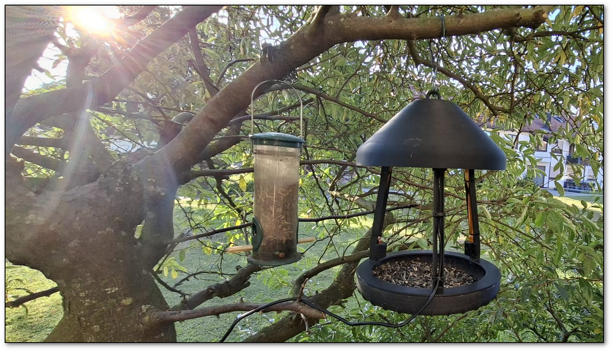
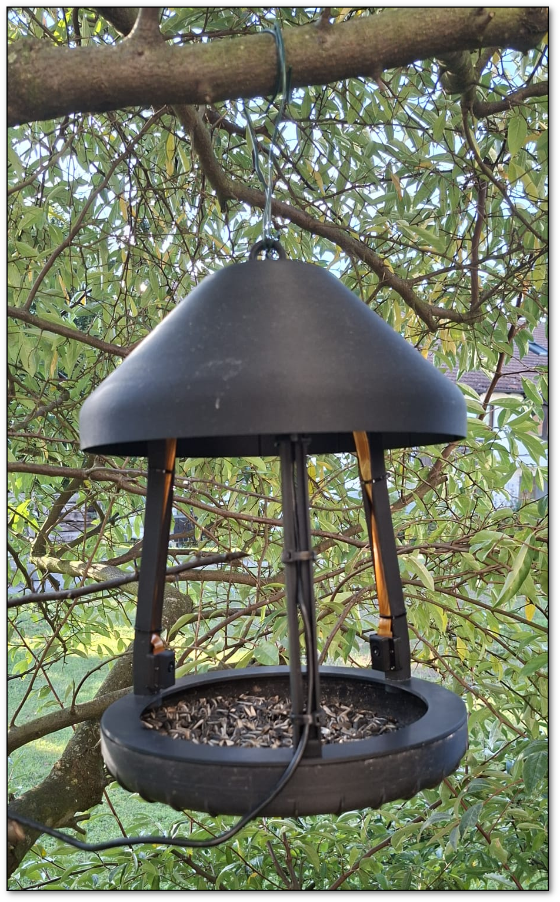
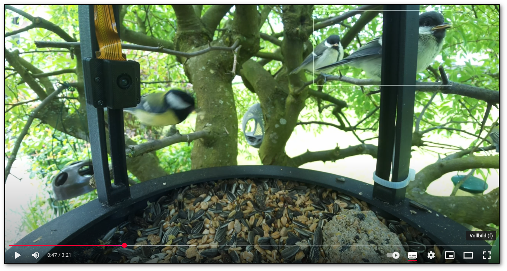

# 🐦 Vogel-Kamera-Linux

[](https://github.com/roimme65/vogel-kamera-linux/releases/tag/v1.2.0)
[](https://github.com/roimme65/vogel-kamera-linux/issues)
[](https://github.com/roimme65/vogel-kamera-linux/pulls)
[](LICENSE)



**🐦 Professionelles Vogel-Beobachtungssystem mit KI-gestützter Objekterkennung**

`vogel-kamera-linux` ist ein **Open-Source-Projekt** zur ferngesteuerten Überwachung von Vogelhäusern mittels Raspberry Pi 5 Kamera. Das System kombiniert hochauflösende Video-/Audio-Aufnahmen mit **YOLOv8 KI-Erkennung** für automatische Vogelerkennung und -aufzeichnung.

### 🚀 Quickstart
```bash
# Automatische Vogelerkennung mit KI-Trigger
./kamera-auto-trigger/start-vogel-beobachtung.sh

# Manuelle HD-Aufnahme mit KI
python python-skripte/ai-had-kamera-remote-param-vogel-libcamera-single-AI-Modul.py \
    --duration 5 --width 1920 --height 1080 --ai-modul on
```

> 📺 **Live-Demo:** [YouTube-Kanal](https://www.youtube.com/@vogel-kamera-linux) - Echte Aufnahmen vom vogel-kamera-linux System!

## 📖 Überblick

**vogel-kamera-linux** ist ein vollständiges Remote-Kamera-System für Naturbeobachtung, entwickelt für **Raspberry Pi 5** mit Python 3.11+. Das Projekt kombiniert moderne Kamera-Hardware (IMX708) mit fortgeschrittener KI-Objekterkennung (YOLOv8) für automatische Vogelerkennung.

**🎯 Hauptanwendung:** Ferngesteuerte Vogelhaus-Überwachung mit automatischer Aufnahme bei Vogel-Erkennung, inklusive HD-Video (bis 4K), Zeitlupe (120fps) und synchroner Audio-Aufzeichnung über USB-Mikrofon.

### 🎬 YouTube-Kanal & Beispielaufnahmen

[](https://www.youtube.com/@vogel-kamera-linux)

**Echte Aufnahmen vom vogel-kamera-linux System!** Sehen Sie die Kamera in Aktion mit Live-Vogelerkennung, Zeitlupen-Aufnahmen und 4K-Videos aus unserem Vogelhaus.

**📱 QR-Code für mobilen Zugriff:**


<!-- YOUTUBE_VIDEOS_START -->
**📺 Aktuelle Videos:**

| 🎬 Video | 📅 Datum | ⏱️ Dauer | 👁️ Views | 👍 Likes |
|----------|----------|----------|----------|----------|
| [**🤖 KI-gesteuerte Vogelkamera \| Automatische Erkennu...**](https://www.youtube.com/watch?v=5WeZb_YVe0s) | 02.10.2025 | 5:51 | 16 | 4 |
| [**Vogelhaus mit Kleiber  (Futtersuche in Zeitlupe)**](https://www.youtube.com/watch?v=QALijFTA_s8) | 29.09.2025 | 5:07 | 26 | 4 |
| [**Vogelhaus mit junge Haussperlinge**](https://www.youtube.com/watch?v=3na90KiJ-J8) | 06.06.2025 | 3:11 | 48 | 6 |
| [**Vogelhaus mit Kohlmeise  (Am Futterspender in Zeit...**](https://www.youtube.com/watch?v=kFXR03Lv0X0) | 30.05.2025 | 7:23 | 26 | 6 |
| [**Vogelhaus mit Kohlmeisen  (Fütterung Jungtiere mit...**](https://www.youtube.com/watch?v=sqvd99Pbubc) | 18.05.2025 | 3:22 | 36 | 6 |
| [**Vogelhaus mit Kohlmeise  (Fütterung Jungtier mit 2...**](https://www.youtube.com/watch?v=vXWDleJ-18Q) | 17.05.2025 | 2:44 | 20 | 6 |
| [**Vogelhaus mit Kernbeißer (2 Kameras)**](https://www.youtube.com/watch?v=dvCXPdMdNCg) | 27.04.2025 | 2:12 | 74 | 7 |
| [**Vogelhaus mit Kernbeißer und Blaumeise (Vogel-Paar...**](https://www.youtube.com/watch?v=61Szkcp9hcM) | 23.04.2025 | 2:59 | 50 | 5 |
| [**Vogelhaus mit Blaumeise, Kernbeißer und Kohlmeise ...**](https://www.youtube.com/watch?v=kElfd64dWrY) | 21.04.2025 | 4:16 | 94 | 7 |
| [**Vogelhaus mit Blaumeise, Haussperling und Kohlmeis...**](https://www.youtube.com/watch?v=hjrYji0A9Hs) | 18.04.2025 | 3:04 | 63 | 6 |
| [**Vogelhaus mit Blaumeise und Kohlmeise (Zeitlupe)**](https://www.youtube.com/watch?v=lshb68RrF_A) | 13.04.2025 | 5:11 | 72 | 7 |
| [**Vogelhaus mit Blaumeisen, Rotkehlchen, Kernbeißer ...**](https://www.youtube.com/watch?v=6-OFxA__GL8) | 10.04.2025 | 5:05 | 106 | 7 |
| [**Vogelhaus mit Kernbeißer, Blaumeise, Rotkehlchen, ...**](https://www.youtube.com/watch?v=MKb3yUKS_ww) | 09.04.2025 | 4:28 | 80 | 7 |
| [**Vogelhaus mit Blaumeise, Rotkehlchen, Haussperling...**](https://www.youtube.com/watch?v=K0FhU73F6jo) | 08.04.2025 | 5:17 | 90 | 7 |

*Automatisch aktualisiert: 03.10.2025 17:30 Uhr*
<!-- YOUTUBE_VIDEOS_END -->

## ✨ Features

- 🎥 **Hochauflösende Videoaufnahme** (bis zu 4K)
- 🎵 **Synchrone Audioaufnahme** über USB-Mikrofon
- 🤖 **KI-Objekterkennung** mit YOLOv8 und eigenen Vogelarten-Modellen
- 🎯 **Auto-Trigger System** mit automatischer Vogelerkennung *(Neu in v1.2.0)*
- 📺 **Preview-Stream** (RTSP) für Live-Überwachung *(Neu in v1.2.0)*
- 🌐 **Netzwerk-Diagnostics** für Performance-Analyse *(Neu in v1.2.0)*
- 📊 **System-Monitoring** mit CPU-Load und Temperaturüberwachung *(Seit v1.1.9)*
- ⚡ **Performance-Optimierung** für verschiedene Aufnahmemodi *(Seit v1.1.9)*
- 🌐 **Remote-Steuerung** über SSH
- 📁 **Automatische Dateiorganisation** nach Jahr/Woche
- ⚙️ **Flexible Konfiguration** über .env-Dateien
- 📊 **Fortschrittsanzeige** während der Aufnahme
- 🔄 **Automatische Video-/Audio-Synchronisation**
- 📱 **YouTube-Integration** mit QR-Codes für mobile Nutzer
- 🔧 **Einfache Installation** mit config/requirements.txt
- ✅ **Automatische Konfigurationsvalidierung**
- 🎯 **Eigene AI-Modelle** trainierbar für spezifische Vogelarten

## 📸 Hardware-Galerie

**Modulare Kamera-Lösung:**

*Flexible Platzierung für optimale Aufnahmen*

**Live-Aufnahmen & Community:**
 
*Echte Vogelbeobachtungen auf YouTube*

> 💡 **3D-Konstruktions-Dateien verfügbar!** Alle CAD-Dateien für den Nachbau finden Sie im [`3d-konstruktion/`](3d-konstruktion/) Verzeichnis

## 🤖 KI-Objekterkennung & Vogelarten-AI

### Sofort verfügbar: Standard-Objekterkennung
```bash
# YOLOv8 mit allgemeiner Vogelerkennung
python3 ai-had-kamera-remote-param-vogel-libcamera-single-AI-Modul.py \
  --duration 5 --ai-modul on --ai-model yolov8
```

### 🔄 Automatisches bird-species Modell
```bash
# Bird-species Modell - wird automatisch erstellt falls nicht vorhanden
python3 ai-had-kamera-remote-param-vogel-libcamera-single-AI-Modul.py \
  --duration 5 --ai-modul on --ai-model bird-species
```
**Optimierungen:**
- ✅ Automatische Modellerstellung auf Remote-Host
- 🎯 Fokus nur auf Vogel-Klasse (COCO 14)
- ⚡ Niedrigere Schwelle (0.3) für bessere Sensitivität
- 🔄 Temporaler Filter für stabile Erkennungen

### Erweitert: Eigene Vogelarten-Modelle trainieren
Das System unterstützt das Training eigener AI-Modelle für spezifische Vogelarten:

🎯 **Häufige deutsche Gartenvögel**: Amsel, Blaumeise, Kohlmeise, Rotkehlchen, Buchfink...

📋 **Vollständige Anleitung**: [`docs/ANLEITUNG-EIGENES-AI-MODELL.md`](docs/ANLEITUNG-EIGENES-AI-MODELL.md)

🛠️ **Training-Tools**: [`ai-training-tools/`](ai-training-tools/) - Komplettes Toolkit für eigene Modelle

```bash
# Eigenes Modell verwenden
python3 ai-had-kamera-remote-param-vogel-libcamera-single-AI-Modul.py \
  --duration 5 --ai-modul on --ai-model custom \
  --ai-model-path /pfad/zu/eigenem/modell.json
```

## 🛠️ Voraussetzungen

### Hardware
- Raspberry Pi 5 mit Kamera-Modul
- USB-Mikrofon für Audioaufnahme
- Stabile Netzwerkverbindung

### Software
- Python 3.8+
- SSH-Zugang zum Raspberry Pi
- libcamera/rpicam-vid auf dem Raspberry Pi

### Python-Abhängigkeiten

**Empfohlen: Virtuelle Umgebung verwenden**
```bash

# Virtuelle Umgebung erstellen
python3 -m venv venv

# Virtuelle Umgebung aktivieren
source venv/bin/activate  # Linux/macOS
# oder: venv\Scripts\activate  # Windows

# Abhängigkeiten installieren
pip install -r config/requirements.txt
```

**Oder manuell:**
```bash
pip install paramiko scp tqdm python-dotenv qrcode[pil]
```

> 💡 **Hinweis:** Die Verwendung einer virtuellen Umgebung (`venv`) wird empfohlen, um Konflikte mit anderen Python-Projekten zu vermeiden.

### Konfiguration laden
Die Skripte laden automatisch Konfigurationsdaten aus der `.env`-Datei:
```bash
# 1. Kopieren Sie die Beispiel-Konfiguration
cp python-skripte/.env.example python-skripte/.env

# 2. Bearbeiten Sie die .env-Datei mit Ihren Daten  
nano python-skripte/.env

# 3. Testen Sie die Konfiguration
python python-skripte/config.py
```

## 📂 Projektstruktur

```
vogel-kamera-linux/
├── README.md                                                     # Hauptdokumentation
├── LICENSE                                                       # MIT Lizenz
├── .gitignore                                                    # Git-Ignore-Regeln
├── config/                                                       # 🔧 Konfigurationsdateien
│   └── requirements.txt                                          # Python-Abhängigkeiten
├── scripts/                                                      # 🔧 Build/Deploy-Skripte  
│   ├── version.py                                               # Zentrale Versionsverwaltung
│   ├── release_workflow.py                                     # Release-Automatisierung
│   └── update_version.py                                       # Versions-Update-Skript
├── docs/                                                         # 📚 Dokumentation
│   ├── CHANGELOG.md                                             # Versionshistorie (v1.2.0)
│   ├── ARCHITEKTUR.md                                           # 🏗️ Systemarchitektur mit Mermaid-Diagrammen *(v1.2.0)*
│   ├── PROJEKT-REORGANISATION.md                                # Projekt-Reorganisations-Dokumentation
│   ├── SECURITY.md                                              # Sicherheitsrichtlinien
│   ├── AI-MODELLE-VOGELARTEN.md                                 # AI-Modell-Dokumentation
│   └── ANLEITUNG-EIGENES-AI-MODELL.md                          # AI-Training-Anleitung
├── tools/                                                        # 🛠️ Test & Entwicklungstools
│   ├── check_emojis.py                                          # Emoji-Validator für Markdown
│   ├── automation_test.txt                                      # Automatisierungs-Tests
│   ├── test_ai_features.py                                      # AI-Feature Tests
│   └── README.md                                                # Tools-Dokumentation
├── network-tools/                                               # 🌐 Netzwerk-Diagnose-Tools *(v1.2.0)*
│   ├── test-network-quality.py                                  # Netzwerk-Qualitäts-Test
│   └── README.md                                                # Netzwerk-Tools Dokumentation
├── kamera-auto-trigger/                                         # 🎯 Auto-Trigger System *(v1.2.0)*
│   ├── start-vogel-beobachtung.sh                               # Interaktiver Wrapper
│   ├── docs/                                                    # Auto-Trigger Dokumentation
│   │   ├── QUICKSTART-AUTO-TRIGGER.md                           # Schnellstart-Anleitung
│   │   ├── PREVIEW-STREAM-SETUP.md                              # Stream-Setup Guide
│   │   ├── FIREWALL-SETUP-SUMMARY.md                            # Firewall-Konfiguration
│   │   └── AUTO-TRIGGER-OVERVIEW.md                             # System-Überblick
│   ├── tests/                                                   # Test-Skripte
│   │   ├── guided-test.sh                                       # Interaktiver Test
│   │   └── test-auto-trigger.sh                                 # Automatisierter Test
│   └── README.md                                                # Auto-Trigger Dokumentation
├── raspberry-pi-scripts/                                        # 🍓 Raspberry Pi Skripte *(v1.2.0)*
│   ├── start-rtsp-stream.sh                                     # RTSP-Stream Management
│   ├── start-preview-stream.sh                                  # Preview-Stream (Legacy)
│   ├── start-preview-stream-v2.sh                               # Preview-Stream v2
│   └── start-preview-stream-watchdog.sh                         # Stream-Watchdog
├── releases/                                                     # 📋 Release-Dokumentation
│   ├── README.md                                                # Release-Übersicht
│   ├── RELEASE_NOTES_v1.2.0.md                                  # Aktuelle Release Notes *(v1.2.0)*
│   └── vX.X.X/                                                  # Versionierte Release-Archive
│       └── RELEASE_NOTES_vX.X.X.md                              # Archivierte Release-Notes
├── assets/                                                       # 📸 QR-Codes & Medien
│   ├── qr-youtube-channel.png                                   # YouTube-Kanal QR-Code
│   ├── qr-playlists.png                                         # Playlists QR-Code  
│   ├── qr-subscribe.png                                         # Abonnieren QR-Code
│   ├── generate_qr_codes.py                                     # QR-Code Generator
│   └── QR-CODE-ANLEITUNG.md                                     # QR-Code Dokumentation
├── git-automation/                                              # 🔐 Git-Automatisierung
│   ├── git_automation.py                                        # Sichere Git-Operationen mit AES-256
│   ├── setup_ssh_credentials.py                                 # SSH-Credentials Setup
│   ├── test_*.py                                                # Umfassende Test-Suite
│   ├── .git_secrets_encrypted.json                             # Verschlüsselte SSH-Secrets
│   └── README.md                                                # Git-Automation Dokumentation
├── wiki-sync/                                                   # 📚 Wiki-Synchronisation
│   ├── wiki_sync.py                                            # Automatische Wiki-GitHub-Sync
│   └── README.md                                                # Wiki-Sync Dokumentation
├── 3d-konstruktion/                                            # 🔧 3D-Konstruktions-Dateien
│   ├── README.md                                                # 3D-Konstruktions-Dokumentation
│   └── YYYY-MM-DD/                                             # Versionierte Konstruktions-Ordner
│       ├── README.md                                            # Version-spezifische Dokumentation
│       └── stp-dateien/                                        # STEP-Konstruktionsdateien (*.stp)
│           └── *.stp                                           # 3D-CAD Dateien für Hardware
├── veranstaltungen/                                             # 🎤 Event-Management
│   ├── README.md                                                # Event-Übersicht
│   └── YYYY-MM-DD-eventname/                                   # Event-spezifische Ordner
│       ├── README.md                                            # Event-Details
│       ├── slides/                                              # Präsentationsmaterialien
│       │   ├── README.md                                        # Slide-Dokumentation
│       │   └── *.pdf/*.pptx                                    # Präsentationsdateien
│       └── resources/                                           # Event-Ressourcen
│           ├── README.md                                        # Resource-Dokumentation
│           ├── generate_qr_codes.py                            # Event-QR-Codes
│           └── *.png                                           # QR-Code Bilder
└── python-skripte/                                             # 🐍 Haupt-Python-Module
    ├── config.py                                                # Konfigurationssystem
    ├── __version__.py                                           # Modul-Versionsverwaltung
    ├── .env.example                                             # Konfigurationsvorlage
    ├── .env                                                     # Lokale Konfiguration (nicht im Git)
    ├── ai-had-kamera-remote-param-vogel-libcamera-single-AI-Modul.py  # 🤖 Hauptskript mit KI
    ├── ai-had-audio-remote-param-vogel-libcamera-single.py            # 🎵 Audio-Aufnahme
    ├── ai-had-kamera-remote-param-vogel-libcamera-zeitlupe.py         # ⚡ Zeitlupe-Aufnahmen
    ├── ai-had-kamera-auto-trigger.py                                  # 🎯 Auto-Trigger System *(v1.2.0)*
    ├── remote_system_monitor.py                                       # 📊 Umfassendes System-Monitoring *(v1.1.9)*
    ├── quick_system_check.py                                          # ⚡ Schnelle System-Checks *(v1.1.9)*
    └── check_ai_models.py                                             # 🔍 AI-Modell-Validierung
```

## 🚀 Schnellstart

### 1. Installation
```bash
# Repository klonen
git clone https://github.com/roimme65/vogel-kamera-linux.git
cd vogel-kamera-linux

# Virtuelle Umgebung erstellen (empfohlen)
python3 -m venv venv
source venv/bin/activate

# Abhängigkeiten installieren
pip install -r config/requirements.txt
```

### 2. Konfiguration
```bash
# Konfiguration kopieren und anpassen
cp python-skripte/.env.example python-skripte/.env
nano python-skripte/.env

# Konfiguration testen
python python-skripte/config.py
```

### 3. Erste Aufnahme
```bash
# Audio-Test (1 Minute)
python python-skripte/ai-had-audio-remote-param-vogel-libcamera-single.py --duration 1

# Video mit KI (1 Minute, HD)
python python-skripte/ai-had-kamera-remote-param-vogel-libcamera-single-AI-Modul.py --duration 1 --width 1920 --height 1080 --ai-modul on --no-stream-restart
```

### 4. Version prüfen
```bash
python python-skripte/ai-had-kamera-remote-param-vogel-libcamera-single-AI-Modul.py --version
# Ausgabe: Vogel-Kamera-Linux v1.2.0
```

### 🆕 Auto-Trigger System (v1.2.0)
```bash
# Automatische Vogelerkennung mit KI-basiertem Trigger
./kamera-auto-trigger/start-vogel-beobachtung.sh

# Oder direkt mit Python:
python python-skripte/ai-had-kamera-auto-trigger.py --trigger-duration 2

# System-Status (alle Skripte zeigen automatisch vor der Aufnahme):
# 🌡️ CPU-Temperatur mit Warnstufen
# 💾 Festplattenspeicher mit Auslastung
# 🧠 Arbeitsspeicher-Anzeige
# ⚡ CPU-Load mit Performance-Warnungen

# Beispiel-Ausgabe:
# 📊 System-Status für pi@vogelkamera:
# ==================================================
# 🌡️ CPU-Temperatur: 58.4°C 🟢 OK
# 💾 Festplatte: 45G verwendet von 59G (79%) 🟢 OK
# 🧠 Arbeitsspeicher: 2.1G verwendet von 7.8G (5.6G verfügbar)
# ⚡ CPU-Load (1min): 0.8 🟢 NIEDRIG
# ==================================================

# Neue System-Monitoring-Tools:
python python-skripte/remote_system_monitor.py    # Umfassendes Monitoring
python python-skripte/quick_system_check.py       # Schnelle Checks

# Nur System-Status anzeigen (ohne Aufnahme):
python python-skripte/ai-had-kamera-remote-param-vogel-libcamera-single-AI-Modul.py --system-status
```

### Basis-Aufnahme (ohne KI)
```bash
python ai-had-kamera-remote-param-vogel-libcamera-single-AI-Modul.py \
    --duration 5 \
    --width 1920 \
    --height 1080 \
    --no-stream-restart  # Empfohlen für On-Demand Aufnahmen
```

### Mit KI-Objekterkennung
```bash
python ai-had-kamera-remote-param-vogel-libcamera-single-AI-Modul.py \
    --duration 5 \
    --width 1920 \
    --height 1080 \
    --ai-modul on \
    --no-stream-restart  # Empfohlen für On-Demand Aufnahmen
```

### Erweiterte Konfiguration
```bash
python ai-had-kamera-remote-param-vogel-libcamera-single-AI-Modul.py \
    --duration 10 \
    --width 4096 \
    --height 2160 \
    --codec h264 \
    --autofocus_mode continuous \
    --rotation 180 \
    --fps 30 \
    --cam 0 \
    --ai-modul on \
    --no-stream-restart  # Empfohlen für On-Demand Aufnahmen
```

### Parameter-Übersicht

| Parameter | Beschreibung | Standard | Optionen |
|-----------|--------------|----------|----------|
| `--duration` | Aufnahmedauer in Minuten | **erforderlich** | 1-∞ |
| `--width` | Video-Breite | 4096 | 640-4096 |
| `--height` | Video-Höhe | 2160 | 480-2160 |
| `--codec` | Video-Codec | h264 | h264, h265 |
| `--autofocus_mode` | Autofokus-Modus | continuous | continuous, manual |
| `--autofocus_range` | Autofokus-Bereich | macro | macro, full |
| `--hdr` | HDR-Modus | off | auto, off |
| `--rotation` | Bildrotation | 180 | 0, 90, 180, 270 |
| `--fps` | Bildrate | 15 | 1-60 |
| `--cam` | Kamera-ID | 0 | 0, 1 |
| `--ai-modul` | KI-Objekterkennung | off | on, off |
| `--ai-model` | AI-Modell auswählen *(v1.1.8)* | yolov8 | yolov8, bird-species, custom |
| `--ai-model-path` | Pfad zu eigenem AI-Modell *(v1.1.8)* | - | Dateipfad zu .json |
| `--roi` | Region of Interest | - | x,y,w,h |
| `--system-status` | Nur System-Status anzeigen *(v1.1.9)* | - | Flag ohne Wert |
| `--no-stream-restart` | Preview-Stream nicht neu starten *(v1.2.0)* | - | Flag ohne Wert |

## 🔐 Git-Automatisierung

Das Projekt bietet jetzt eine **sichere Git-Automatisierung** für entwickelnde Beitragende:

### ✨ Features
- **🔑 Verschlüsselte SSH-Credentials:** AES-256-CBC mit Master-Password
- **🚀 Automatischer SSH-Agent:** Keine manuelle Passphrase-Eingabe
- **🛡️ Sichere Speicherung:** PBKDF2 Key-Derivation mit 100.000 Iterationen
- **🧪 Umfassende Tests:** Automatisierte Validierung aller Komponenten

### 🚀 Schnellstart Git-Automation
```bash
cd git-automation/

# Abhängigkeiten installieren
pip install -r git_automation_requirements.txt

# SSH-Credentials einrichten (einmalig)
python3 setup_ssh_credentials.py

# System testen
python3 test_full_automation.py
```

### 💻 Verwendung
```python
import sys
sys.path.append('git-automation/')
from git_automation import SecureGitAutomation

# Automatisierte Git-Operationen
automation = SecureGitAutomation()
automation.run_command("git add .")
automation.run_command('git commit -m "Automatischer Commit"')
automation.run_command("git push")
```

> 📚 **Vollständige Dokumentation:** [`git-automation/README.md`](git-automation/README.md)

## ⚙️ SSH-Konfiguration

### 1. Umgebungsvariablen konfigurieren
```bash
# Kopieren Sie die Beispiel-Konfiguration
cp python-skripte/.env.example python-skripte/.env

# Bearbeiten Sie die .env-Datei mit Ihren Daten
nano python-skripte/.env
```

Beispiel `.env`-Datei:
```bash
RPI_HOSTNAME=your-raspberry-pi-hostname
RPI_USERNAME=pi
SSH_KEY_PATH=~/.ssh/id_rsa_rpi
BASE_VIDEO_PATH=~/Videos/Vogelhaus
REMOTE_VIDEO_PATH=/home/pi/Videos/Vogelhaus
REMOTE_AUDIO_PATH=/home/pi/Audio/Kamerawagen
```

> 📺 **Beispielaufnahmen:** [Vogel-Kamera Setup](https://www.youtube.com/@vogel-kamera-linux) - Siehe die Kamera in Aktion

### 2. **SSH-Schlüssel generieren** (falls noch nicht vorhanden):
```bash
ssh-keygen -t rsa -b 4096 -f ~/.ssh/id_rsa_rpi
```

### 3. **Öffentlichen Schlüssel auf Raspberry Pi kopieren**:
```bash
ssh-copy-id -i ~/.ssh/id_rsa_rpi.pub pi@your-raspberry-pi-hostname
```

### 4. **Hostname in /etc/hosts eintragen** (optional):
```bash
echo "192.168.1.XXX your-raspberry-pi-hostname" | sudo tee -a /etc/hosts
```

## 📁 Dateiorganisation

Die aufgenommenen Videos werden automatisch organisiert:
```
~/Videos/Vogelhaus/
├── AI-HAD/        # Hauptskript mit KI-Erkennung
├── Audio/         # Reine Audio-Aufnahmen  
└── Zeitlupe/      # Slow-Motion Videos
    └── 2025/
        └── 38/  # Kalenderwoche
            └── Montag__2025-09-23__14-30-15/
                └── Montag__2025-09-23__14-30-15__4096x2160.mp4
```

## 🤖 KI-Objekterkennung

Das Hauptskript nutzt YOLOv8 für die Echtzeit-Objekterkennung:
- **Automatische Vogelerkennung** während der Aufnahme
- **Optimierte Inferenz** auf Raspberry Pi 5
- **Konfigurierbare Erkennungsparameter**

## 🔧 Problembehandlung

### Konfigurationsprobleme
```bash
# Konfiguration überprüfen
python python-skripte/config.py

# Fehlermeldung: "Hostname nicht konfiguriert"
# → Bearbeiten Sie python-skripte/.env mit Ihren Werten
```

### Audio-Gerät nicht gefunden
```bash
# Auf dem Raspberry Pi prüfen:
arecord -l
```

### SSH-Verbindungsprobleme
```bash
# Verbindung testen:
ssh -i ~/.ssh/id_rsa_rpi pi@your-raspberry-pi-hostname

# Konfiguration validieren:
python python-skripte/config.py

# .env-Datei überprüfen:
cat python-skripte/.env
```

### Dependency-Probleme
```bash
# Alle Abhängigkeiten neu installieren
pip install -r config/requirements.txt

# Einzelne Pakete installieren  
pip install paramiko scp tqdm python-dotenv qrcode[pil]
```

### Kamera-Probleme
```bash
# Kamera-Status prüfen:
rpicam-hello --list-cameras
```

## 📄 Lizenz

Siehe [LICENSE](LICENSE) Datei für Details.

## 🤝 Beitragen

1. Fork des Repositories
2. Feature-Branch erstellen
3. Änderungen commiten
4. Pull Request erstellen

## 👥 Community & Diskussionen

[](https://github.com/roimme65/vogel-kamera-linux/discussions)

Tauschen Sie sich mit anderen Nutzern aus:
- 🙋 **Fragen stellen** zu Installation und Konfiguration  
- 💡 **Ideen teilen** für neue Features
- 📸 **Aufnahmen zeigen** aus Ihrem Vogelhaus
- 🔧 **Hardware-Tipps** diskutieren

## 📞 Support

Bei Fragen oder Problemen:
- 💬 **Diskussionen starten** in [GitHub Discussions](https://github.com/roimme65/vogel-kamera-linux/discussions)
- 🐛 **Bugs melden** über [GitHub Issues](https://github.com/roimme65/vogel-kamera-linux/issues)

## 📚 Dokumentation

### Hauptdokumentation
- **[docs/CHANGELOG.md](docs/CHANGELOG.md)** - Vollständige Versionshistorie mit allen Änderungen
- **[docs/ARCHITEKTUR.md](docs/ARCHITEKTUR.md)** - 🏗️ **NEU in v1.2.0!** Detaillierte Systemarchitektur mit Mermaid-Diagrammen
  - Kommunikationsflüsse (PC ↔ Raspberry Pi)
  - CPU-Optimierungs-Visualisierung (107% → 40%)
  - Video- und Audio-Pipeline-Diagramme
  - Erkennungs-Workflow und Fehlerbehandlung
- **[docs/PROJEKT-REORGANISATION.md](docs/PROJEKT-REORGANISATION.md)** - Projekt-Reorganisations-Historie

### Auto-Trigger System *(v1.2.0)*
- **[kamera-auto-trigger/README.md](kamera-auto-trigger/README.md)** - Hauptdokumentation Auto-Trigger
- **[kamera-auto-trigger/docs/QUICKSTART-AUTO-TRIGGER.md](kamera-auto-trigger/docs/QUICKSTART-AUTO-TRIGGER.md)** - 3-Minuten Quick-Start
- **[kamera-auto-trigger/docs/AUTO-TRIGGER-DOKUMENTATION.md](kamera-auto-trigger/docs/AUTO-TRIGGER-DOKUMENTATION.md)** - Vollständige Feature-Dokumentation
- **[kamera-auto-trigger/docs/AUTO-TRIGGER-OVERVIEW.md](kamera-auto-trigger/docs/AUTO-TRIGGER-OVERVIEW.md)** - System-Überblick

### AI & Training
- **[docs/AI-MODELLE-VOGELARTEN.md](docs/AI-MODELLE-VOGELARTEN.md)** - AI-Modell-Dokumentation
- **[docs/ANLEITUNG-EIGENES-AI-MODELL.md](docs/ANLEITUNG-EIGENES-AI-MODELL.md)** - Training eigener Modelle

### Sicherheit & Entwicklung
- **[docs/SECURITY.md](docs/SECURITY.md)** - Sicherheitsrichtlinien
- **[git-automation/README.md](git-automation/README.md)** - Git-Automation Dokumentation (v1.2.0)

## 📋 Changelog

Alle Änderungen werden in **[docs/CHANGELOG.md](docs/CHANGELOG.md)** dokumentiert.

### 🆕 Neu in v1.2.0 (01. Oktober 2025)
- 🎯 **Auto-Trigger System:** Automatische Vogelerkennung mit KI-basierter Aufnahmesteuerung
- 📺 **Preview-Stream:** RTSP-Stream für Echtzeit-Überwachung (640x480 @ 5fps)
- ⏱️ **Trigger-Duration Logic:** 2-Sekunden-Check mit 70% Detection Rate
- 🔄 **Stream-Management:** Automatischer Stream-Restart nach HD-Aufnahmen
- 🌐 **Network-Diagnostics:** Umfassendes Netzwerk-Qualitäts-Test-Tool
- 📊 **Status-Reports Optimierung:** Pausierung während Aufnahme und Cooldown
- 🛠️ **Wrapper-Skripte:** Interaktive Benutzerführung für Auto-Trigger

### 📊 System-Monitoring in v1.1.9 (30. September 2025)
- System-Überwachung: CPU-Load, Temperatur und Speicher-Checks
- Performance-Optimierung für alle Aufnahmemodi
- Bereitschaftschecks vor Aufnahmestart

### 🎯 Hochpräzise Modelle in v1.1.8
- 🤖 **Automatische bird-species Modelle:** Dynamische Erstellung optimierter AI-Modelle
- 🔧 **3D-Konstruktions-System:** Vollständige CAD-Dateien für Hardware-Nachbau  
- 📚 **Wiki-Integration:** Umfassende Dokumentation mit Sidebar-Navigation
- 📊 **Version-Tracking:** Programmatische Versionsinformationen (version.py)
- 📋 **Release-Dokumentation:** Vollständige Release Notes und CHANGELOG-Updates

### 🎬 Neu in v1.1.0
- YouTube-Integration mit QR-Codes
- Zentrales Konfigurationssystem  
- Sicherheitsverbesserungen (keine hardcodierten Daten)

## 🔖 Versionen

- **Aktuelle Version:** v1.2.0
- **Entwicklungszweig:** `devel-v1.2.0`
- **Stabile Version (main):** v1.1.9
- **Alle Releases:** [GitHub Releases](../../releases) | [Tags](../../tags)
