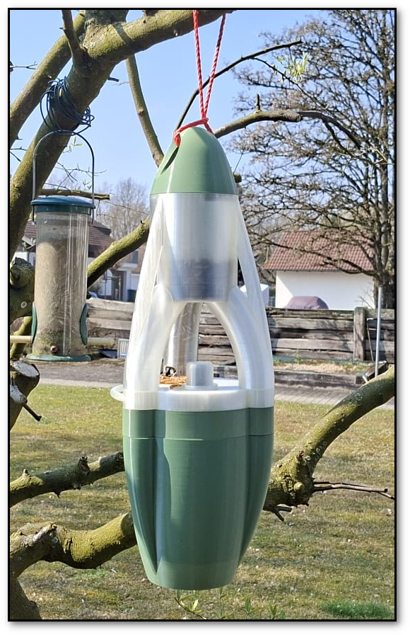
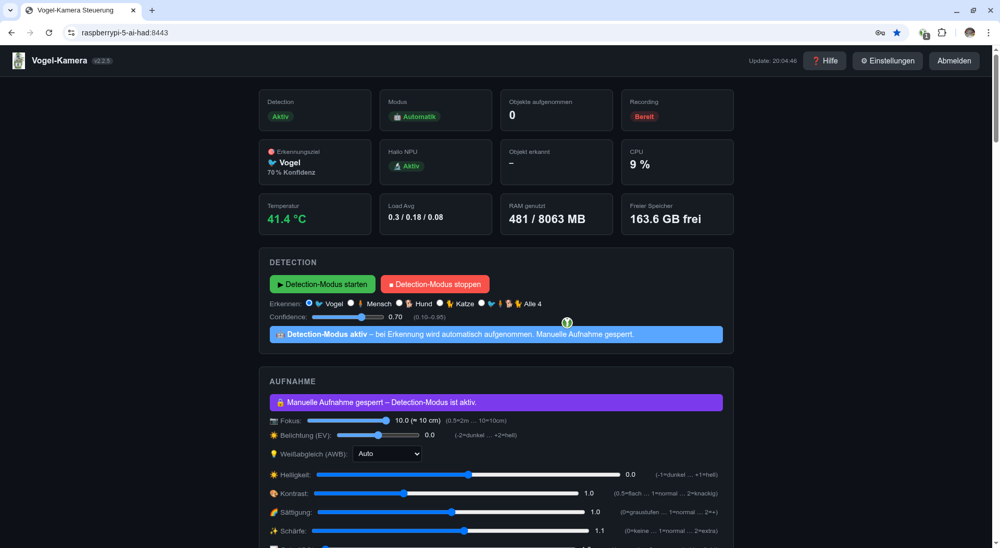
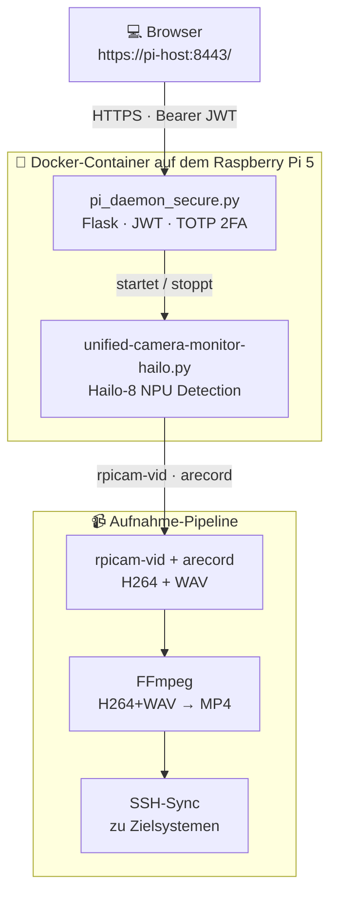
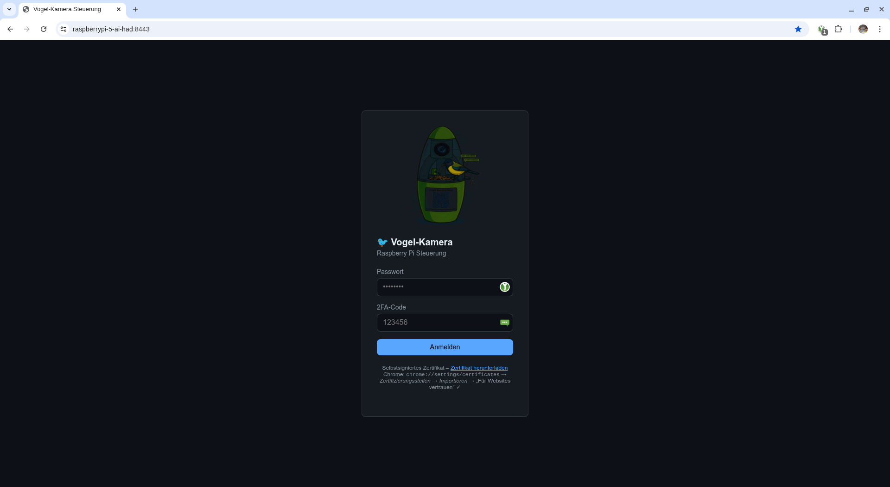
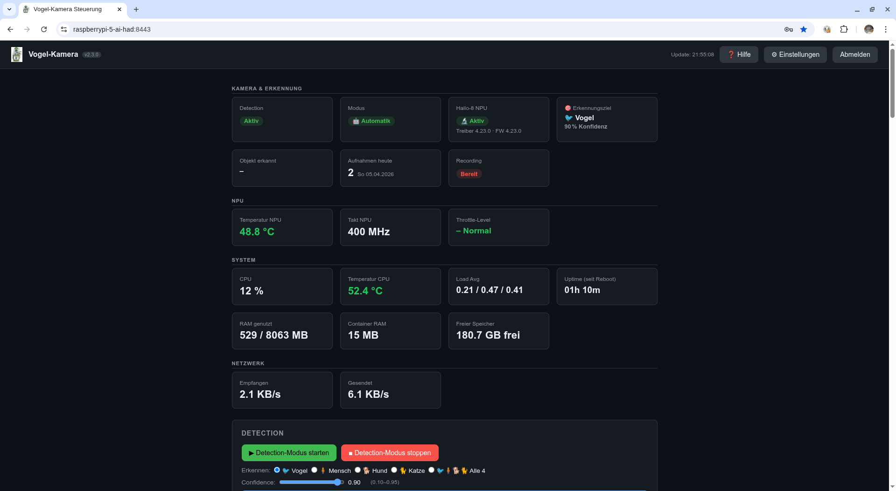
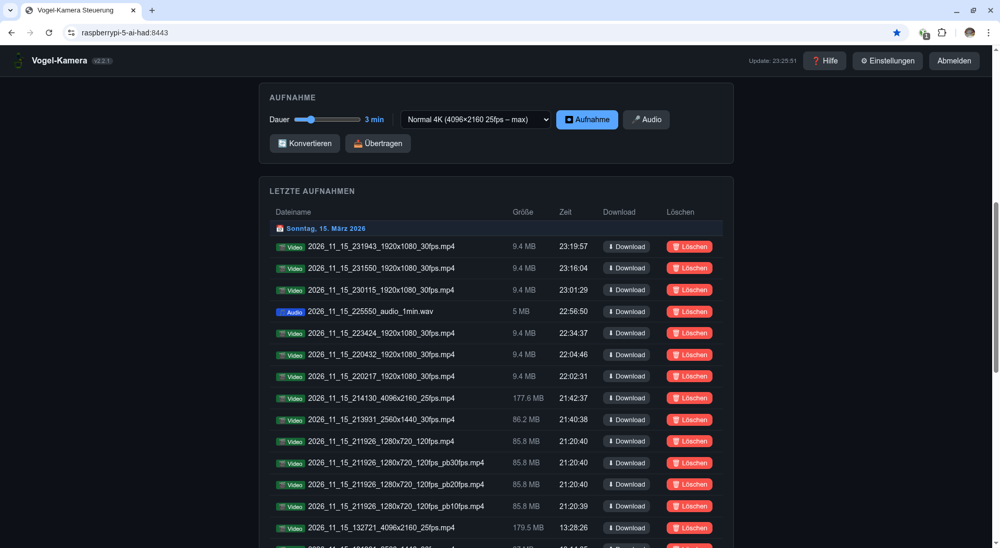
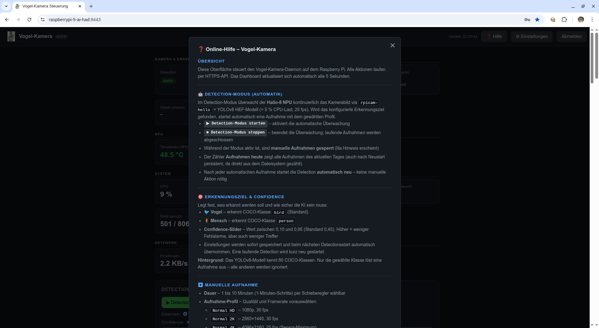
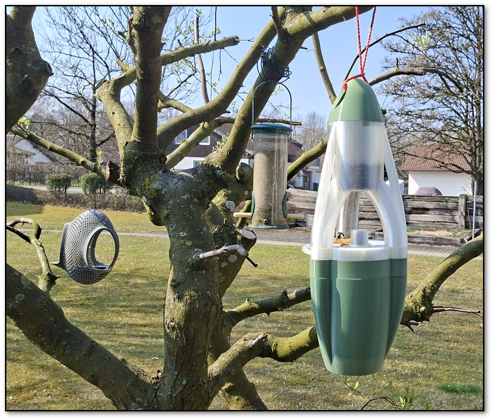
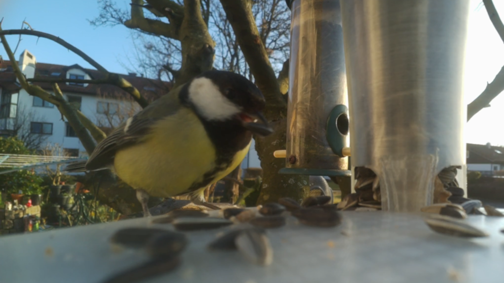
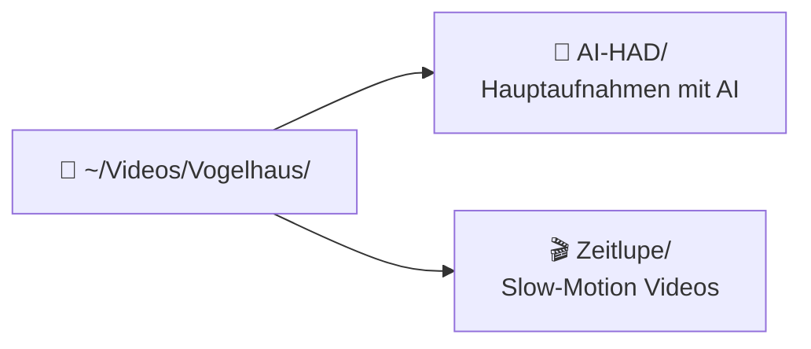

# 🐦 Vogel-Kamera-Linux

> 🌐 **Multi-Language Documentation:** This README is available in multiple languages!  



## Release v2.2.6 — Bugfix: Detection-Prozess & Aufnahmen-Tageszähler 🐛

- **Version:** v2.2.6 (31. März 2026)
- **🐛 Bugfixes:**
  - **Detection-Race-Condition behoben:** Stop Detection → manuelle Aufnahme → Detection-Mode führte zu zwei konkurrierenden `rpicam-hello`-Prozessen → fix: explizites Killen des vorhandenen Prozesses vor Neustart
- **✨ Neue Features:**
  - **📅 Aufnahmen-Tageszähler:** Dashboard-Karte „Aufnahmen heute" zeigt persistente Tagesanzahl der `.mp4`-Aufnahmen + Datum
  - **🚀 Ansible Hotpatch:** Neues `hotpatch.yml` Playbook für schnellen Datei-Deployment ohne Image-Rebuild

- **🔧 Technical Stack:**
  - ✅ Flask + HTTPS (selbstsigniertes Zertifikat, Port 8443)
  - ✅ JWT-Authentifizierung + TOTP-2FA (PyOTP)
  - ✅ Hailo-8 NPU Detection (rpicam-hello + YOLOv8 HEF) als Subprocess im Container
  - ✅ Automatische Video-Konvertierung (H264 → MP4) und SSH-Sync zu Zielsystemen
  - ✅ Persönliche Konfiguration ausschließlich in `ansible/.env` (gitignored)

**Deployment:** [`ansible/build_and_deploy.sh`](ansible/build_and_deploy.sh)  
**Changelog:** [`CHANGELOG.md`](CHANGELOG.md)  
**Release Notes:** [`releases/v2.2.6/`](releases/v2.2.6/RELEASE_NOTES_v2.2.6.md)

[](https://github.com/kamera-linux/vogel-kamera-linux/releases/tag/v2.2.6)
[]()
[]()
[]()

### v2.2.5 (Archiv)
**EV & AWB Sliders**
- **Version:** v2.2.5 (21. März 2026)
- Siehe [Archiv-Release](releases/v2.2.5/) für Details oder CHANGELOG.md

### v2.2.4 (Archiv)
**Manueller Fokus-Slider**
- **Version:** v2.2.4 (20. März 2026)
- Siehe [Archiv-Release](releases/v2.2.4/) für Details oder CHANGELOG.md

### v2.2.3 (Archiv)
**Aufnahmedauer-Fix & Dashboard-Korrektionen**
- **Version:** v2.2.3 (März 2026)
- Siehe [Archiv-Release](releases/v2.2.3/) für Details oder CHANGELOG.md

> ⚠️ **Raspberry Pi OS Trixie (Debian 13):** Diese Version ist für **Trixie** optimiert.  
> 📘 **Für Bookworm (Debian 12):** Verwenden Sie den [bookworm-legacy-Branch (v1.2.x)](https://github.com/kamera-linux/vogel-kamera-linux/tree/bookworm-legacy)  
> 📖 **Migration-Guide:** [legacy/docs/TRIXIE-MIGRATION.md](legacy/docs/TRIXIE-MIGRATION.md)



**🐦 Professionelles Vogel-Beobachtungssystem mit KI-gestützter Objekterkennung**

`vogel-kamera-linux` ist ein **Open-Source-Projekt** zur ferngesteuerten Überwachung von Vogelhäusern mittels Raspberry Pi 5 Kamera. Das System kombiniert hochauflösende Video-/Audio-Aufnahmen mit **YOLO26n KI-Erkennung** für automatische Vogelerkennung und -aufzeichnung.

### 🚀 Quickstart
```bash
# 1. Konfiguration: persönliche Werte eintragen (.env wird nicht versioniert)
cp ansible/.env.example ansible/.env && nano ansible/.env

# 2. Erstinstallation auf dem Raspberry Pi
./ansible/build_and_deploy.sh --install

# 3. Web-GUI im Browser öffnen
# https://<PI_HOST>:8443/
```

> 📺 **Live-Demo:** [YouTube-Kanal](https://www.youtube.com/@vogel-kamera-linux) - Echte Aufnahmen vom vogel-kamera-linux System!

## 📖 Überblick

**vogel-kamera-linux** ist ein vollständiges Remote-Kamera-System für Naturbeobachtung, entwickelt für **Raspberry Pi 5** mit Python 3.13+. Das Projekt kombiniert moderne Kamera-Hardware (IMX708) mit spezialisierter KI-Objekterkennung (YOLO26n) für automatische Vogelerkennung.

**🎯 Hauptanwendung:** Ferngesteuerte Vogelhaus-Überwachung mit automatischer Aufnahme bei Vogel-Erkennung, inklusive HD-Video (bis 4K), Zeitlupe (120fps) und synchroner Audio-Aufzeichnung über USB-Mikrofon.

### 📺 Live-Beispiele & YouTube-Kanal

[](https://www.youtube.com/@vogel-kamera-linux)

**Echte Aufnahmen vom vogel-kamera-linux System** - Live-Vogelerkennung, Zeitlupen-Aufnahmen, 4K-Videos!

<!-- YOUTUBE_VIDEOS_START -->
**📺 Aktuelle Videos:**

| 🎬 Video | 📅 Datum | ⏱️ Dauer | 👁️ Views | 👍 Likes | 💬 Komm. |
|----------|----------|----------|----------|----------|---------|
| [**Hausperling und Grünling am Futterhaus - Zeitlupen...**](https://www.youtube.com/watch?v=NXworCxUw8Q) | 24.03.2026 | 2:40 | 49 | 3 | 0 |
| [**🐦 Vogel-Beobachtung mit neuem Futterhaus**](https://www.youtube.com/watch?v=Y3KsGb4NkbU) | 23.03.2026 | 0:55 | 29 | 5 | 0 |
| [**🐦 Vogel-Beobachtung von einem Star am Futterhaus**](https://www.youtube.com/watch?v=0bNoF5cutnc) | 06.03.2026 | 2:33 | 58 | 6 | 0 |
| [**🐦 Vogel-Beobachtung mit KI: Meisen, Rotkehlchen un...**](https://www.youtube.com/watch?v=1Mrq4oIzckI) | 30.11.2025 | 2:38 | 172 | 1 | 2 |
| [**3 Vogelarten live am Futterhaus - KI erkennt Kohlm...**](https://www.youtube.com/watch?v=uZm4Ao9JHoo) | 24.11.2025 | 3:10 | 174 | 6 | 1 |
| [**🐦 Wunderschönes Rotkehlchen beim Fressen \| 4K Voge...**](https://www.youtube.com/watch?v=rWkWFUeVK0o) | 31.10.2025 | 1:58 | 71 | 6 | 0 |
| [**🐦 Blaumeise beim Fressen \| KI-Kamera 120fps Zeitlu...**](https://www.youtube.com/watch?v=ew3l12TSn5k) | 28.10.2025 | 2:25 | 103 | 9 | 0 |
| [**🐦 Sumpfmeise in Zeitlupe \| Futtersuche im Vogelhau...**](https://www.youtube.com/watch?v=dORu9qs8KSA) | 20.10.2025 | 2:46 | 51 | 6 | 1 |
| [**5 Vogelarten mit Aufnahme (120fps) \| Automatische ...**](https://www.youtube.com/watch?v=k3tS0oJX7YE) | 06.10.2025 | 3:24 | 72 | 8 | 5 |
| [**🤖 KI-gesteuerte Vogelkamera \| Automatische Erkennu...**](https://www.youtube.com/watch?v=5WeZb_YVe0s) | 02.10.2025 | 5:51 | 119 | 7 | 1 |
| [**Vogelhaus mit Kleiber  (Futtersuche in Zeitlupe)**](https://www.youtube.com/watch?v=QALijFTA_s8) | 29.09.2025 | 5:07 | 78 | 7 | 2 |
| [**Vogelhaus mit junge Haussperlinge**](https://www.youtube.com/watch?v=3na90KiJ-J8) | 06.06.2025 | 3:11 | 60 | 6 | 0 |
| [**Vogelhaus mit Kohlmeise  (Am Futterspender in Zeit...**](https://www.youtube.com/watch?v=kFXR03Lv0X0) | 30.05.2025 | 7:23 | 41 | 6 | 0 |
| [**Vogelhaus mit Kohlmeisen  (Fütterung Jungtiere mit...**](https://www.youtube.com/watch?v=sqvd99Pbubc) | 18.05.2025 | 3:22 | 53 | 6 | 1 |
| [**Vogelhaus mit Kohlmeise  (Fütterung Jungtier mit 2...**](https://www.youtube.com/watch?v=vXWDleJ-18Q) | 17.05.2025 | 2:44 | 21 | 6 | 0 |
| [**Vogelhaus mit Kernbeißer (2 Kameras)**](https://www.youtube.com/watch?v=dvCXPdMdNCg) | 27.04.2025 | 2:12 | 87 | 8 | 2 |
| [**Vogelhaus mit Kernbeißer und Blaumeise (Vogel-Paar...**](https://www.youtube.com/watch?v=61Szkcp9hcM) | 23.04.2025 | 2:59 | 57 | 6 | 2 |
| [**Vogelhaus mit Blaumeise, Kernbeißer und Kohlmeise ...**](https://www.youtube.com/watch?v=kElfd64dWrY) | 21.04.2025 | 4:16 | 111 | 7 | 0 |
| [**Vogelhaus mit Blaumeise, Haussperling und Kohlmeis...**](https://www.youtube.com/watch?v=hjrYji0A9Hs) | 18.04.2025 | 3:04 | 68 | 6 | 0 |
| [**Vogelhaus mit Blaumeise und Kohlmeise (Zeitlupe)**](https://www.youtube.com/watch?v=lshb68RrF_A) | 13.04.2025 | 5:11 | 79 | 7 | 0 |

*Automatisch aktualisiert: 02.04.2026 08:19 Uhr (Sommerzeit (MESZ))*
<!-- YOUTUBE_VIDEOS_END -->

## 🔩 Hardware-Stückliste

> *Automatisch ausgelesen vom laufenden System `raspberrypi-5-ai-had` am 31. März 2026.*

### 🖥️ Einplatinencomputer

| Komponente | Details |
|---|---|
| **Board** | Raspberry Pi 5 Model B Rev 1.1 |
| **SoC** | Broadcom BCM2712 (Cortex-A76, 4 Kerne, 1,8 GHz) |
| **RAM** | 8 GB LPDDR4X *(dieses System)* · alternativ: 4 GB oder 2 GB erhältlich |
| **Netzwerk** | WLAN (Broadcom brcmfmac, 2.4/5 GHz) · Ethernet RP1 PCIe (integriert) |

### 🤖 KI-Beschleuniger (AI HAD+)

| Komponente | Details |
|---|---|
| **KI-HAT** | Raspberry Pi AI HAT+ |
| **NPU** | Hailo-8 AI Processor (PCIe Rev 01, 26 TOPS) |
| **Treiber** | `hailo_pci` (Kernel-Modul) |
| **HailoRT** | 4.23.0 (Laufzeitbibliothek + PCIe-Treiber) |
| **TAPPAS Core** | 5.1.0 |
| **Metapaket** | `hailo-all` 5.1.1 |
| **Post-Processing** | `rpicam-apps-hailo-postprocess` 1.11.1-1 |

### 📷 Kamera

| Komponente | Details |
|---|---|
| **Sensor** | Sony IMX708 Wide (integriert in Raspberry Pi High Quality Camera) |
| **Schnittstelle** | CSI-2 (integrierter Anschluss) |
| **Autofokus** | DW9807 VCM (Voice Coil Motor) |
| **Auflösung** | bis 4K · Zeitlupe 120 fps (1080p) |

### 💾 Speicher

| Komponente | Details |
|---|---|
| **Karte** | MicroSD 256 GB (238,2 GB Partition, ~31% belegt) |
| **SWAP** | zram0 2 GB (komprimierter RAM-Swap) |

### 🎙️ Audio

| Komponente | Details |
|---|---|
| **USB-Mikrofon/Soundkarte** | Texas Instruments PCM2902 Audio Codec (USB) |
| **Ausgabe** | 2× HDMI Audio (vc4-hdmi-0, vc4-hdmi-1) |

### 💿 Betriebssystem & Kernel

| Komponente | Details |
|---|---|
| **OS** | Debian GNU/Linux 13 (Trixie) |
| **Kernel** | 6.12.75+rpt-rpi-2712 (Raspberry Pi optimiert) |
| **Docker** | läuft als `pi-daemon` Container |

### 🔋 Stromversorgung

| Komponente | Details |
|---|---|
| **Powerbank** | Anker 737 Power Bank (PowerCore 26K) · 140 W USB-C · 25.600 mAh |
| **Ausgang** | 140 W USB-C PD (kompatibel mit Raspberry Pi 5 Netzteil-Anforderung 27 W) |

---

## ✨ Features

- 🎥 **Hochauflösende Videoaufnahme** (bis zu 4K)
- 🎵 **Synchrone Audioaufnahme** über USB-Mikrofon
- 🤖 **KI-Objekterkennung** mit YOLO26n spezialisiert auf deutsche Vogelarten
- 🎯 **Auto-Trigger System** mit automatischer Vogelerkennung *(Neu in v1.2.0)*
- 📺 **Preview-Stream** (RTSP) für Live-Überwachung *(Neu in v1.2.0)*
- 🌐 **Netzwerk-Diagnostics** für Performance-Analyse *(Neu in v1.2.0)*
- 📊 **System-Monitoring** mit CPU-Load und Temperaturüberwachung *(Seit v1.1.9)*
- ⚡ **Performance-Optimierung** für verschiedene Aufnahmemodi *(Seit v1.1.9)*
- 🌐 **Remote-Steuerung** über Web-GUI (HTTPS, JWT + TOTP 2FA)
- 📁 **Automatische Dateiorganisation** nach Jahr/Woche
- ⚙️ **Flexible Konfiguration** über `ansible/.env` (gitignored)
- 📊 **Fortschrittsanzeige** während der Aufnahme
- 🔄 **Automatische Video-/Audio-Synchronisation**
- 📱 **YouTube-Integration** mit QR-Codes für mobile Nutzer
- 🔧 **Einfache Installation** per Ansible (`build_and_deploy.sh`)
- ✅ **Automatische Konfigurationsvalidierung**
- 🎯 **Eigene AI-Modelle** trainierbar für spezifische Vogelarten

## 🎯 Web-GUI — browserbasierte Steuerung

Das System läuft als **Docker-Container auf dem Raspberry Pi** und wird vollständig über eine HTTPS-Web-Oberfläche bedient — kein lokaler Python-Client nötig.

### Architektur-Überblick


```mermaid
flowchart TD
    B["💻 Browser\nhttps://pi-host:8443/"] -->|"HTTPS · Bearer JWT"| D
    subgraph Container["🐳 Docker-Container auf dem Raspberry Pi 5"]
        D["pi_daemon_secure.py\nFlask · JWT · TOTP 2FA"]
        M["unified-camera-monitor-hailo.py\nHailo-8 NPU Detection"]
        D -->|"startet / stoppt"| M
    end
    subgraph Pipeline["📹 Aufnahme-Pipeline"]
        R["rpicam-vid + arecord\nH264 + WAV"]
        F["FFmpeg\nH264+WAV → MP4"]
        S["SSH-Sync\nzu Zielsystemen"]
        R --> F --> S
    end
    M -->|"rpicam-vid · arecord"| R
```

### Web-GUI Features

| Funktion | Beschreibung |
|----------|--------------|
| **Detection starten / stoppen** | KI-gestützte Vogelerkennung mit automatischer Aufnahme bei Trigger |
| **Manuelle Aufnahme** | Zeitgesteuerte Aufnahme ohne Erkennungs-Overhead |
| **Konvertierung** | Automatische H264 → MP4 Konvertierung im Container |
| **Transfer** | SSH-Sync zu konfigurierten Zielsystemen |
| **Download** | Direkte Browser-Downloads von Aufnahmen |
| **Löschen** | Verwaltung der Aufnahmen im Container |

### Screenshots

| Login | Status-Übersicht |
|-------|-----------------|
|  |  |

| Manuelles Video | Online-Hilfe |
|----------------|-------------|
|  |  |

### Deployment

```bash
# Einmalig: persönliche Konfiguration anlegen
cp ansible/.env.example ansible/.env
nano ansible/.env          # PI_HOST, PI_USER, PI_SSH_KEY eintragen

# Erstinstallation auf dem Pi
./ansible/build_and_deploy.sh --install

# Update nach Code-Änderungen
./ansible/build_and_deploy.sh --update
```

## 📸 Hardware-Galerie

**Modulare Kamera-Lösung:**
  

*Flexible Platzierung für optimale Aufnahmen*

  

*Neue Version vom Vogelhaus mit Kamera*

**Live-Aufnahmen & Community:**
 

*Echte Vogelbeobachtungen auf YouTube*

> 💡 **3D-Konstruktions-Dateien verfügbar!** Alle CAD-Dateien für den Nachbau finden Sie im [`3d-konstruktion/`](3d-konstruktion/) Verzeichnis

## 🤖 KI-Objekterkennung mit YOLO26

### Standard: YOLO26n Vogelarten-Erkennung

Die KI-Erkennung läuft **im Docker-Container auf dem Pi** — keine lokale Installation nötig. Aktivierung über die Web-GUI oder Ansible-Deployment.

**YOLO26n Features:**
- ✅ Spezialisiert auf deutsche Vogelarten
- ✅ Hohe Genauigkeit (>90% für häufige Arten)
- ✅ Optimiert für Raspberry Pi 5
- ✅ Automatische Modellerstellung
- ✅ Fokus nur auf Vogel-Klasse (COCO 14)
- ⚡ Temporaler Filter für stabile Erkennungen

### Erweitert: Eigene Vogelarten-Modelle trainieren
Das System unterstützt das Training eigener AI-Modelle für spezifische Vogelarten:

🎯 **Häufige deutsche Gartenvögel**: Amsel, Blaumeise, Kohlmeise, Rotkehlchen, Buchfink...

#### 🚀 Erweiterte KI-Training (Optional)

Für spezialisierte Vogelarten-Modelle:
- 📦 **vogel-model-trainer:** [PyPI](https://pypi.org/project/vogel-model-trainer/) - Professionelles Training-Tool
- 📋 **Anleitung:** [`docs/ANLEITUNG-EIGENES-AI-MODELL.md`](docs/ANLEITUNG-EIGENES-AI-MODELL.md)

#### 🤖 **Vortrainierte Vogelarten-Modelle**

**Empfohlene Hugging Face Modelle für deutsche Vogelarten:**

🔗 **[kamera-linux/german-bird-classifier-v2](https://huggingface.co/kamera-linux/german-bird-classifier-v2)** ⭐ **Empfohlen**
- Neueste Version mit verbesserter Genauigkeit
- Trainiert auf 8 häufigen deutschen Vogelarten
- Optimiert für Vogelfütterungen

🔗 **[kamera-linux/german-bird-classifier](https://huggingface.co/kamera-linux/german-bird-classifier)** (v1, Legacy)
- Erste Version des Modells
- Weiterhin funktional, aber v2 wird empfohlen

```bash
# Verwendung mit vogel-model-trainer
vogel-trainer classify --species-model kamera-linux/german-bird-classifier-v2 ~/images/

# Verwendung mit vogel-video-analyzer
pip install vogel-video-analyzer
vogel-analyze --identify-species --species-model kamera-linux/german-bird-classifier-v2 video.mp4
```

Mehr Informationen: [`docs/AI-MODELLE-VOGELARTEN.md`](docs/AI-MODELLE-VOGELARTEN.md)

#### 📋 **Alternative: Lokale Training-Tools (Legacy)**

📋 **Manuelle Anleitung**: [`docs/ANLEITUNG-EIGENES-AI-MODELL.md`](docs/ANLEITUNG-EIGENES-AI-MODELL.md)

🛠️ **Basis-Tools**: [`ai-training-tools/`](ai-training-tools/) - Legacy Training-Scripts für fortgeschrittene Nutzer

#### 🎯 **Eigenes Modell im Docker-Container verwenden**

Das eigene Modell wird per `ansible/group_vars/all/vars.yml` referenziert und beim Deployment in den Container kopiert. Details: [`docs/ANLEITUNG-EIGENES-AI-MODELL.md`](docs/ANLEITUNG-EIGENES-AI-MODELL.md)

## 🛠️ Voraussetzungen

### Hardware
- Raspberry Pi 5 mit Kamera-Modul (IMX708 Wide empfohlen)
- USB-Mikrofon für Audioaufnahme
- Stabile Netzwerkverbindung (Gigabit LAN empfohlen)

### Software auf dem lokalen Rechner (deploy-PC)
- **Docker** (für den Build des Container-Images)
- **Ansible** (`ansible-playbook`)
- **Python** (für Ansible-Skripte, 3.8+)

### Software auf dem Raspberry Pi (wird automatisch per Ansible installiert)
- **Raspberry Pi OS Trixie (Debian 13)**
- **Docker** (Ansible richtet das ein)
- **rpicam-apps**, **FFmpeg**, **ALSA**

### Deployment Setup (einmalig)
```bash
# 1. Konfigurationsdatei aus Vorlage erstellen (.env wird nicht versioniert)
cp ansible/.env.example ansible/.env
nano ansible/.env     # PI_HOST, PI_USER, PI_SSH_KEY, VAULT_PASS_FILE eintragen

# 2. Erstinstallation
./ansible/build_and_deploy.sh --install

# 3. Web-GUI öffnen
# https://<PI_HOST>:8443/
```

## 📂 Projektstruktur

```
vogel-kamera-linux/
├── ansible/                          # 🚀 Deployment & Konfiguration
│   ├── group_vars/all/               #    Variablen + Vault (Secrets)
│   ├── inventory/hosts.yml           #    Raspberry Pi (Alias: pi-camera)
│   ├── playbooks/                    #    deploy.yml · update.yml · setup-build-host.yml
│   ├── roles/                        #    build-host · docker · firewall · pi-daemon · ssl
│   ├── build_and_deploy.sh           #    ⭐ Haupt-Skript (--install / --update / --e2e)
│   └── ansible.cfg
│
├── unified-monitor-client/           # 🐳 Docker-Container (Hauptsystem)
│   ├── web/                          #    Web-GUI (index.html + logo.png)
│   ├── pi_daemon_secure.py           #    ⭐ Flask HTTPS-Daemon (JWT + TOTP)
│   ├── requirements_daemon.txt
│   └── README.md / SETUP_GUIDE.md
│
├── raspberry-pi-scripts/             # 🍓 Detection-Skripte (laufen im Container)
│   ├── unified-camera-monitor-hailo.py         # ⭐ Hailo-8 NPU Detection (rpicam-hello)
│   ├── unified-camera-monitor-detect-only.py   #    CPU-YOLO Detection (Legacy)
│   ├── requirements-pi.txt
│   └── HAILO-README.md
│
├── docker/                           # 🐳 Dockerfile (ARM64, python:3.13-slim-bookworm)
│
├── docs/                             # 📚 Dokumentation
│   ├── i18n/                         #    README.de.md · README.md · README.ja.md
│   ├── ARCHITEKTUR.md
│   ├── SECURITY.md
│   ├── AI-MODELLE-VOGELARTEN.md
│   └── ANLEITUNG-EIGENES-AI-MODELL.md
│
├── releases/                         # 📋 Release-Archiv
│   ├── v2.2.3/                       #    ← aktuelle Version
│   ├── v2.2.2/ … v1.1.1/            #    ältere Versionen
│   └── README.md
│
├── assets/                           # 📸 Bilder & Screenshots
│   ├── WebGUI-Login.png
│   ├── WebGUI-Status.png
│   ├── WebGUI-Manuelles-Video.png
│   ├── WebGUI-OnlineHilfe.png
│   └── vogelhaus-kamera-*.png
│
├── scripts/                          # 🔧 Versions- & Release-Skripte
│   ├── version.py
│   ├── release_workflow.py
│   └── update_version.py
│
├── ai-training-tools/                # 🤖 KI-Trainings-Tools (optional)
│   ├── train_bird_model.py
│   ├── extract_frames.py
│   └── vogel-model-trainer/
│
├── python-toolbox/                   # 🐍 Python-Tools
│   └── vogel-video-analyzer/         #    Video-Analyse (Git Submodule)
│
├── git-automation/                   # 🔐 Git-Automatisierung (AES-256)
│   └── git_automation.py
│
├── wiki-sync/                        # 📚 GitHub-Wiki Synchronisation
├── 3d-konstruktion/                  # 🔧 CAD-Dateien für Vogelhaus-Baupläne
├── legacy/                           # 📦 Archiviert (< v2.2, SSH-basierter Client)
├── veranstaltungen/                  # 🎤 Event-Management
│
├── CHANGELOG.md
├── VERSION                           # 2.2.3
└── README.md
```

> ⭐ = Hauptsystem-Einstiegspunkte

## 🚀 Schnellstart: 3 Schritte

### 1️⃣ Repository klonen
```bash
git clone https://github.com/kamera-linux/vogel-kamera-linux.git
cd vogel-kamera-linux
```

### 2️⃣ Konfiguration anlegen (einmalig, wird NICHT versioniert)
```bash
# Vorlage kopieren und eigene Werte eintragen
cp ansible/.env.example ansible/.env
nano ansible/.env
```

**Wichtige `.env`-Parameter:**
```bash
PI_HOST=raspberry-pi.local      # Hostname oder IP des Raspberry Pi
PI_USER=pi                       # SSH-Benutzername auf dem Pi
PI_SSH_KEY=~/.ssh/id_rsa_pi     # Pfad zum SSH Private Key
VAULT_PASS_FILE=~/.pi-vault-pass # Ansible Vault Passwort-Datei
```

### 3️⃣ Deployment starten
```bash
# Erstinstallation (Docker + Daemon + TLS-Zertifikate)
./ansible/build_and_deploy.sh --install

# Nach Code-Änderungen: Container aktualisieren
./ansible/build_and_deploy.sh --update

# Web-GUI öffnen
# https://<PI_HOST>:8443/
```

📚 **Mehr Details:** [`unified-monitor-client/SETUP_GUIDE.md`](unified-monitor-client/SETUP_GUIDE.md)


---

## 📚 Weitere Dokumentation

- **[unified-monitor-client/README.md](unified-monitor-client/README.md)** - Web-API und Container-Dokumentation
- **[unified-monitor-client/SETUP_GUIDE.md](unified-monitor-client/SETUP_GUIDE.md)** - Deployment-Anleitung (Ansible)
- **[CHANGELOG.md](CHANGELOG.md)** - Vollständige Versionshistorie
- **[raspberry-pi-scripts/UNIFIED-MONITOR-README.md](raspberry-pi-scripts/UNIFIED-MONITOR-README.md)** - Detection-Skript
- **[docs/SECURITY.md](docs/SECURITY.md)** - Sicherheitsrichtlinien

## 📁 Dateiorganisation

Videos werden automatisch organisiert:


```mermaid
graph LR
    V["📁 ~/Videos/Vogelhaus/"] --> A["🤖 AI-HAD/\nHauptaufnahmen mit AI"]
    V --> Z["🎬 Zeitlupe/\nSlow-Motion Videos"]
```

## 🔧 Troubleshooting

```bash
# Diagnose
cd unified-monitor-client && python3 diagnose_remote_system.py

# SSH Test
ssh -i ~/.ssh/your-ssh-key <your-username>@your-raspberry-pi

# Audio-Devices
arecord -l
```

## 📄 Lizenz

MIT License - siehe [LICENSE](LICENSE)

## 🤝 Beitragen

1. Fork Repository
2. Feature-Branch erstellen  
3. Pull Request erstellen

## 📞 Support

- 💬 [GitHub Discussions](https://github.com/kamera-linux/vogel-kamera-linux/discussions)
- 🐛 [GitHub Issues](https://github.com/kamera-linux/vogel-kamera-linux/issues)
- 📺 [YouTube Channel](https://www.youtube.com/@vogel-kamera-linux)

---

**Version:** v2.2.3 (März 2026) | **Status:** Produktionsreif ✅  
**Raspberry Pi 5 AI HAD+ · Hailo-8 NPU · Debian Trixie (13) | Docker Web-API | JWT + TOTP 2FA**
