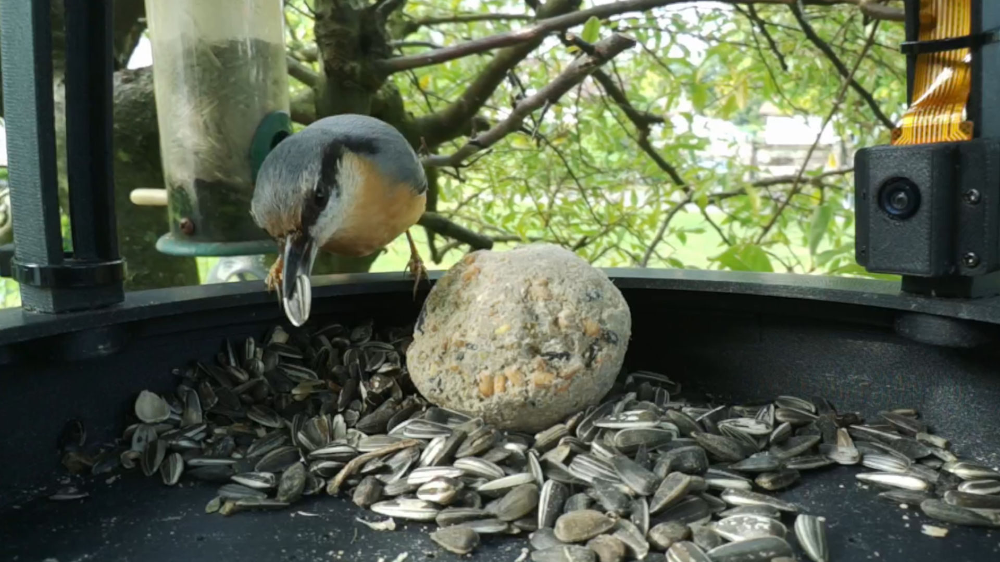
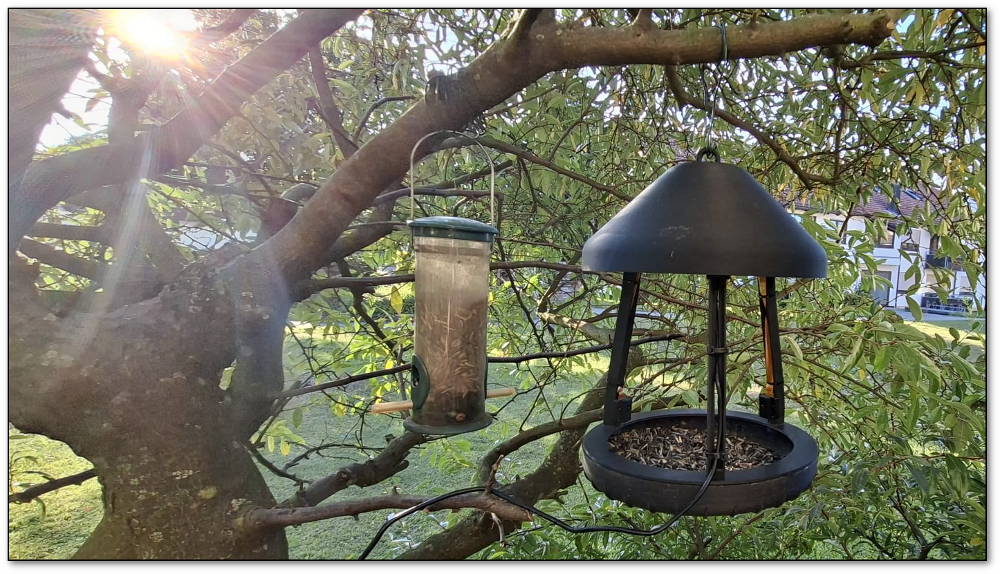
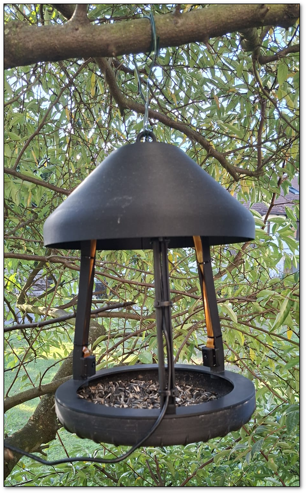
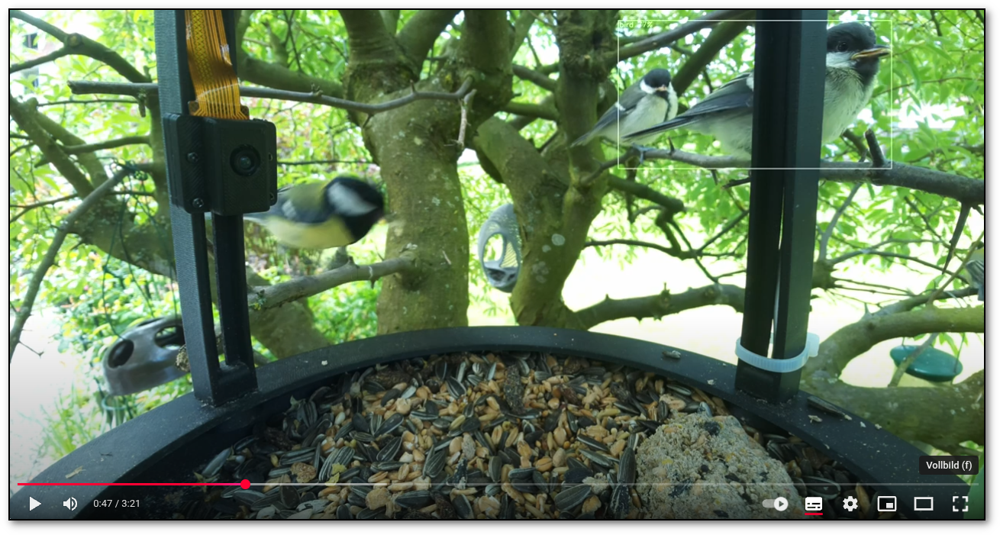

# 🐦 Vogel-Kamera-Linux

> 🌐 **Multi-Language Documentation:** This README is available in multiple languages!  



## Release v2.0.1 — Kurzüberblick

- Version: v2.0.1
- Highlights: Cinema 4K (4096x2160 @ 25fps), AI-HAD Audio-Modus, neue CLI-Modi (`normal`, `slowmo`, `4k`, `ai-had`), verbesserte SSH-Resilienz und automatische Video-Synchronisation nach Konvertierung.
- Wichtige Fixes: ISO-Wochenkorrektur, Pfad-Extraktion, automatische SSH-Wiederverbindung, Fix für `pipefail`-bedingte Skript-Beendigungen.

Vollständige Release-Notes: [`releases/RELEASE_NOTES_v2.0.1.md`](releases/RELEASE_NOTES_v2.0.1.md)

[](https://github.com/kamera-linux/vogel-kamera-linux/releases/tag/v2.0.0)
[-blue)](docs/TRIXIE-MIGRATION.md)
[](https://github.com/kamera-linux/vogel-kamera-linux/issues)
[](https://github.com/kamera-linux/vogel-kamera-linux/pulls)
[](LICENSE)

> ⚠️ **Raspberry Pi OS Trixie (Debian 13):** Diese Version ist für **Trixie** optimiert.  
> 📘 **Für Bookworm (Debian 12):** Verwenden Sie den [bookworm-legacy-Branch (v1.2.x)](https://github.com/kamera-linux/vogel-kamera-linux/tree/bookworm-legacy)  
> 📖 **Migration-Guide:** [TRIXIE-MIGRATION.md](docs/TRIXIE-MIGRATION.md)



**🐦 Professionelles Vogel-Beobachtungssystem mit KI-gestützter Objekterkennung**

`vogel-kamera-linux` ist ein **Open-Source-Projekt** zur ferngesteuerten Überwachung von Vogelhäusern mittels Raspberry Pi 5 Kamera. Das System kombiniert hochauflösende Video-/Audio-Aufnahmen mit **YOLOv8 KI-Erkennung** für automatische Vogelerkennung und -aufzeichnung.

### 🚀 Quickstart
```bash
# EMPFOHLEN: Unified Camera Monitor (direkt auf Raspberry Pi)
python3 raspberry-pi-scripts/unified-camera-monitor.py --slowmo

# Oder via Wrapper vom Client-PC
cd auto-start-kamera
./start-unified-monitoring.sh slowmo

# LEGACY: Alte Remote-Control Skripte (siehe legacy/README.md)
python legacy/ai-had-kamera-remote-param-vogel-libcamera-single-AI-Modul.py \
    --duration 5 --width 1920 --height 1080 --ai-modul on
```

> 📺 **Live-Demo:** [YouTube-Kanal](https://www.youtube.com/@vogel-kamera-linux) - Echte Aufnahmen vom vogel-kamera-linux System!

## 📖 Überblick

**vogel-kamera-linux** ist ein vollständiges Remote-Kamera-System für Naturbeobachtung, entwickelt für **Raspberry Pi 5** mit Python 3.11+. Das Projekt kombiniert moderne Kamera-Hardware (IMX708) mit fortgeschrittener KI-Objekterkennung (YOLOv8) für automatische Vogelerkennung.

**🎯 Hauptanwendung:** Ferngesteuerte Vogelhaus-Überwachung mit automatischer Aufnahme bei Vogel-Erkennung, inklusive HD-Video (bis 4K), Zeitlupe (120fps) und synchroner Audio-Aufzeichnung über USB-Mikrofon.

### 🎬 YouTube-Kanal & Beispielaufnahmen

[](https://www.youtube.com/@vogel-kamera-linux)

**Echte Aufnahmen vom vogel-kamera-linux System!** Sehen Sie die Kamera in Aktion mit Live-Vogelerkennung, Zeitlupen-Aufnahmen und 4K-Videos aus unserem Vogelhaus.

**📱 QR-Code für mobilen Zugriff:**


<!-- YOUTUBE_VIDEOS_START -->
**📺 Aktuelle Videos:**

| 🎬 Video | 📅 Datum | ⏱️ Dauer | 👁️ Views | 👍 Likes | 💬 Komm. |
|----------|----------|----------|----------|----------|---------|
| [**🐦 Vogel-Beobachtung mit KI: Meisen, Rotkehlchen un...**](https://www.youtube.com/watch?v=1Mrq4oIzckI) | 30.11.2025 | 2:38 | 132 | 1 | 2 |
| [**3 Vogelarten live am Futterhaus - KI erkennt Kohlm...**](https://www.youtube.com/watch?v=uZm4Ao9JHoo) | 24.11.2025 | 3:10 | 153 | 5 | 1 |
| [**🐦 Wunderschönes Rotkehlchen beim Fressen \| 4K Voge...**](https://www.youtube.com/watch?v=rWkWFUeVK0o) | 31.10.2025 | 1:58 | 56 | 5 | 0 |
| [**🐦 Blaumeise beim Fressen \| KI-Kamera 120fps Zeitlu...**](https://www.youtube.com/watch?v=ew3l12TSn5k) | 28.10.2025 | 2:25 | 86 | 8 | 0 |
| [**🐦 Sumpfmeise in Zeitlupe \| Futtersuche im Vogelhau...**](https://www.youtube.com/watch?v=dORu9qs8KSA) | 20.10.2025 | 2:46 | 47 | 6 | 1 |
| [**5 Vogelarten mit Aufnahme (120fps) \| Automatische ...**](https://www.youtube.com/watch?v=k3tS0oJX7YE) | 06.10.2025 | 3:24 | 61 | 6 | 5 |
| [**🤖 KI-gesteuerte Vogelkamera \| Automatische Erkennu...**](https://www.youtube.com/watch?v=5WeZb_YVe0s) | 02.10.2025 | 5:51 | 101 | 6 | 1 |
| [**Vogelhaus mit Kleiber  (Futtersuche in Zeitlupe)**](https://www.youtube.com/watch?v=QALijFTA_s8) | 29.09.2025 | 5:07 | 75 | 7 | 2 |
| [**Vogelhaus mit junge Haussperlinge**](https://www.youtube.com/watch?v=3na90KiJ-J8) | 06.06.2025 | 3:11 | 57 | 6 | 0 |
| [**Vogelhaus mit Kohlmeise  (Am Futterspender in Zeit...**](https://www.youtube.com/watch?v=kFXR03Lv0X0) | 30.05.2025 | 7:23 | 37 | 6 | 0 |
| [**Vogelhaus mit Kohlmeisen  (Fütterung Jungtiere mit...**](https://www.youtube.com/watch?v=sqvd99Pbubc) | 18.05.2025 | 3:22 | 46 | 6 | 1 |
| [**Vogelhaus mit Kohlmeise  (Fütterung Jungtier mit 2...**](https://www.youtube.com/watch?v=vXWDleJ-18Q) | 17.05.2025 | 2:44 | 21 | 6 | 0 |
| [**Vogelhaus mit Kernbeißer (2 Kameras)**](https://www.youtube.com/watch?v=dvCXPdMdNCg) | 27.04.2025 | 2:12 | 79 | 8 | 2 |
| [**Vogelhaus mit Kernbeißer und Blaumeise (Vogel-Paar...**](https://www.youtube.com/watch?v=61Szkcp9hcM) | 23.04.2025 | 2:59 | 56 | 6 | 2 |
| [**Vogelhaus mit Blaumeise, Kernbeißer und Kohlmeise ...**](https://www.youtube.com/watch?v=kElfd64dWrY) | 21.04.2025 | 4:16 | 109 | 7 | 0 |
| [**Vogelhaus mit Blaumeise, Haussperling und Kohlmeis...**](https://www.youtube.com/watch?v=hjrYji0A9Hs) | 18.04.2025 | 3:04 | 68 | 6 | 0 |
| [**Vogelhaus mit Blaumeise und Kohlmeise (Zeitlupe)**](https://www.youtube.com/watch?v=lshb68RrF_A) | 13.04.2025 | 5:11 | 79 | 7 | 0 |
| [**Vogelhaus mit Blaumeisen, Rotkehlchen, Kernbeißer ...**](https://www.youtube.com/watch?v=6-OFxA__GL8) | 10.04.2025 | 5:06 | 113 | 7 | 0 |
| [**Vogelhaus mit Kernbeißer, Blaumeise, Rotkehlchen, ...**](https://www.youtube.com/watch?v=MKb3yUKS_ww) | 09.04.2025 | 4:28 | 86 | 7 | 0 |
| [**Vogelhaus mit Blaumeise, Rotkehlchen, Haussperling...**](https://www.youtube.com/watch?v=K0FhU73F6jo) | 08.04.2025 | 5:17 | 105 | 7 | 0 |

*Automatisch aktualisiert: 25.01.2026 07:01 Uhr (Winterzeit (MEZ))*
<!-- YOUTUBE_VIDEOS_END -->

## ✨ Features

- 🎥 **Hochauflösende Videoaufnahme** (bis zu 4K)
- 🎵 **Synchrone Audioaufnahme** über USB-Mikrofon
- 🤖 **KI-Objekterkennung** mit YOLOv8 und eigenen Vogelarten-Modellen
- 🎯 **Auto-Trigger System** mit automatischer Vogelerkennung *(Neu in v1.2.0)*
- 📺 **Preview-Stream** (RTSP) für Live-Überwachung *(Neu in v1.2.0)*
- 🌐 **Netzwerk-Diagnostics** für Performance-Analyse *(Neu in v1.2.0)*
- 📊 **System-Monitoring** mit CPU-Load und Temperaturüberwachung *(Seit v1.1.9)*
- ⚡ **Performance-Optimierung** für verschiedene Aufnahmemodi *(Seit v1.1.9)*
- 🌐 **Remote-Steuerung** über SSH
- 📁 **Automatische Dateiorganisation** nach Jahr/Woche
- ⚙️ **Flexible Konfiguration** über .env-Dateien
- 📊 **Fortschrittsanzeige** während der Aufnahme
- 🔄 **Automatische Video-/Audio-Synchronisation**
- 📱 **YouTube-Integration** mit QR-Codes für mobile Nutzer
- 🔧 **Einfache Installation** mit config/requirements.txt
- ✅ **Automatische Konfigurationsvalidierung**
- 🎯 **Eigene AI-Modelle** trainierbar für spezifische Vogelarten

## 📸 Hardware-Galerie

**Modulare Kamera-Lösung:**

*Flexible Platzierung für optimale Aufnahmen*

**Live-Aufnahmen & Community:**
 
*Echte Vogelbeobachtungen auf YouTube*

> 💡 **3D-Konstruktions-Dateien verfügbar!** Alle CAD-Dateien für den Nachbau finden Sie im [`3d-konstruktion/`](3d-konstruktion/) Verzeichnis

## 🤖 KI-Objekterkennung & Vogelarten-AI

### Sofort verfügbar: Standard-Objekterkennung
```bash
# YOLOv8 mit allgemeiner Vogelerkennung
python3 ai-had-kamera-remote-param-vogel-libcamera-single-AI-Modul.py \
  --duration 5 --ai-modul on --ai-model yolov8
```

### 🔄 Automatisches bird-species Modell
```bash
# Bird-species Modell - wird automatisch erstellt falls nicht vorhanden
python3 ai-had-kamera-remote-param-vogel-libcamera-single-AI-Modul.py \
  --duration 5 --ai-modul on --ai-model bird-species
```
**Optimierungen:**
- ✅ Automatische Modellerstellung auf Remote-Host
- 🎯 Fokus nur auf Vogel-Klasse (COCO 14)
- ⚡ Niedrigere Schwelle (0.3) für bessere Sensitivität
- 🔄 Temporaler Filter für stabile Erkennungen

### Erweitert: Eigene Vogelarten-Modelle trainieren
Das System unterstützt das Training eigener AI-Modelle für spezifische Vogelarten:

🎯 **Häufige deutsche Gartenvögel**: Amsel, Blaumeise, Kohlmeise, Rotkehlchen, Buchfink...

#### 🚀 **Empfohlen: vogel-model-trainer Package**

[](https://pypi.org/project/vogel-model-trainer/)

**Professionelles Training-Tool für Vogelarten-KI-Modelle** - einfach installierbar via pip!

```bash
# Installation
pip install vogel-model-trainer

# Quick Start - Automatisiertes Training
vogel-trainer train --species blaumeise --video-dir ./videos --epochs 50

# Kompletter Workflow
vogel-trainer extract --video-dir ./videos --output-dir ./frames
vogel-trainer organize --frames-dir ./frames --output-dir ./dataset
vogel-trainer train --dataset-dir ./dataset --epochs 100
vogel-trainer test --model best.pt --test-dir ./test-images
```

**Vorteile:**
- ✅ Einfache Installation via pip
- 🚀 Automatisierte Workflows (Extract → Organize → Train → Test)
- 📊 Integrierte Evaluierung und Metriken
- 🎯 >90% Genauigkeit für lokale Vogelarten
- 🔄 Iteratives Training für kontinuierliche Verbesserung

📦 **Repository**: [vogel-model-trainer](https://github.com/kamera-linux/vogel-model-trainer)

#### 🤖 **Vortrainierte Vogelarten-Modelle**

**Empfohlene Hugging Face Modelle für deutsche Vogelarten:**

🔗 **[kamera-linux/german-bird-classifier-v2](https://huggingface.co/kamera-linux/german-bird-classifier-v2)** ⭐ **Empfohlen**
- Neueste Version mit verbesserter Genauigkeit
- Trainiert auf 8 häufigen deutschen Vogelarten
- Optimiert für Vogelfütterungen

🔗 **[kamera-linux/german-bird-classifier](https://huggingface.co/kamera-linux/german-bird-classifier)** (v1, Legacy)
- Erste Version des Modells
- Weiterhin funktional, aber v2 wird empfohlen

```bash
# Verwendung mit vogel-model-trainer
vogel-trainer classify --species-model kamera-linux/german-bird-classifier-v2 ~/images/

# Verwendung mit vogel-video-analyzer
pip install vogel-video-analyzer
vogel-analyze --identify-species --species-model kamera-linux/german-bird-classifier-v2 video.mp4
```

Mehr Informationen: [`docs/AI-MODELLE-VOGELARTEN.md`](docs/AI-MODELLE-VOGELARTEN.md)

#### 📋 **Alternative: Lokale Training-Tools (Legacy)**

📋 **Manuelle Anleitung**: [`docs/ANLEITUNG-EIGENES-AI-MODELL.md`](docs/ANLEITUNG-EIGENES-AI-MODELL.md)

🛠️ **Basis-Tools**: [`ai-training-tools/`](ai-training-tools/) - Legacy Training-Scripts für fortgeschrittene Nutzer

#### 🎯 **Eigenes Modell verwenden**

```bash
# Eigenes Modell verwenden
python3 ai-had-kamera-remote-param-vogel-libcamera-single-AI-Modul.py \
  --duration 5 --ai-modul on --ai-model custom \
  --ai-model-path /pfad/zu/eigenem/modell.json
```

## 🛠️ Voraussetzungen

### Hardware
- Raspberry Pi 5 mit Kamera-Modul (empfohlen: IMX708 Wide)
- USB-Mikrofon für Audioaufnahme
- Stabile Netzwerkverbindung (Gigabit LAN empfohlen)

### Software (Raspberry Pi)
- **Raspberry Pi OS Trixie (Debian 13)** - für diese Version ERFORDERLICH
- Python 3.13+
- rpicam-apps v1.9.1+
- FFmpeg 7.1.2+
- SSH-Zugang konfiguriert

> ⚠️ **Trixie-spezifisch:** Diese Version nutzt TCP Watchdog für Preview-Stream (FFmpeg 7.1.2 kompatibel)  
> 📘 **Bookworm-Nutzer:** Verwenden Sie [bookworm-legacy-Branch (v1.2.x)](https://github.com/kamera-linux/vogel-kamera-linux/tree/bookworm-legacy)

### Software (Client-PC)
- Python 3.8+
- SSH-Client
- Virtuelle Umgebung (empfohlen)

### Python-Abhängigkeiten

**Empfohlen: Virtuelle Umgebung verwenden**
```bash

# Virtuelle Umgebung erstellen
python3 -m venv venv

# Virtuelle Umgebung aktivieren
source venv/bin/activate  # Linux/macOS
# oder: venv\Scripts\activate  # Windows

# Abhängigkeiten installieren
pip install -r config/requirements.txt
```

**Oder manuell:**
```bash
pip install paramiko scp tqdm python-dotenv qrcode[pil]
```

> 💡 **Hinweis:** Die Verwendung einer virtuellen Umgebung (`venv`) wird empfohlen, um Konflikte mit anderen Python-Projekten zu vermeiden.

### Konfiguration laden
Die Skripte laden automatisch Konfigurationsdaten aus der `.env`-Datei:
```bash
# 1. Kopieren Sie die Beispiel-Konfiguration
cp python-skripte/.env.example python-skripte/.env

# 2. Bearbeiten Sie die .env-Datei mit Ihren Daten  
nano python-skripte/.env

# 3. Testen Sie die Konfiguration
python python-skripte/config.py
```

## 📂 Projektstruktur

```
vogel-kamera-linux/
├── README.md                                                     # Hauptdokumentation
├── LICENSE                                                       # MIT Lizenz
├── .gitignore                                                    # Git-Ignore-Regeln
├── config/                                                       # 🔧 Konfigurationsdateien
│   └── requirements.txt                                          # Python-Abhängigkeiten
├── scripts/                                                      # 🔧 Build/Deploy-Skripte  
│   ├── version.py                                               # Zentrale Versionsverwaltung
│   ├── release_workflow.py                                     # Release-Automatisierung
│   └── update_version.py                                       # Versions-Update-Skript
├── docs/                                                         # 📚 Dokumentation
│   ├── CHANGELOG.md                                             # Versionshistorie (v2.0.0)
│   ├── ARCHITEKTUR.md                                           # 🏗️ Systemarchitektur mit Mermaid-Diagrammen *(v1.2.0)*
│   ├── PROJEKT-REORGANISATION.md                                # Projekt-Reorganisations-Dokumentation
│   ├── TRIXIE-MIGRATION.md                                      # Trixie Migration Guide
│   ├── SECURITY.md                                              # Sicherheitsrichtlinien
│   ├── DOKUMENTATION-UEBERSICHT.md                              # Dokumentations-Index
│   ├── AI-MODELLE-VOGELARTEN.md                                 # AI-Modell-Dokumentation
│   ├── ANLEITUNG-EIGENES-AI-MODELL.md                          # AI-Training-Anleitung
│   ├── i18n/                                                    # 🌐 Multilingual Documentation *(v2.0)*
│   │   ├── README.md                                            # 🇬🇧 English Documentation
│   │   ├── README.de.md                                         # 🇩🇪 Deutsche Dokumentation
│   │   └── README.ja.md                                         # 🇯🇵 日本語ドキュメント
│   └── legacy/                                                  # 📦 Archivierte Dokumente *(v2.0)*
│       ├── README.md                                            # Legacy-Docs Migration Guide
│       ├── AUTO-TRIGGER-PERFORMANCE-OPTIMIZATION.md             # Obsolet (in README integriert)
│       ├── AUTO-TRIGGER-STREAM-RESTART.md                       # Obsolet (Unified System)
│       ├── FIX-API-KEY-ZUGRIFF.md                               # Obsolet
│       ├── FIX-PREVIEW-STREAM-RESTART.md                        # Obsolet
│       ├── PARAMETER-NO-STREAM-RESTART.md                       # Obsolet
│       ├── README-IMPROVEMENTS.md                               # Obsolet (implementiert)
│       ├── SYSTEM-READY.md                                      # Obsolet
│       ├── UNIFIED-MONITORING-SYSTEM.md                         # In README integriert
│       └── INSTALLATION-TRIXIE.md                               # In TRIXIE-MIGRATION.md
├── python-toolbox/                                             # 🐍 Python Packages & Tools *(v1.3.2)*
│   ├── vogel-video-analyzer/                                   # Video-Analyse-Tool (Git Submodule)
│   ├── requirements.txt                                         # Python-Dependencies
│   └── README.md                                                # Python-Toolbox Dokumentation
├── tools/                                                        # 🛠️ Test & Entwicklungstools
│   ├── check_emojis.py                                          # Emoji-Validator für Markdown
│   ├── automation_test.txt                                      # Automatisierungs-Tests
│   ├── test_ai_features.py                                      # AI-Feature Tests
│   └── README.md                                                # Tools-Dokumentation
├── auto-start-kamera/                                           # 🚀 Auto-Start Skripte *(v2.0)*
│   ├── start-unified-monitoring.sh                              # Remote-Wrapper für Unified Monitor
│   ├── remote-unified-control.sh                                # Remote Control Tool
│   └── README.md                                                # Auto-Start Dokumentation
├── raspberry-pi-scripts/                                        # 🍓 Raspberry Pi Skripte *(v2.0)*
│   ├── unified-camera-monitor.py                                # ⭐ HAUPT-SYSTEM: Vereinheitlichter Kamera-Monitor
│   ├── start-unified-monitor.sh                                 # Lokaler Start-Wrapper
│   ├── setup-unified-monitor.sh                                 # Installation & Setup
│   ├── UNIFIED-MONITOR-README.md                                # Unified Monitor Dokumentation
│   └── requirements-pi.txt                                      # Python-Dependencies für Raspberry Pi
├── releases/                                                     # 📋 Release-Dokumentation
│   ├── README.md                                                # Release-Übersicht
│   ├── RELEASE_NOTES_v1.2.0.md                                  # Aktuelle Release Notes *(v1.2.0)*
│   └── vX.X.X/                                                  # Versionierte Release-Archive
│       └── RELEASE_NOTES_vX.X.X.md                              # Archivierte Release-Notes
├── assets/                                                       # 📸 QR-Codes & Medien
│   ├── qr-youtube-channel.png                                   # YouTube-Kanal QR-Code
│   ├── qr-playlists.png                                         # Playlists QR-Code  
│   ├── qr-subscribe.png                                         # Abonnieren QR-Code
│   ├── generate_qr_codes.py                                     # QR-Code Generator
│   └── QR-CODE-ANLEITUNG.md                                     # QR-Code Dokumentation
├── git-automation/                                              # 🔐 Git-Automatisierung
│   ├── git_automation.py                                        # Sichere Git-Operationen mit AES-256
│   ├── setup_ssh_credentials.py                                 # SSH-Credentials Setup
│   ├── test_*.py                                                # Umfassende Test-Suite
│   ├── .git_secrets_encrypted.json                             # Verschlüsselte SSH-Secrets
│   └── README.md                                                # Git-Automation Dokumentation
├── wiki-sync/                                                   # 📚 Wiki-Synchronisation
│   ├── wiki_sync.py                                            # Automatische Wiki-GitHub-Sync
│   └── README.md                                                # Wiki-Sync Dokumentation
├── legacy/                                                      # 📦 Archivierte Skripte & Docs *(v2.0)*
│   ├── README.md                                                # Legacy Migration Guide
│   ├── kamera-auto-trigger/                                     # 🎯 Altes Auto-Trigger System (v1.2.0)
│   │   ├── start-vogel-beobachtung.sh                          # Interaktiver Wrapper (obsolet)
│   │   ├── scripts/ai-had-kamera-auto-trigger.py               # Auto-Trigger mit Legacy-Skripten (obsolet)
│   │   ├── docs/                                                # Auto-Trigger Dokumentation
│   │   └── README.md                                            # Auto-Trigger Dokumentation
│   ├── network-tools/                                           # 🌐 Netzwerk-Diagnose (v1.2.0, obsolet)
│   │   ├── test-network-quality.py                             # TCP-Stream-Diagnostik (obsolet)
│   │   └── README.md                                            # Network-Tools Dokumentation
│   ├── raspberry-pi-scripts/                                    # 🍓 Alte Stream-Skripte (v1.2.0, obsolet)
│   │   ├── start-preview-stream.sh                             # Preview-Stream (obsolet)
│   │   ├── start-preview-stream-v2.sh                          # Preview-Stream v2 (obsolet)
│   │   ├── start-preview-stream-watchdog.sh                    # Stream-Watchdog (obsolet)
│   │   ├── start-rtsp-stream.sh                                # RTSP-Stream (obsolet)
│   │   ├── start-tcp-preview-stream.sh                         # TCP-Stream (obsolet)
│   │   ├── start-tcp-preview-watchdog.sh                       # TCP-Watchdog (obsolet)
│   │   └── audio-monitor.sh                                     # Audio-Monitor (obsolet)
│   ├── ai-had-audio-remote-param-vogel-libcamera-single.py     # Audio-Aufnahme (veraltet)
│   ├── ai-had-kamera-remote-param-vogel-libcamera-single-AI-Modul.py  # Video+AI (veraltet)
│   ├── ai-had-kamera-remote-param-vogel-libcamera-zeitlupe.py  # Zeitlupe (veraltet)
│   ├── config.py                                                # Config-System (veraltet)
│   └── .env.example                                             # Env-Template (veraltet)
├── 3d-konstruktion/                                            # 🔧 3D-Konstruktions-Dateien
│   ├── README.md                                                # 3D-Konstruktions-Dokumentation
│   └── YYYY-MM-DD/                                             # Versionierte Konstruktions-Ordner
│       ├── README.md                                            # Version-spezifische Dokumentation
│       └── stp-dateien/                                        # STEP-Konstruktionsdateien (*.stp)
│           └── *.stp                                           # 3D-CAD Dateien für Hardware
├── veranstaltungen/                                             # 🎤 Event-Management
│   ├── README.md                                                # Event-Übersicht
│   └── YYYY-MM-DD-eventname/                                   # Event-spezifische Ordner
│       ├── README.md                                            # Event-Details
│       ├── slides/                                              # Präsentationsmaterialien
│       │   ├── README.md                                        # Slide-Dokumentation
│       │   └── *.pdf/*.pptx                                    # Präsentationsdateien
│       └── resources/                                           # Event-Ressourcen
│           ├── README.md                                        # Resource-Dokumentation
│           ├── generate_qr_codes.py                            # Event-QR-Codes
│           └── *.png                                           # QR-Code Bilder
└── python-skripte/                                             # 🐍 Haupt-Python-Module
    ├── __version__.py                                           # Modul-Versionsverwaltung
    ├── check_ai_models.py                                       # 🔍 AI-Modell-Validierung
    ├── quick_system_check.py                                    # ⚡ Schnelle System-Checks *(v1.1.9)*
    ├── remote_system_monitor.py                                 # 📊 Umfassendes System-Monitoring *(v1.1.9)*
    └── .env                                                     # Lokale Konfiguration (nicht im Git)
```

## 🚀 Schnellstart

### 1. Installation
```bash
# Repository klonen
git clone https://github.com/kamera-linux/vogel-kamera-linux.git
cd vogel-kamera-linux

# Virtuelle Umgebung erstellen (empfohlen)
python3 -m venv venv
source venv/bin/activate

# Abhängigkeiten installieren
pip install -r config/requirements.txt
```

### 2. Raspberry Pi Setup (Trixie)
```bash
# Auf Raspberry Pi - Python-Pakete installieren (apt, nicht pip!)
sudo apt-get update
sudo apt-get install -y python3-scp python3-paramiko python3-opencv python3-numpy

# Kamera-Tools prüfen
rpicam-hello --version  # Sollte v1.9.1+ sein
ffmpeg -version         # Sollte 7.1.2+ sein

# SSH-Zugang konfigurieren
ssh-keygen -t rsa -b 4096 -f ~/.ssh/id_rsa_rpi
# Öffentlichen Schlüssel auf Raspberry Pi kopieren
```

### 3. Client-PC Konfiguration
```bash
# Konfiguration kopieren und anpassen
cp python-skripte/.env.example python-skripte/.env
nano python-skripte/.env

# Konfiguration testen
python python-skripte/config.py
```

### 4. Erste Aufnahme
```bash
# Audio-Test (1 Minute)
python python-skripte/ai-had-audio-remote-param-vogel-libcamera-single.py --duration 1

# Video mit KI (1 Minute, HD)
python python-skripte/ai-had-kamera-remote-param-vogel-libcamera-single-AI-Modul.py --duration 1 --width 1920 --height 1080 --ai-modul on --no-stream-restart
```

### 5. Version prüfen
```bash
### 5. Version prüfen
```bash
python raspberry-pi-scripts/unified-camera-monitor.py --version
# Ausgabe: Vogel-Kamera-Linux v2.0.0
```

## 🎯 Unified Camera Monitor System (v2.0)

**NEU!** Vereinheitlichter Kamera-Prozess ohne SSH-Overhead - läuft direkt auf dem Raspberry Pi.

### ✨ Vorteile
- ✅ **Keine Kamera-Konflikte** - Ein einziger Prozess für alles
- ✅ **Schnellere Reaktion** - Kein SSH/Netzwerk-Latenz
- ✅ **Einfachere Bedienung** - CLI-Parameter statt .env-Dateien
- ✅ **Live-Monitoring** - Heartbeat alle 30s, Status alle 5min mit Traffic Lights
- ✅ **Auto-Shutdown** - Bei kritischer Temperatur (>75°C)

### 📦 Installation auf Raspberry Pi

```bash
# 1. Python-Pakete installieren (WICHTIG: Mit apt, nicht pip!)
sudo apt-get update
sudo apt-get install -y \
    python3-picamera2 \
    python3-opencv \
    python3-numpy \
    python3-libcamera

# 2. YOLOv8 installieren (via pip ist hier ok)
pip install ultralytics --break-system-packages

# 3. Repository klonen
cd ~
git clone https://github.com/kamera-linux/vogel-kamera-linux.git
cd vogel-kamera-linux

# 4. Skript ausführbar machen
chmod +x raspberry-pi-scripts/unified-camera-monitor.py
```

### 🚀 Verwendung

```bash
# Standard-Modus (4K @ 30fps, 60s Aufnahmen)
python3 raspberry-pi-scripts/unified-camera-monitor.py

# Zeitlupen-Modus (1536x864 @ 120fps)
python3 raspberry-pi-scripts/unified-camera-monitor.py --slowmo

# Custom Konfiguration
python3 raspberry-pi-scripts/unified-camera-monitor.py \
    --threshold 0.3 \
    --cooldown 10 \
    --recording-duration 120 \
    --recording-width 1920 \
    --recording-height 1080 \
    --recording-fps 60

# Mit Wrapper vom Client-PC starten
cd auto-start-kamera
./start-unified-monitoring.sh         # Standard
./start-unified-monitoring.sh slowmo  # Zeitlupe
```

### ⚙️ Verfügbare Parameter

| Parameter | Beschreibung | Standard | Beispiel |
|-----------|--------------|----------|----------|
| `--camera` | Kamera-Nummer | 0 | `--camera 1` |
| `--threshold` | AI-Erkennungs-Schwelle | 0.4 | `--threshold 0.3` |
| `--cooldown` | Cooldown zwischen Aufnahmen (s) | 15 | `--cooldown 10` |
| `--trigger-duration` | Mindest-Dauer für Trigger (s) | 1.0 | `--trigger-duration 0.5` |
| `--video-path` | Basis-Pfad für Videos | `/home/roimme/Videos/Vogelhaus` | `--video-path /mnt/nas/birds` |
| `--model` | Pfad zum YOLO-Model | yolov8n.pt | `--model custom.pt` |
| `--preview-fps` | Preview FPS | 6 | `--preview-fps 10` |
| `--recording-width` | Aufnahme-Breite (px) | 4096 | `--recording-width 1920` |
| `--recording-height` | Aufnahme-Höhe (px) | 2160 | `--recording-height 1080` |
| `--recording-fps` | Aufnahme-FPS | 30 | `--recording-fps 60` |
| `--recording-duration` | Aufnahme-Dauer (s) | 60 | `--recording-duration 120` |
| `--slowmo` | Zeitlupen-Modus aktivieren | - | `--slowmo` |
| `--debug` | Debug-Modus aktivieren | - | `--debug` |

### 📊 Live-Monitoring Ausgabe

```
======================================================================
🐦 UNIFIED CAMERA MONITOR - Vogel-Kamera-Linux
======================================================================

======================================================================
📊 INITIALER STATUS-REPORT
======================================================================

2025-11-11 19:27:14 - INFO - [✓] Monitor aktiv - 354 Frames verarbeitet
2025-11-11 19:29:12 - INFO - Status: 0h 5min | Aufnahmen: 0 | Frames: 584 | Temp: 🟢51.0°C | Load: 🟡1.72 | RAM: 🟢7% | Disk: 🟢215.3GB
2025-11-11 19:34:12 - INFO - Status: 0h 10min | Aufnahmen: 1 | Frames: 1184 | Temp: 🟢52.0°C | Load: 🟢0.98 | RAM: 🟢8% | Disk: 🟢215.2GB
```

**Traffic Light Thresholds:**
- **Temperatur:** 🟢 <55°C | 🟡 55-65°C | 🔴 >65°C | ⛔ STOP >75°C
- **CPU Load:** 🟢 <1.0 | 🟡 1.0-2.0 | 🔴 >2.0
- **RAM:** 🟢 <75% | 🟡 75-90% | 🔴 >90%
- **Disk:** 🟢 <90% | 🟡 90-95% | 🔴 >95%

### 📁 Ausgabe-Struktur

```
/home/roimme/Videos/Vogelhaus/
└── 2025-11-11_19-30-45_bird_0.45.h264
```

### 🚀 Remote-Start vom Client-PC

```bash
# Standard-Modus
cd auto-start-kamera
./start-unified-monitoring.sh

# Zeitlupen-Modus
./start-unified-monitoring.sh slowmo

# Custom Parameter
ssh user@raspberry-pi "cd vogel-kamera-linux && python3 raspberry-pi-scripts/unified-camera-monitor.py --threshold 0.3 --cooldown 10"
```

---

## 📝 Legacy: Remote-Control Scripts

> ⚠️ **Diese Skripte sind veraltet!** Verwenden Sie stattdessen das **Unified Camera Monitor System** (siehe oben).
> 
> Die alten Skripte wurden nach `legacy/` verschoben. Details: [`legacy/README.md`](legacy/README.md)

### Basis-Aufnahme (ohne KI) - LEGACY
```bash
python ai-had-kamera-remote-param-vogel-libcamera-single-AI-Modul.py \
    --duration 5 \
    --width 1920 \
    --height 1080 \
    --no-stream-restart  # Empfohlen für On-Demand Aufnahmen
```

### Mit KI-Objekterkennung
```bash
python ai-had-kamera-remote-param-vogel-libcamera-single-AI-Modul.py \
    --duration 5 \
    --width 1920 \
    --height 1080 \
    --ai-modul on \
    --no-stream-restart  # Empfohlen für On-Demand Aufnahmen
```

### Erweiterte Konfiguration
```bash
python ai-had-kamera-remote-param-vogel-libcamera-single-AI-Modul.py \
    --duration 10 \
    --width 4096 \
    --height 2160 \
    --codec h264 \
    --autofocus_mode continuous \
    --rotation 180 \
    --fps 30 \
    --cam 0 \
    --ai-modul on \
    --no-stream-restart  # Empfohlen für On-Demand Aufnahmen
```

### Parameter-Übersicht

| Parameter | Beschreibung | Standard | Optionen |
|-----------|--------------|----------|----------|
| `--duration` | Aufnahmedauer in Minuten | **erforderlich** | 1-∞ |
| `--width` | Video-Breite | 4096 | 640-4096 |
| `--height` | Video-Höhe | 2160 | 480-2160 |
| `--codec` | Video-Codec | h264 | h264, h265 |
| `--autofocus_mode` | Autofokus-Modus | continuous | continuous, manual |
| `--autofocus_range` | Autofokus-Bereich | macro | macro, full |
| `--hdr` | HDR-Modus | off | auto, off |
| `--rotation` | Bildrotation | 180 | 0, 90, 180, 270 |
| `--fps` | Bildrate | 15 | 1-60 |
| `--cam` | Kamera-ID | 0 | 0, 1 |
| `--ai-modul` | KI-Objekterkennung | off | on, off |
| `--ai-model` | AI-Modell auswählen *(v1.1.8)* | yolov8 | yolov8, bird-species, custom |
| `--ai-model-path` | Pfad zu eigenem AI-Modell *(v1.1.8)* | - | Dateipfad zu .json |
| `--roi` | Region of Interest | - | x,y,w,h |
| `--system-status` | Nur System-Status anzeigen *(v1.1.9)* | - | Flag ohne Wert |
| `--no-stream-restart` | Preview-Stream nicht neu starten *(v1.2.0)* | - | Flag ohne Wert |

## 🔐 Git-Automatisierung

Das Projekt bietet jetzt eine **sichere Git-Automatisierung** für entwickelnde Beitragende:

### ✨ Features
- **🔑 Verschlüsselte SSH-Credentials:** AES-256-CBC mit Master-Password
- **🚀 Automatischer SSH-Agent:** Keine manuelle Passphrase-Eingabe
- **🛡️ Sichere Speicherung:** PBKDF2 Key-Derivation mit 100.000 Iterationen
- **🧪 Umfassende Tests:** Automatisierte Validierung aller Komponenten

### 🚀 Schnellstart Git-Automation
```bash
cd git-automation/

# Abhängigkeiten installieren
pip install -r git_automation_requirements.txt

# SSH-Credentials einrichten (einmalig)
python3 setup_ssh_credentials.py

# System testen
python3 test_full_automation.py
```

### 💻 Verwendung
```python
import sys
sys.path.append('git-automation/')
from git_automation import SecureGitAutomation

# Automatisierte Git-Operationen
automation = SecureGitAutomation()
automation.run_command("git add .")
automation.run_command('git commit -m "Automatischer Commit"')
automation.run_command("git push")
```

> 📚 **Vollständige Dokumentation:** [`git-automation/README.md`](git-automation/README.md)

## ⚙️ SSH-Konfiguration

### 1. Umgebungsvariablen konfigurieren
```bash
# Kopieren Sie die Beispiel-Konfiguration
cp python-skripte/.env.example python-skripte/.env

# Bearbeiten Sie die .env-Datei mit Ihren Daten
nano python-skripte/.env
```

Beispiel `.env`-Datei:
```bash
RPI_HOSTNAME=your-raspberry-pi-hostname
RPI_USERNAME=pi
SSH_KEY_PATH=~/.ssh/id_rsa_rpi
BASE_VIDEO_PATH=~/Videos/Vogelhaus
REMOTE_VIDEO_PATH=/home/pi/Videos/Vogelhaus
REMOTE_AUDIO_PATH=/home/pi/Audio/Vogel-Kamera
```

> 📺 **Beispielaufnahmen:** [Vogel-Kamera Setup](https://www.youtube.com/@vogel-kamera-linux) - Siehe die Kamera in Aktion

### 2. **SSH-Schlüssel generieren** (falls noch nicht vorhanden):
```bash
ssh-keygen -t rsa -b 4096 -f ~/.ssh/id_rsa_rpi
```

### 3. **Öffentlichen Schlüssel auf Raspberry Pi kopieren**:
```bash
ssh-copy-id -i ~/.ssh/id_rsa_rpi.pub pi@your-raspberry-pi-hostname
```

### 4. **Hostname in /etc/hosts eintragen** (optional):
```bash
echo "192.168.1.XXX your-raspberry-pi-hostname" | sudo tee -a /etc/hosts
```

## 📁 Dateiorganisation

Die aufgenommenen Videos werden automatisch organisiert:
```
~/Videos/Vogelhaus/
├── AI-HAD/        # Hauptskript mit KI-Erkennung
├── Audio/         # Reine Audio-Aufnahmen  
└── Zeitlupe/      # Slow-Motion Videos
    └── 2025/
        └── 38/  # Kalenderwoche
            └── Montag__2025-09-23__14-30-15/
                └── Montag__2025-09-23__14-30-15__4096x2160.mp4
```

## 🤖 KI-Objekterkennung

Das Hauptskript nutzt YOLOv8 für die Echtzeit-Objekterkennung:
- **Automatische Vogelerkennung** während der Aufnahme
- **Optimierte Inferenz** auf Raspberry Pi 5
- **Konfigurierbare Erkennungsparameter**

## 🔧 Problembehandlung

### Konfigurationsprobleme
```bash
# Konfiguration überprüfen
python python-skripte/config.py

# Fehlermeldung: "Hostname nicht konfiguriert"
# → Bearbeiten Sie python-skripte/.env mit Ihren Werten
```

### Audio-Gerät nicht gefunden
```bash
# Auf dem Raspberry Pi prüfen:
arecord -l
```

### SSH-Verbindungsprobleme
```bash
# Verbindung testen:
ssh -i ~/.ssh/id_rsa_rpi pi@your-raspberry-pi-hostname

# Konfiguration validieren:
python python-skripte/config.py

# .env-Datei überprüfen:
cat python-skripte/.env
```

### Dependency-Probleme
```bash
# Alle Abhängigkeiten neu installieren
pip install -r config/requirements.txt

# Einzelne Pakete installieren  
pip install paramiko scp tqdm python-dotenv qrcode[pil]
```

### Kamera-Probleme
```bash
# Kamera-Status prüfen:
rpicam-hello --list-cameras
```

## 📄 Lizenz

Siehe [LICENSE](LICENSE) Datei für Details.

## 🤝 Beitragen

1. Fork des Repositories
2. Feature-Branch erstellen
3. Änderungen commiten
4. Pull Request erstellen

## 👥 Community & Diskussionen

[](https://github.com/kamera-linux/vogel-kamera-linux/discussions)

Tauschen Sie sich mit anderen Nutzern aus:
- 🙋 **Fragen stellen** zu Installation und Konfiguration  
- 💡 **Ideen teilen** für neue Features
- 📸 **Aufnahmen zeigen** aus Ihrem Vogelhaus
- 🔧 **Hardware-Tipps** diskutieren

## 📞 Support

Bei Fragen oder Problemen:
- 💬 **Diskussionen starten** in [GitHub Discussions](https://github.com/kamera-linux/vogel-kamera-linux/discussions)
- 🐛 **Bugs melden** über [GitHub Issues](https://github.com/kamera-linux/vogel-kamera-linux/issues)

## 📚 Dokumentation

### Hauptdokumentation
- **[docs/CHANGELOG.md](docs/CHANGELOG.md)** - Vollständige Versionshistorie mit allen Änderungen
- **[docs/ARCHITEKTUR.md](docs/ARCHITEKTUR.md)** - 🏗️ **NEU in v1.2.0!** Detaillierte Systemarchitektur mit Mermaid-Diagrammen
  - Kommunikationsflüsse (PC ↔ Raspberry Pi)
  - CPU-Optimierungs-Visualisierung (107% → 40%)
  - Video- und Audio-Pipeline-Diagramme
  - Erkennungs-Workflow und Fehlerbehandlung
- **[docs/PROJEKT-REORGANISATION.md](docs/PROJEKT-REORGANISATION.md)** - Projekt-Reorganisations-Historie

### Auto-Trigger System *(v1.2.0)*
- **[kamera-auto-trigger/README.md](kamera-auto-trigger/README.md)** - Hauptdokumentation Auto-Trigger
- **[kamera-auto-trigger/docs/QUICKSTART-AUTO-TRIGGER.md](kamera-auto-trigger/docs/QUICKSTART-AUTO-TRIGGER.md)** - 3-Minuten Quick-Start
- **[kamera-auto-trigger/docs/AUTO-TRIGGER-DOKUMENTATION.md](kamera-auto-trigger/docs/AUTO-TRIGGER-DOKUMENTATION.md)** - Vollständige Feature-Dokumentation
- **[kamera-auto-trigger/docs/AUTO-TRIGGER-OVERVIEW.md](kamera-auto-trigger/docs/AUTO-TRIGGER-OVERVIEW.md)** - System-Überblick

### AI & Training
- **[docs/AI-MODELLE-VOGELARTEN.md](docs/AI-MODELLE-VOGELARTEN.md)** - AI-Modell-Dokumentation
- **[docs/ANLEITUNG-EIGENES-AI-MODELL.md](docs/ANLEITUNG-EIGENES-AI-MODELL.md)** - Training eigener Modelle

### Sicherheit & Entwicklung
- **[docs/SECURITY.md](docs/SECURITY.md)** - Sicherheitsrichtlinien
- **[git-automation/README.md](git-automation/README.md)** - Git-Automation Dokumentation (v1.2.0)

## 📋 Changelog

Alle Änderungen werden in **[docs/CHANGELOG.md](docs/CHANGELOG.md)** dokumentiert.

### 🆕 Neu in v1.3.1 (05. November 2025)
- 🎬 **Live-Progressbar:** Custom single-line Progressbar während Aufnahmen
- 🔧 **TCP Watchdog Hardening:** Robuste Fehlerbehandlung, Auto-Restart mit 5s Delay
- ⚡ **Optimierte Parameter:** 1.5s Trigger-Duration, 60% Konsistenz, 8 FPS
- 🐛 **Cleanup-Verbesserungen:** SIGTERM → SIGKILL Cascade, sauberes Beenden
- 📊 **Frame-Count-Debugging:** Detaillierte Trigger-Informationen mit Frame-Statistik
- 🐍 **Python Unbuffered Mode:** Echtzeit-Debug-Output mit `-u` Flag

### 📡 Trixie Support in v1.3.0 (01. November 2025)
- 📡 **TCP Watchdog System:** Robuste Preview-Stream-Verwaltung (FFmpeg 7.1.2 kompatibel)
- 🎯 **On-Demand Stream-Modus:** Dual-Kamera-Betrieb ohne Konflikte
- 🐍 **PEP 668 Compliance:** Python-Pakete via apt statt pip

### 📊 System-Monitoring in v1.1.9 (30. September 2025)
- System-Überwachung: CPU-Load, Temperatur und Speicher-Checks
- Performance-Optimierung für alle Aufnahmemodi
- Bereitschaftschecks vor Aufnahmestart

### 🎯 Hochpräzise Modelle in v1.1.8
- 🤖 **Automatische bird-species Modelle:** Dynamische Erstellung optimierter AI-Modelle
- 🔧 **3D-Konstruktions-System:** Vollständige CAD-Dateien für Hardware-Nachbau  
- 📚 **Wiki-Integration:** Umfassende Dokumentation mit Sidebar-Navigation
- 📊 **Version-Tracking:** Programmatische Versionsinformationen (version.py)
- 📋 **Release-Dokumentation:** Vollständige Release Notes und CHANGELOG-Updates

### 🎬 Neu in v1.1.0
- YouTube-Integration mit QR-Codes
- Zentrales Konfigurationssystem  
- Sicherheitsverbesserungen (keine hardcodierten Daten)

## 🔖 Versionen

- **Aktuelle Version:** v1.3.1
- **Branch:** `main` (Trixie)
- **Legacy Branch:** `bookworm-legacy` (v1.2.x für Debian 12)
- **Alle Releases:** [GitHub Releases](../../releases) | [Tags](../../tags)
