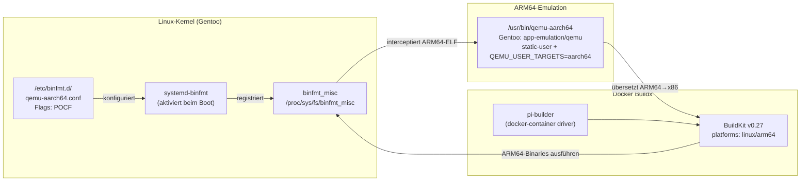
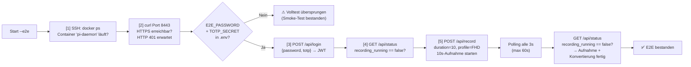
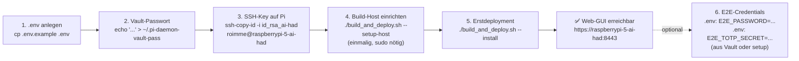

# Ansible – Deployment für Vogel-Kamera

Automatisiert das Deployment des `pi-daemon`-Containers auf den Raspberry Pi 5 sowie die
Einrichtung des lokalen Gentoo-Build-Rechners für ARM64-Cross-Builds.

---

## Systemübersicht

```mermaid
graph LR
    subgraph Build["🖥  Build-Host (Gentoo x86_64)"]
        BDS[build_and_deploy.sh]
        BX["docker buildx\nplatform: linux/arm64"]
        QE["QEMU aarch64\nbinfmt_misc POCF"]
        IMG["vogel-pi:latest\nARM64-Image"]
        BDS --> BX
        BX -->|emuliert via| QE
        BX --> IMG
    end

    subgraph Transfer["📦  Übertragung"]
        GZ["docker save | gzip\n/tmp/vogel-pi.tar.gz"]
        SCP["SCP → Pi /tmp/"]
        ANS["ansible-playbook\nupdate.yml / deploy.yml"]
        IMG --> GZ --> SCP --> ANS
    end

    subgraph Pi["🍓  Raspberry Pi 5 – raspberrypi-5-ai-had"]
        DL["docker load"]
        DC["docker-compose up\nvogel-pi:latest"]
        SD["systemd\npi-daemon.service"]
        subgraph Container["🐳  Container pi-daemon (Port 8443 HTTPS)"]
            DM["pi_daemon_secure.py\nFlask + JWT + TOTP"]
            DET["python3-trixie\nunified-camera-monitor\nYOLO Detection"]
            CAM["libcamera\nPicamera2\nRaspberry Pi Kamera"]
            DM -->|startet/stoppt| DET
            DET -->|rpicam-vid| CAM
        end
        ANS --> DL --> DC --> SD --> Container
    end

    subgraph Client["💻  Browser / Client"]
        GUI["Web-GUI\nhttps://pi:8443"]
        GUI -->|HTTPS + Bearer JWT| DM
    end
```



---

## Schnellstart

```bash
# Einmalig: Ansible-venv anlegen (wird von build_and_deploy.sh automatisch genutzt)
python3 -m venv ~/ansible-venv && ~/ansible-venv/bin/pip install ansible python-dotenv pyotp

# Einmalig: persönliche Einstellungen anlegen
cp ansible/.env.example ansible/.env
nano ansible/.env

# Einmalig: Vault-Passwort hinterlegen
echo 'MeinVaultPasswort' > ~/.pi-daemon-vault-pass && chmod 600 ~/.pi-daemon-vault-pass

# Erstdeployment (baut Image, überträgt, richtet Pi ein)
cd ansible && bash build_and_deploy.sh --install

# Normales Update (Image neu bauen + ausrollen)
cd ansible && bash build_and_deploy.sh --update
```

---

## `build_and_deploy.sh` – Befehle

| Befehl | Was passiert | Wann nutzen |
|--------|-------------|-------------|
| `--install` | Vollständiges Erstdeployment: Docker CE, SSL-Zertifikat, Firewall, systemd-Service | Erstmalige Einrichtung |
| `--update` | Image neu bauen → gzippen → SCP → `docker load` → Daemon neu starten | Jedes Code-Update |
| `--hotpatch` | `pi_daemon_secure.py` + `web/index.html` direkt in laufenden Container kopieren + Neustart | Schneller Bugfix ohne Image-Rebuild |
| `--build` | Nur ARM64-Image bauen, kein Transfer und kein Deploy | Lokaler Test |
| `--setup-host` | Gentoo-Build-Rechner einrichten: Docker, QEMU aarch64, buildx, binfmt | Einmalig auf dem Build-Host |
| `--no-cache` | Kombinierbar mit obigen: Docker-Cache ignorieren | Nach Dependency-Updates |
| `--e2e` | E2E-Test gegen laufenden Container (solo oder kombiniert mit `--update`) | Nach jedem Deploy |

---

## Cross-Build-Architektur (x86_64 → ARM64)

Das Docker-Image wird auf dem Gentoo-Intel-System gebaut und dann auf den Pi übertragen.
Dies ist schneller als ein nativer Build auf dem Pi.



**Wichtige Details zum F/POCF-Flag:**  
`F` (fix-binary) bedeutet: der Kernel öffnet den Dateideskriptor zur QEMU-Binary beim
Registrieren von binfmt – nicht erst beim Ausführen. Dadurch funktioniert auch die
dynamisch gelinkte `qemu-aarch64`-Binary innerhalb eines Containers, wo `/usr/bin/` nicht
erreichbar ist.

```bash
# Status prüfen
cat /proc/sys/fs/binfmt_misc/qemu-aarch64
docker buildx inspect pi-builder | grep Platforms
# → Platforms: linux/amd64, linux/arm64, ...
```

---

## E2E-Test (`--e2e`)

Der E2E-Test prüft nach dem Deploy, ob der Container korrekt läuft und die API antwortet.
Er kann solo (nur testen) oder direkt nach einem Deploy ausgeführt werden.

```bash
# Nur testen (kein Build, kein Deploy)
bash build_and_deploy.sh --e2e

# Deployen und direkt danach automatisch testen
bash build_and_deploy.sh --update --e2e
```

### Testablauf



| Schritt | Geprüft | Auth nötig |
|---------|---------|------------|
| [1] Container | `docker ps` via SSH → `pi-daemon` mit Status `running` | Nein – SSH-Key |
| [2] HTTPS | `curl -sk` Port 8443 `/api/status` → HTTP-Code `401` | Nein |
| [3] Login | `POST /api/login` mit Passwort + TOTP → gültiger JWT-Token | `E2E_PASSWORD` + `E2E_TOTP_SECRET` |
| [4] Status | `GET /api/status` → `recording_running: false` | JWT |
| [5] Aufnahme | 10s-Aufnahme starten, Polling alle 3s bis `recording_running=false` (max 60s) | JWT |

> **Hinweis:** Schritte 3–5 laufen nur, wenn `E2E_PASSWORD` **und** `E2E_TOTP_SECRET` in `ansible/.env` gesetzt sind.
> Ohne diese Variablen gilt der Test nach Schritt 2 als bestanden (Smoke-Test).

### Voraussetzungen Volltest

**`ansible/.env` ergänzen:**
```bash
E2E_PASSWORD=MeinSicheresPasswort
E2E_TOTP_SECRET=DEIN_BASE32_SECRET   # identisch mit PI_DAEMON_TOTP_SECRET im Vault
```

**TOTP-Tool lokal installieren** (eines davon genügt):
```bash
# Gentoo
emerge -av sys-auth/oath-toolkit

# Debian/Ubuntu
apt install oathtool

# Python (ansible-venv – wird von build_and_deploy.sh genutzt)
~/ansible-venv/bin/pip install pyotp
```

> Das `E2E_TOTP_SECRET` ist dasselbe Base32-Secret, das beim Erstdeployment in den Vault
> eingetragen wurde (`PI_DAEMON_TOTP_SECRET`). Es wird **nicht** neu generiert, sondern
> nur aus dem Vault herausgelesen.

---

## Deploy-Ablauf im Detail

```mermaid
graph LR
    A["build_and_deploy.sh\n--update"] --> B["SSH-Check\nroimme@raspberrypi-5-ai-had"]
    B --> C["docker buildx build\n--platform linux/arm64\n--load"]
    C --> D["docker save | gzip\n→ /tmp/vogel-pi.tar.gz"]
    D --> E["scp → Pi\n/tmp/vogel-pi.tar.gz"]
    E --> F["ansible-playbook\nupdate.yml"]

    subgraph Ansible["Ansible – Tasks auf dem Pi"]
        F --> G["docker load\n-i /tmp/vogel-pi.tar.gz"]
        G --> H["Template: .env\n(Secrets aus Vault)"]
        H --> I["Template: docker-compose.yml"]
        I --> J["systemctl restart\npi-daemon"]
        J --> K["wait_for Port 8443\n(ansible_host, 180s)"]
        K --> L["✅ Fertig"]
    end
```



---

## Playbooks

### `deploy.yml` – Erstdeployment

Legt alle Grundlagen auf dem Pi an. Führt diese Rollen aus:

| Rolle | Aufgabe |
|-------|---------|
| `docker` | Docker CE + docker-compose auf dem Pi installieren |
| `ssl` | Self-signed TLS-Zertifikat für HTTPS auf Port 8443 erzeugen |
| `firewall` | UFW-Regeln: Port 8443 offen, alles andere gesperrt |
| `pi-daemon` | Image laden, Verzeichnisse anlegen, docker-compose + systemd-Service |

### `update.yml` – Image-Update

Schnelles Update ohne System-Änderungen:

1. `docker load -i /tmp/vogel-pi.tar.gz` (wenn Archiv vorhanden)
2. `.env` aus Vault-Template aktualisieren
3. `docker-compose.yml` aktualisieren
4. `systemctl restart pi-daemon`
5. Warten bis Port 8443 antwortet (`ansible_host`, max. 180 s)

### `hotpatch.yml` – Schneller Datei-Fix

Kopiert einzelne Dateien direkt in den laufenden Container und startet ihn neu.
Kein Image-Rebuild, kein SCP-Transfer des gesamten Images – deutlich schneller als `--update`.

```bash
# Aufruf (Vault-Passwort aus Datei, keine manuelle Eingabe nötig)
python3 build_and_deploy.py --hotpatch
```

**Ablauf:**
1. `pi_daemon_secure.py` + `web/index.html` per SCP auf den Pi übertragen
2. Container-ID via `docker ps --filter name=pi-daemon` ermitteln
3. Beide Dateien per `docker cp` in den Container kopieren
4. `docker restart <container-id>`
5. Warten bis Port 8443 antwortet (max. 60 s)

> **Wichtig:** Änderungen per `--hotpatch` überleben keinen kompletten Image-Rebuild (`--update`).
> Nach dem nächsten `--update` müssen die Änderungen im Quellcode bereits eingeflossen sein.

### `setup-build-host.yml` – Lokaler Build-Rechner

Bereitet den Gentoo-Rechner für ARM64-Cross-Builds vor:

| Schritt | Details |
|---------|---------|
| Portage-Keywords | Docker CE + Buildx + QEMU auf `~amd64` freigeben |
| `package.use` | `app-emulation/qemu static-user` |
| `make.conf` | `QEMU_USER_TARGETS="aarch64"` |
| portage `emerge` | `docker`, `docker-cli`, `docker-buildx`, `qemu` |
| binfmt.d | `/etc/binfmt.d/qemu-aarch64.conf` mit POCF-Flags |
| `systemd-binfmt` | Aktivieren + starten (persistiert nach Reboot) |
| Sofort-Registrierung | `docker run --privileged tonistiigi/binfmt --install arm64` |
| docker-Gruppe | Aktuellen User zur `docker`-Gruppe hinzufügen |
| buildx-Kontext | `pi-builder` anlegen + bootstrappen |

---

## Verzeichnisstruktur

```
ansible/
├── .env                        ← Persönliche Werte (gitignoriert)
├── .env.example                ← Vorlage
├── ansible.cfg
├── build_and_deploy.sh         ← Haupt-Skript für alle Aktionen
├── inventory/
│   └── hosts.yml               ← Raspberry Pi als Deploy-Ziel (Alias: pi-camera)
├── group_vars/all/
│   ├── vars.yml                ← Variablen (aus .env via lookup('env'))
│   └── vault.yml               ← Verschlüsselt: TOTP-Secret, Passwort-Hash
├── playbooks/
│   ├── deploy.yml              ← Erstdeployment (alle 4 Rollen)
│   ├── update.yml              ← Image-Update (schnell)
│   ├── hotpatch.yml            ← Einzelne Dateien direkt in Container (kein Image-Rebuild)
│   └── setup-build-host.yml   ← Gentoo Build-Rechner einrichten
└── roles/
    ├── build-host/             ← Lokaler Gentoo-Rechner: Docker, QEMU, buildx
    ├── docker/                 ← Docker CE auf dem Pi installieren
    ├── firewall/               ← UFW-Regeln auf dem Pi
    ├── pi-daemon/              ← Container + systemd-Service auf dem Pi
    │   └── templates/
    │       ├── docker-compose.yml.j2   ← Volume-Mounts, Ports, Env-Vars
    │       ├── env.j2                  ← Secrets (JWT, TOTP, Passwort-Hash)
    │       └── pi-daemon.service.j2   ← systemd Unit
    └── ssl/                    ← Self-signed TLS-Zertifikat
```

---

## Konfiguration (`.env` + `group_vars`)

### `ansible/.env` – Verbindungsparameter (nicht im Git)

| Variable | Bedeutung | Beispiel |
|----------|-----------|---------|
| `PI_HOST` | Hostname oder IP des Pi | `raspberrypi-5-ai-had` |
| `PI_USER` | SSH-Benutzername auf dem Pi | `roimme` |
| `PI_SSH_KEY` | Lokaler Pfad zum SSH-Private-Key | `~/.ssh/id_rsa_ai-had` |
| `VAULT_PASS_FILE` | Pfad der Vault-Passwort-Datei | `~/.pi-daemon-vault-pass` |
| `E2E_PASSWORD` | *(optional)* Klartext-Passwort für `--e2e` Volltest | `MeinPasswort` |
| `E2E_TOTP_SECRET` | *(optional)* Base32-TOTP-Secret für `--e2e` Volltest | `JBSWY3DPEHPK3PXP` |
### Wichtige Variablen (`group_vars/all/vars.yml`)

| Variable | Wert | Bedeutung |
|----------|------|-----------|
| `pi_daemon_dir` | `/opt/pi-daemon` | `docker-compose.yml` + `.env` auf dem Pi |
| `pi_daemon_port` | `8443` | HTTPS-Port der Web-GUI |
| `pi_video_dir` | `~/Videos` | Host-Volume für Aufnahmen |
| `pi_certs_dir` | `/etc/pi-daemon/certs` | TLS-Zertifikat |
| `pi_daemon_image` | `vogel-pi:latest` | Docker-Image-Name |
| `pi_token_expiry_h` | `8` | JWT-Token-Gültigkeit in Stunden |

---

## Ansible Vault

TOTP-Secret und Passwort-Hash werden verschlüsselt gespeichert und niemals im Klartext übertragen:

```bash
# Erstmalig verschlüsseln
ansible-vault encrypt ansible/group_vars/all/vault.yml

# Inhalt anzeigen (für Debugging)
ansible-vault view ansible/group_vars/all/vault.yml --vault-password-file ~/.pi-daemon-vault-pass

# Bearbeiten (öffnet $EDITOR)
ansible-vault edit ansible/group_vars/all/vault.yml --vault-password-file ~/.pi-daemon-vault-pass
```

---

## Einmalige Einrichtung – Schritt für Schritt



> **E2E_PASSWORD:** Das Klartext-Passwort, das beim Erstdeployment als
> `vault_pi_daemon_password_hash` (bcrypt) in den Vault eingetragen wurde.
> Es wird nirgendwo gespeichert – nur du kennst es.
>
> **E2E_TOTP_SECRET:** Kann aus dem Vault gelesen werden:
> ```bash
> ansible-vault view ansible/group_vars/all/vault.yml \
>   --vault-password-file ~/.pi-daemon-vault-pass \
>   | grep totp_secret
> ```

### Build-Rechner einrichten (Schritt 4, Gentoo)

```bash
cd ansible
bash build_and_deploy.sh --setup-host
# → fragt sudo-Passwort (become)
# → emerge: docker, docker-cli, docker-buildx, qemu[aarch64]
# → binfmt.d konfigurieren + systemd-binfmt aktivieren
# → docker buildx pi-builder anlegen
# Danach: newgrp docker  (oder neu einloggen)
```

### SSH-Key erzeugen und übertragen

```bash
ssh-keygen -t ed25519 -f ~/.ssh/id_rsa_ai-had -C "vogel-kamera pi5"
ssh-copy-id -i ~/.ssh/id_rsa_ai-had roimme@raspberrypi-5-ai-had
```

---

## Typischer Update-Workflow

```bash
# Aus dem Repo-Root oder ansible/-Verzeichnis:
cd ansible
bash build_and_deploy.sh --update

# Mit erzwungenem Cache-Löschen (z.B. nach pip-Dependency-Update):
bash build_and_deploy.sh --update --no-cache

# Update + E2E-Test in einem Schritt:
bash build_and_deploy.sh --update --e2e

# Nur E2E-Test (kein neues Build, kein Deploy):
bash build_and_deploy.sh --e2e
```

Dauer: ~30 s (Build gecacht) + ~15 s Ansible = **~45 s** für ein vollständiges Update.
Mit `--e2e` Volltest kommen ~20–40 s hinzu (10s Aufnahme + ffmpeg-Konvertierung + Polling).

---

## Weiterführende Dokumentation

| Dokument | Inhalt |
|----------|--------|
| [docker/README.md](../docker/README.md) | Dockerfile, Image-Aufbau, Container-Architektur |
| [raspberry-pi-scripts/UNIFIED-MONITOR-README.md](../raspberry-pi-scripts/UNIFIED-MONITOR-README.md) | Detection-Skript, YOLO, Hailo |
| [unified-monitor-client/](../unified-monitor-client/) | pi_daemon_secure.py, Web-GUI |
| [docs/ARCHITEKTUR.md](../docs/ARCHITEKTUR.md) | Gesamtarchitektur des Systems |
