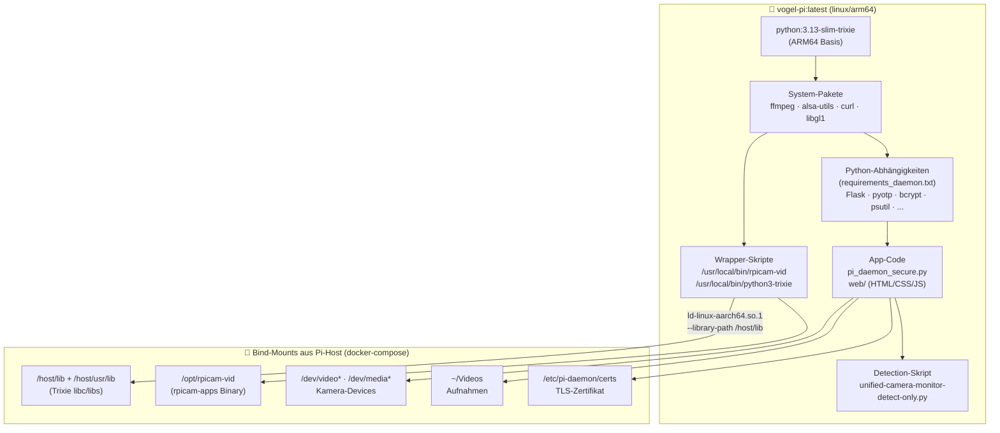

# 🐳 Docker — ARM64-Image für den Vogel-Kamera-Daemon

Cross-Compilation des `pi-daemon`-Images (`linux/arm64`) auf einem **Gentoo x86_64**-Rechner über QEMU-Emulation.

> **Tipp – alles automatisch per Ansible:**
> ```bash
> cd ansible
> bash build_and_deploy.sh --setup-host   # Build-Host einrichten (einmalig)
> bash build_and_deploy.sh --update       # Image bauen + auf Pi deployen
> ```
> Die manuelle Anleitung unten erklärt, was dabei im Hintergrund passiert.

---

## Image-Architektur



**Warum kein `rpicam-apps` im Image?**
`rpicam-apps` ist auf Raspberry Pi OS Trixie gegen eine neuere glibc gelinkt als im
`bookworm`-Basis-Image. Statt das gesamte Trixie-System ins Image zu packen, werden die
Binaries und Libs per **Bind-Mount** aus dem Pi-Host eingebunden. Ein Wrapper-Skript
(`/usr/local/bin/rpicam-vid`) ruft `rpicam-vid` über den Trixie-Dynamic-Linker auf —
dadurch lädt es die Trixie-Libs ohne den Python-3.13-Interpreter des Images zu beeinflussen.

---

## Voraussetzungen auf dem Build-Host (Gentoo)

### Schritt 1 — Docker installieren

Auf Gentoo wird Docker über `app-containers/docker` installiert:

```bash
echo 'app-containers/docker ~amd64' >> /etc/portage/package.accept_keywords
echo 'app-containers/docker-cli ~amd64' >> /etc/portage/package.accept_keywords
echo 'app-containers/docker-buildx ~amd64' >> /etc/portage/package.accept_keywords

emerge --ask app-containers/docker app-containers/docker-cli app-containers/docker-buildx

# systemd
systemctl enable --now docker

# User zur docker-Gruppe hinzufügen (kein sudo nötig)
gpasswd -a $USER docker
newgrp docker
```

---

### Schritt 2 — QEMU (ARM64-Emulation) installieren

```bash
echo 'app-emulation/qemu ~amd64' >> /etc/portage/package.accept_keywords
echo 'app-emulation/qemu static-user' >> /etc/portage/package.use/qemu
echo 'QEMU_USER_TARGETS="aarch64"' >> /etc/portage/make.conf

emerge --ask app-emulation/qemu
```

binfmt dauerhaft einrichten (wird von `--setup-host` automatisch konfiguriert):

```bash
# Flags: P=preserve-argv[0], O=open-binary, C=credentials, F=fix-binary
# F ist entscheidend: Kernel öffnet QEMU-Binary beim Registrieren →
# funktioniert auch innerhalb von Docker-Containern ohne /usr/bin-Zugriff
echo ':qemu-aarch64:M::\x7fELF\x02\x01\x01\x00\x00\x00\x00\x00\x00\x00\x00\x00\x02\x00\xb7\x00:\xff\xff\xff\xff\xff\xff\xff\x00\xff\xff\xff\xff\xff\xff\xff\xff\xfe\xff\xff\xff:/usr/bin/qemu-aarch64:POCF' \
    > /etc/binfmt.d/qemu-aarch64.conf

systemctl enable --now systemd-binfmt

# Prüfen
cat /proc/sys/fs/binfmt_misc/qemu-aarch64
# → enabled
```

---

### Schritt 3 — docker buildx Kontext anlegen

```bash
docker buildx create --name pi-builder --use
docker buildx inspect --bootstrap
# → Platforms: linux/amd64, linux/arm64, ...
```

---

## Image bauen

**Wichtig:** Build-Kontext ist das **Repo-Root** (nicht `docker/`), da der Dockerfile
Dateien aus `unified-monitor-client/` und `raspberry-pi-scripts/` kopiert.

```bash
cd vogel-kamera-linux   # Repo-Root

docker buildx build \
    --platform linux/arm64 \
    --file docker/Dockerfile \
    --tag vogel-pi:latest \
    --load \
    .
```

| Flag | Bedeutung |
|------|-----------|
| `--platform linux/arm64` | Ziel-Architektur (Raspberry Pi 5) |
| `--file docker/Dockerfile` | Dockerfile relativ zum Build-Kontext |
| `--tag vogel-pi:latest` | Image-Name |
| `--load` | Ins lokale `docker images` laden (nicht pushen) |

Mit Cache-Reset (nach Dependency-Updates):
```bash
docker buildx build --platform linux/arm64 --file docker/Dockerfile \
    --tag vogel-pi:latest --load --no-cache .
```

Baudauer: ~**3–8 Minuten** (gecacht: ~30 s).

Image prüfen:
```bash
docker inspect vogel-pi:latest | grep Architecture
# → "Architecture": "arm64"
docker images vogel-pi
```

---

## Image auf den Pi übertragen

### Automatisch (empfohlen)

```bash
cd ansible
bash build_and_deploy.sh --update
# → baut, komprimiert, SCP, docker load, systemctl restart pi-daemon
```

### Manuell

```bash
docker save vogel-pi:latest | gzip > /tmp/vogel-pi.tar.gz
scp -i ~/.ssh/id_rsa_ai-had /tmp/vogel-pi.tar.gz roimme@raspberrypi-5-ai-had:/tmp/

ssh -i ~/.ssh/id_rsa_ai-had roimme@raspberrypi-5-ai-had \
    "docker load -i /tmp/vogel-pi.tar.gz && systemctl restart pi-daemon"
```

---

## Container-Konfiguration (docker-compose)

Der Container läuft auf dem Pi mit `privileged: true` und folgenden Bind-Mounts:

| Mount | Richtung | Zweck |
|-------|----------|-------|
| `~/Videos` → `/root/Videos` | Host → Container | Aufnahmen persistent speichern |
| `/etc/pi-daemon/certs` | Host → Container | TLS-Zertifikat (HTTPS Port 8443) |
| `/usr/bin/rpicam-vid` → `/opt/rpicam-vid` | Host → Container | rpicam-apps Binary (Trixie) |
| `/lib/aarch64-linux-gnu` → `/host/lib` | Host → Container | Trixie-libc für rpicam-vid |
| `/usr/lib/aarch64-linux-gnu` → `/host/usr/lib` | Host → Container | Trixie-Libs |
| `/usr/lib/python3` → `/host/usr/lib2` | Host → Container | picamera2 / numpy Trixie-Libs |
| `/dev/video*`, `/dev/media*` | Host-Devices | Kamera-Hardware-Zugriff |

---

## Wrapper-Skripte im Container

### `/usr/local/bin/rpicam-vid`
```sh
#!/bin/sh
exec /host/lib/ld-linux-aarch64.so.1 \
    --library-path /host/lib:/host/usr/lib:/host/usr/lib/pulseaudio \
    /opt/rpicam-vid "$@"
```
Ruft das Host-`rpicam-vid` über den Trixie-Dynamic-Linker auf → lädt automatisch die
passenden Trixie-Libs statt der Bookworm-Libs des Containers.

### `/usr/local/bin/python3-trixie`
```sh
#!/bin/sh
exec /host/lib/ld-linux-aarch64.so.1 \
    --library-path /host/lib:/host/usr/lib:/host/usr/lib2 \
    /opt/python3-host "$@"
```
Wird vom Detection-Skript verwendet, das `picamera2` / YOLO / Hailo-Libs benötigt —
diese sind nur als Trixie-Pakete auf dem Host verfügbar.

---

## Health-Check

Der Container prüft sich alle 30 Sekunden selbst:
```bash
docker inspect --format='{{.State.Health.Status}}' pi-daemon
# → healthy
```

---

## Fehlerbehebung

**`exec format error` beim Build:**
```bash
# QEMU-binfmt neu registrieren
systemctl restart systemd-binfmt
cat /proc/sys/fs/binfmt_misc/qemu-aarch64   # → muss "enabled" zeigen
```

**`GLIBC_PRIVATE not found` im Container:**
Die Trixie-Libs auf dem Pi-Host sind nicht korrekt gemountet. Prüfen ob die Bind-Mounts
in `docker-compose.yml` auf die richtigen Host-Pfade zeigen.

**`docker buildx` nicht gefunden:**
```bash
emerge --ask app-containers/docker-buildx
```

**Build sehr langsam:**
QEMU-Emulation ist ~10–20× langsamer als native ARM64-Hardware — nur beim ersten Build
ohne Cache. Danach werden Layer gecacht (~30 s):
```bash
docker buildx build ... --progress=plain   # detaillierte Ausgabe
```

**Kein Speicherplatz:**
```bash
docker buildx prune -f     # Build-Cache löschen (~3–5 GB bei QEMU-Builds)
docker system prune -f     # ungenutzte Images/Container löschen
```

---

## Weiterführende Dokumentation

| Dokument | Inhalt |
|----------|--------|
| [ansible/README.md](../ansible/README.md) | Build & Deploy Workflow, E2E-Test |
| [unified-monitor-client/](../unified-monitor-client/) | `pi_daemon_secure.py`, Web-GUI |
| [raspberry-pi-scripts/UNIFIED-MONITOR-README.md](../raspberry-pi-scripts/UNIFIED-MONITOR-README.md) | Detection-Skript, YOLO, Hailo |
| [docs/ARCHITEKTUR.md](../docs/ARCHITEKTUR.md) | Gesamtarchitektur |
