# 🏗️ Kamera-Auto-Trigger Architektur

## Systemübersicht

Das Kamera-Auto-Trigger System ist eine verteilte Anwendung zur automatischen Vogel-Erkennung und -Aufnahme. Es besteht aus zwei Hauptkomponenten:

- **PC (Lokales System)**: KI-gestützte Echtzeit-Analyse des Preview-Streams
- **Raspberry Pi 5 (Remote)**: Hochauflösende Video- und Audio-Aufnahme

---

## 🔄 Kommunikationsfluss

### Gesamtarchitektur

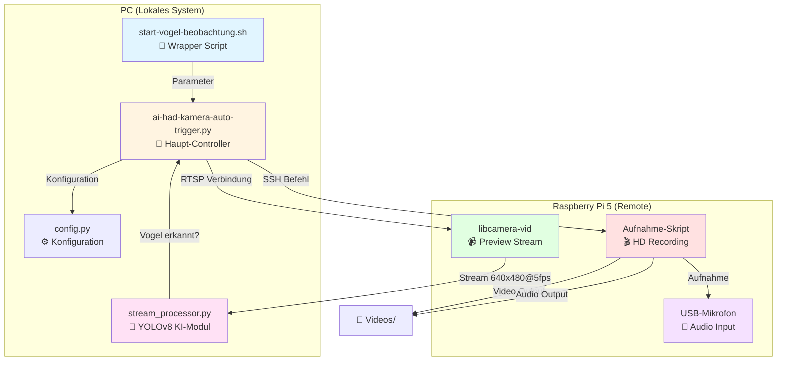

---

## 📊 Detaillierter Ablauf

### 1️⃣ Systemstart

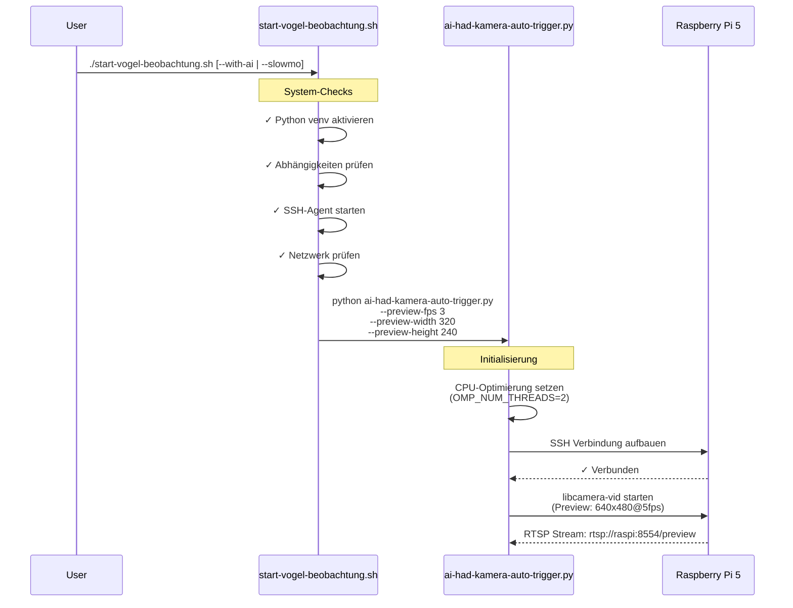

---

### 2️⃣ Preview Stream & KI-Analyse

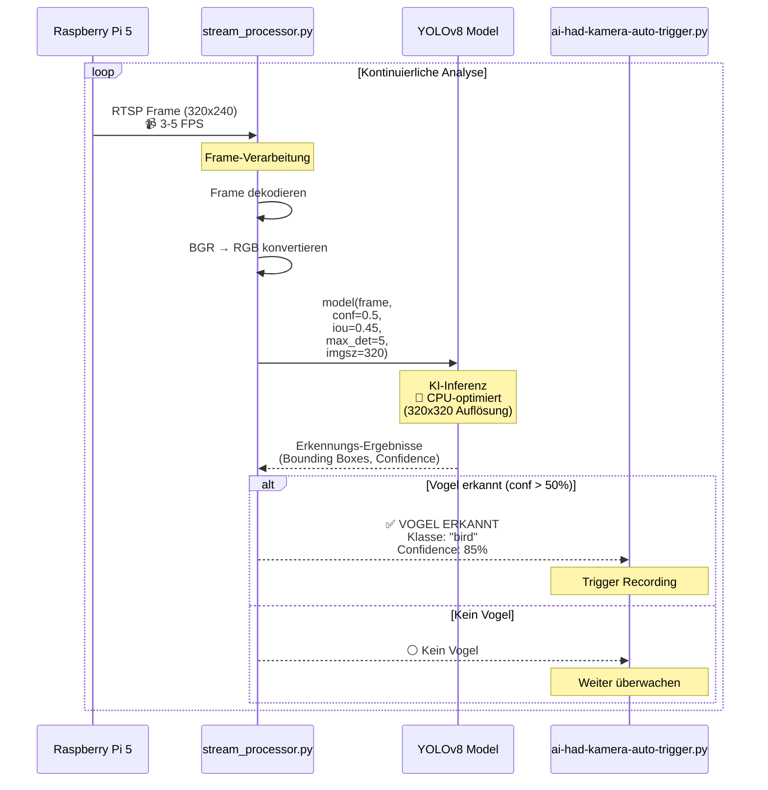

---

### 3️⃣ Aufnahme-Trigger (3 Modi)

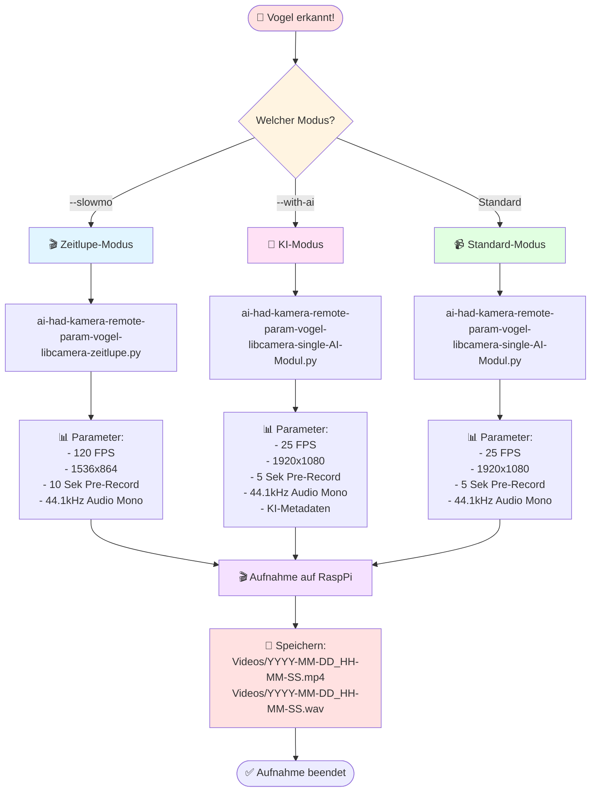

---

### 4️⃣ SSH-Kommunikation im Detail

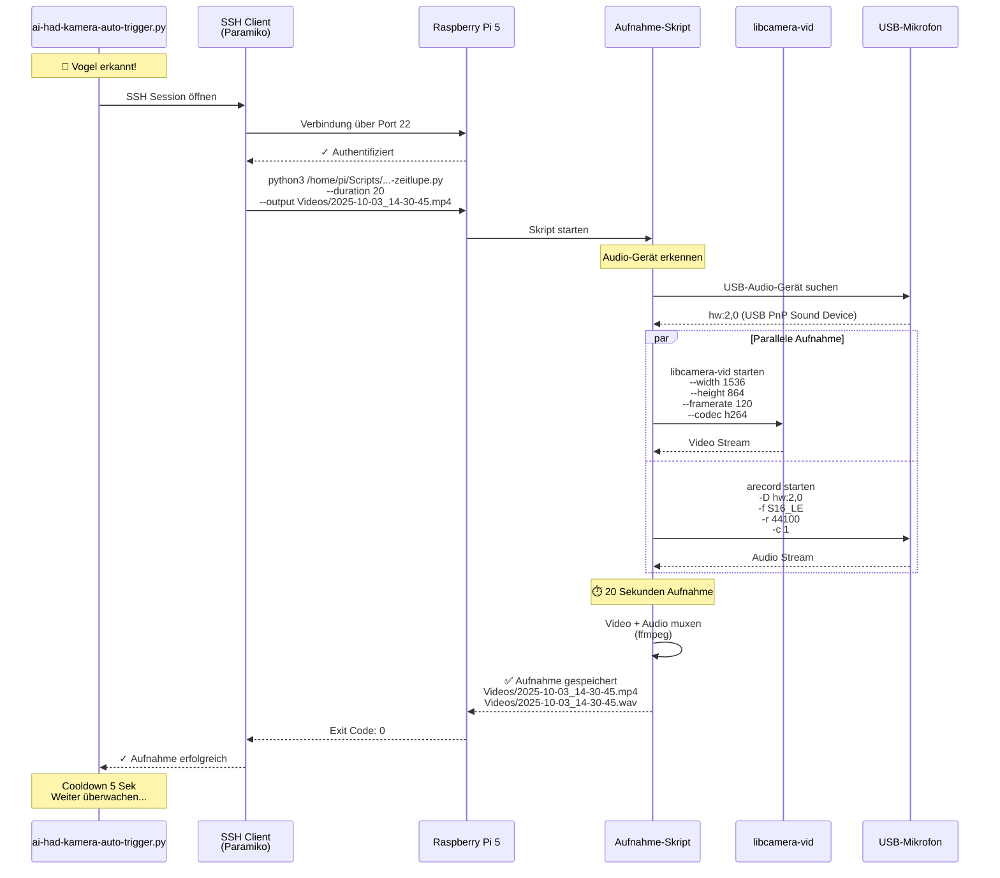

---

## ⚙️ CPU-Optimierung Details

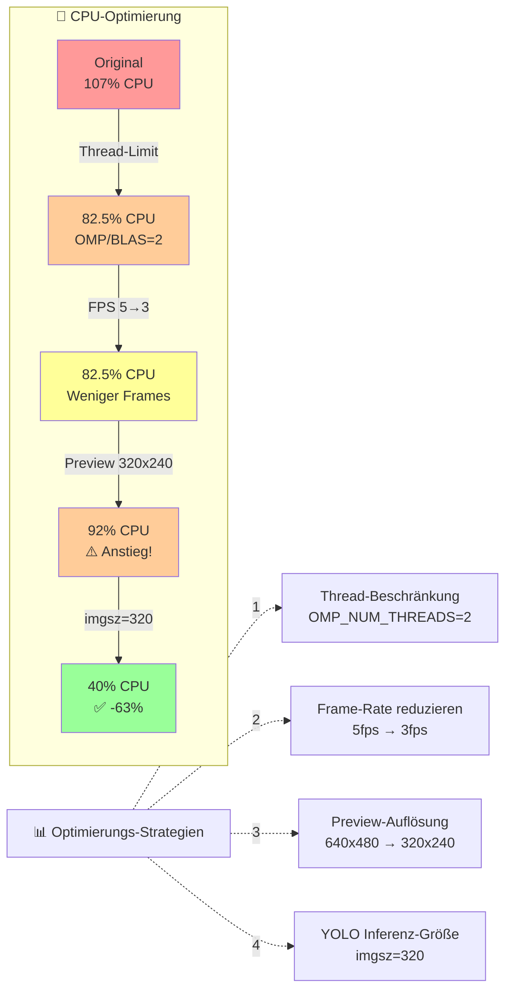

**Erklärung:**
1. **Thread-Limit**: Begrenzt parallele CPU-Threads für NumPy/OpenBLAS
2. **FPS-Reduktion**: Weniger Frames pro Sekunde → weniger Analysen
3. **Preview-Auflösung**: Kleinere Stream-Auflösung (nicht die Aufnahme!)
4. **YOLO imgsz=320**: 🎯 **Durchbruch!** YOLO rechnet intern mit 320x320 statt Vollbild

---

## 🔌 Datenflüsse

### Video-Pipeline

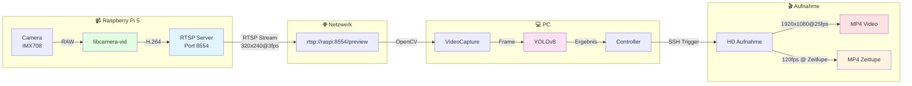

### Audio-Pipeline

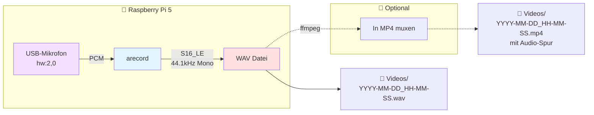

### Audio-Pipeline

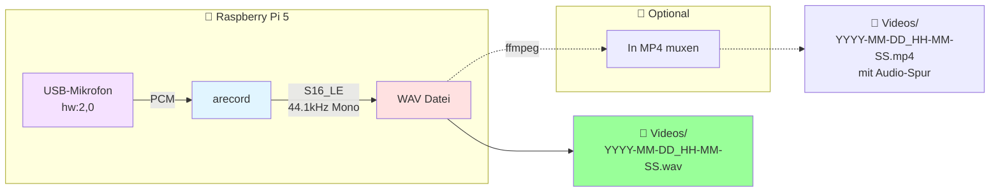

---

## 🎛️ Konfigurations-Hierarchie

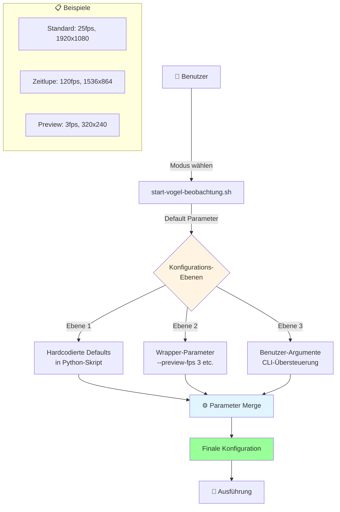

**Priorität:** Benutzer-Argumente > Wrapper-Parameter > Defaults

---

## 🧩 Modul-Abhängigkeiten

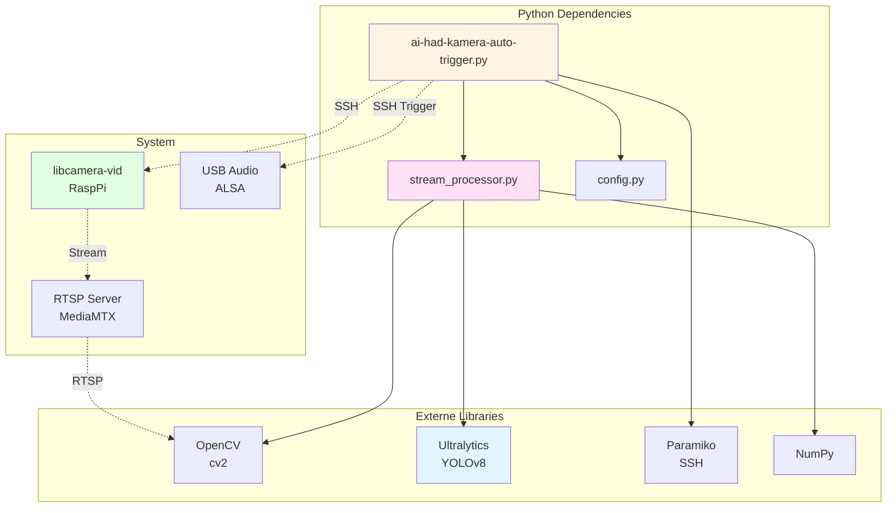

---

## 📈 Performance-Metriken

### CPU-Auslastung nach Optimierung

```mermaid
gantt
    title CPU-Auslastung während Auto-Trigger Betrieb
    dateFormat X
    axisFormat %s

    section Baseline
    Python-Prozess (107%) :crit, 0, 107
    
    section Nach Optimierung
    Python-Prozess (40%) :active, 0, 40
    System-Overhead (10%) : 0, 10
    Reserve (50%) : 0, 50
```

### Frame-Processing-Zeiten

| Komponente | Zeit | Anteil |
|------------|------|--------|
| Frame-Empfang (RTSP) | ~10ms | 10% |
| Frame-Dekodierung | ~5ms | 5% |
| YOLOv8 Inferenz (imgsz=320) | ~80ms | 80% |
| Ergebnis-Verarbeitung | ~5ms | 5% |
| **Gesamt** | **~100ms** | **100%** |

**→ Theoretische Max-FPS:** 10 FPS  
**→ Praktische FPS:** 3 FPS (CPU-schonend)

---

## 🔒 Sicherheit & SSH

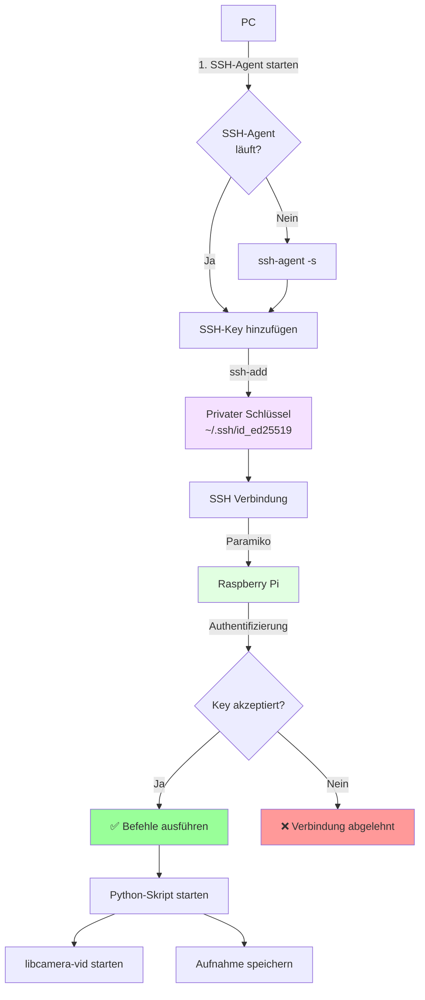

**Sicherheitsfeatures:**
- 🔑 SSH-Key Authentifizierung (keine Passwörter!)
- 🔐 SSH-Agent für Key-Management
- 🚫 Nur autorisierte Public Keys auf RaspPi
- 📝 Alle SSH-Befehle geloggt

---

## 🎯 Erkennungs-Workflow

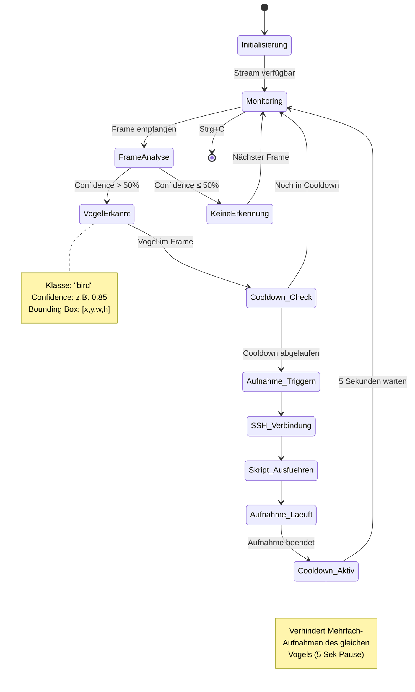

---

## 📁 Datei-Struktur

```
vogel-kamera-linux/
├── kamera-auto-trigger/
│   ├── scripts/
│   │   ├── ai-had-kamera-auto-trigger.py  🧠 Haupt-Controller
│   │   ├── stream_processor.py            🤖 YOLOv8 KI-Modul
│   │   └── config.py                      ⚙️ Konfiguration
│   ├── start-vogel-beobachtung.sh         🚀 Wrapper-Script
│   ├── run-auto-trigger.sh                🔧 venv Aktivierung
│   ├── README.md                          📖 Dokumentation
│   └── ARCHITEKTUR.md                     🏗️ Diese Datei
│
├── python-skripte/
│   ├── ai-had-kamera-remote-param-vogel-libcamera-single-AI-Modul.py
│   │                                      📹 Standard/KI Aufnahme
│   └── ai-had-kamera-remote-param-vogel-libcamera-zeitlupe.py
│                                          🎬 Zeitlupen-Aufnahme
│
├── git-automation/
│   ├── git_automation.py                  🔄 Git Automatisierung
│   └── GIT_AUTOMATION_README.md
│
└── Videos/                                💾 Aufnahme-Verzeichnis
    ├── 2025-10-03_14-30-45.mp4
    ├── 2025-10-03_14-30-45.wav
    └── ...
```

---

## 🚀 Startup-Sequenz im Detail

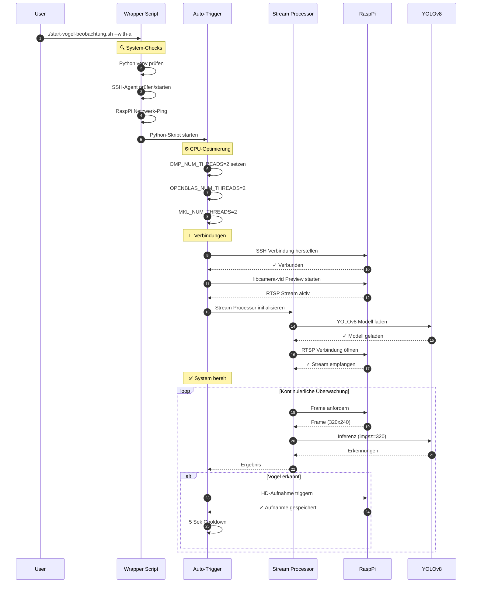

---

## 🔧 Fehlerbehandlung

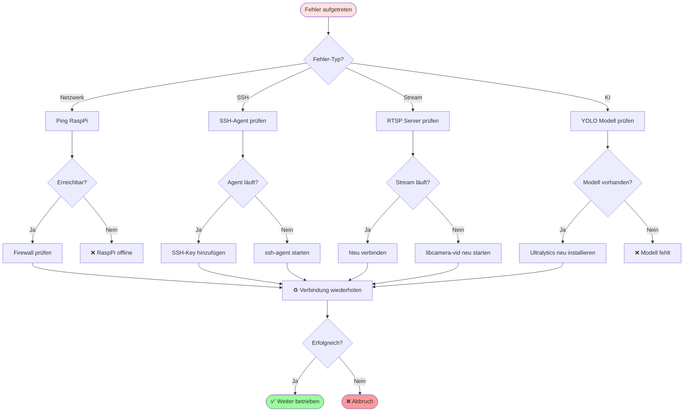

**Automatische Recovery:**
- **Netzwerk-Timeout**: Auto-Reconnect nach 5 Sekunden
- **Stream-Unterbrechung**: Automatischer Stream-Neustart
- **SSH-Fehler**: SSH-Agent Neuinitialisierung
- **Frame-Drop**: Frame überspringen, weiter überwachen

---

## 📊 Monitoring & Logging

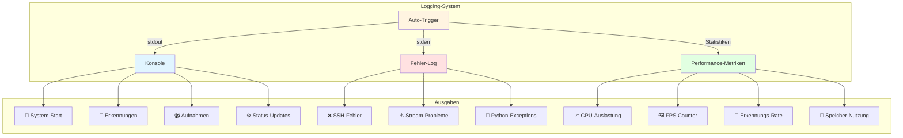

**Log-Beispiele:**

```
🚀 Vogel-Beobachtung mit KI gestartet
━━━━━━━━━━━━━━━━━━━━━━━━━━━━━━━━━━━━━━━
Aufnahme-Modus: 🤖 Mit KI + Audio (yolov8n.pt)
Preview: 320x240 @ 3 FPS
Recording: 1920x1080 @ 25 FPS + 44.1kHz Mono
CPU-Optimierung: OMP_NUM_THREADS=2
━━━━━━━━━━━━━━━━━━━━━━━━━━━━━━━━━━━━━━━

✓ SSH Verbindung hergestellt
✓ RTSP Stream aktiv: rtsp://raspi:8554/preview
✓ YOLOv8 Modell geladen

[14:30:45] 🎯 VOGEL ERKANNT! Confidence: 85%
[14:30:45] 📹 Aufnahme gestartet: Videos/2025-10-03_14-30-45.mp4
[14:31:05] ✅ Aufnahme beendet (20 Sekunden)
[14:31:05] ⏸️ Cooldown: 5 Sekunden

Performance: CPU 40% | FPS 3.2 | RAM 180MB
```

---

## 🎓 Zusammenfassung

### Haupt-Komponenten

| Komponente | Funktion | Technologie |
|------------|----------|-------------|
| **Preview Stream** | Niedrig-auflösende Echtzeit-Überwachung | RTSP, libcamera-vid |
| **KI-Modul** | Vogel-Erkennung in Echtzeit | YOLOv8, OpenCV |
| **Controller** | Orchestrierung & Trigger-Logik | Python, Paramiko |
| **Recording** | HD-Aufnahme mit Audio | libcamera-vid, arecord |
| **SSH-Layer** | Sichere Remote-Kommunikation | SSH, SSH-Agent |

### Datenfluss-Zusammenfassung

1. **RaspPi** sendet Preview-Stream (320x240, 3fps) via RTSP
2. **PC** analysiert Stream mit YOLOv8 (imgsz=320 für CPU-Effizienz)
3. Bei Vogel-Erkennung: **SSH-Trigger** an RaspPi
4. **RaspPi** startet HD-Aufnahme (1920x1080, 25fps oder 120fps)
5. **Audio** wird parallel aufgenommen (44.1kHz Mono)
6. **Speicherung** erfolgt lokal auf RaspPi als MP4 + WAV

### Performance-Optimierungen

```
🔧 Thread-Limiting → 🔧 FPS-Reduktion → 🔧 Auflösung → 🎯 YOLO imgsz=320
   (OMP=2)              (3 FPS)          (320x240)       (DURCHBRUCH!)
   
   107% → 82% → 82% → 40% CPU ✅
```

### Modi-Übersicht

| Modus | FPS | Auflösung | Audio | Verwendung |
|-------|-----|-----------|-------|------------|
| **Standard** | 25 | 1920x1080 | ✅ 44.1kHz | Normale Aufnahmen |
| **Mit KI** | 25 | 1920x1080 | ✅ 44.1kHz | Mit KI-Metadaten |
| **Zeitlupe** | 120 | 1536x864 | ✅ 44.1kHz | Slow-Motion |

---

## 🔗 Referenzen

- [YOLOv8 Dokumentation](https://docs.ultralytics.com/)
- [libcamera Dokumentation](https://libcamera.org/)
- [OpenCV Dokumentation](https://docs.opencv.org/)
- [Paramiko SSH Library](https://www.paramiko.org/)
- [Raspberry Pi Camera Dokumentation](https://www.raspberrypi.com/documentation/computers/camera_software.html)

---

**Version:** 1.2.0  
**Letzte Aktualisierung:** 3. Oktober 2025  
**Status:** ✅ Produktiv im Einsatz
