# 🏗️ Vogel-Kamera Architektur (v2.1.0)

## 📋 Überblick

Das `vogel-kamera-linux` System (v2.1.0) basiert auf einer **Dual-Architecture mit zwei spezialisierten Backends**, die dynamisch je nach Anwendungsfall gewählt werden.

```
UNIFIED MONITOR CLIENT (Python, vom PC aus)
├── SSH Verbindung zu Raspberry Pi
├── Mode Selection →
│   ├── --auto-record     → picamera2 + YOLO26n (KI-Monitoring)
│   └── --manual-record   → rpicam-vid (Reine Aufnahmen)
└── Monitoring & rsync-Transfer
```

## 🔄 Neue Dual-Architecture (v2.1.0)

### System-Komponenten

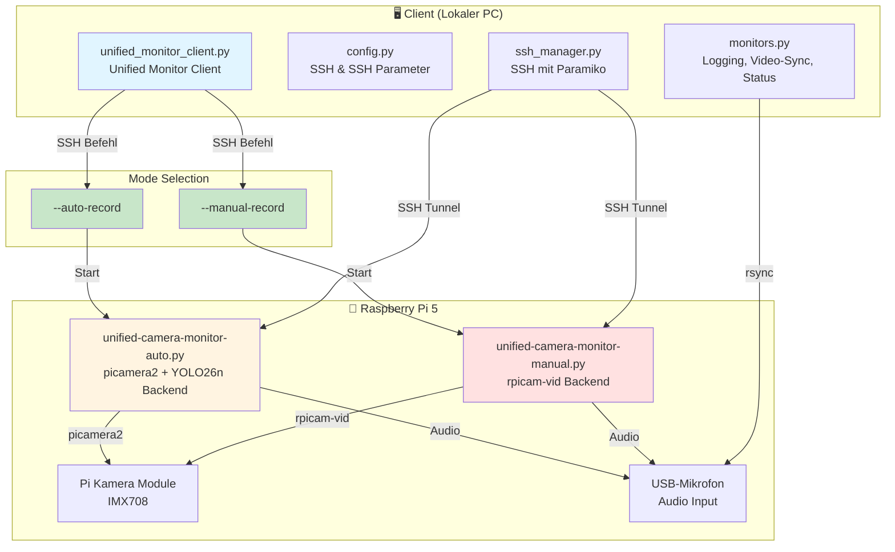
```mermaid
graph TB
    subgraph Client["🖥️ Client (Lokaler PC)"]
        A["unified_monitor_client.py<br/>Unified Monitor Client"]
        B["config.py<br/>SSH & SSH Parameter"]
        C["ssh_manager.py<br/>SSH mit Paramiko"]
        D["monitors.py<br/>Logging, Video-Sync, Status"]
    end
    
    subgraph RaspPi["🍓 Raspberry Pi 5"]
        E["unified-camera-monitor-auto.py<br/>picamera2 + YOLO26n Backend"]
        F["unified-camera-monitor-manual.py<br/>rpicam-vid Backend"]
        G["Pi Kamera Module<br/>IMX708"]
        H["USB-Mikrofon<br/>Audio Input"]
    end
    
    subgraph Mode["Mode Selection"]
        I["--auto-record"]
        J["--manual-record"]
    end
    
    A -->|SSH Befehl| I
    A -->|SSH Befehl| J
    I -->|Start| E
    J -->|Start| F
    E -->|picamera2| G
    F -->|rpicam-vid| G
    E -->|Audio| H
    F -->|Audio| H
    C -->|SSH Tunnel| E
    C -->|SSH Tunnel| F
    D -->|rsync| H
    
    style A fill:#e1f5ff
    style E fill:#fff4e1
    style F fill:#ffe1e1
    style I fill:#c8e6c9
    style J fill:#c8e6c9
```

### Workflow: Mode Selection

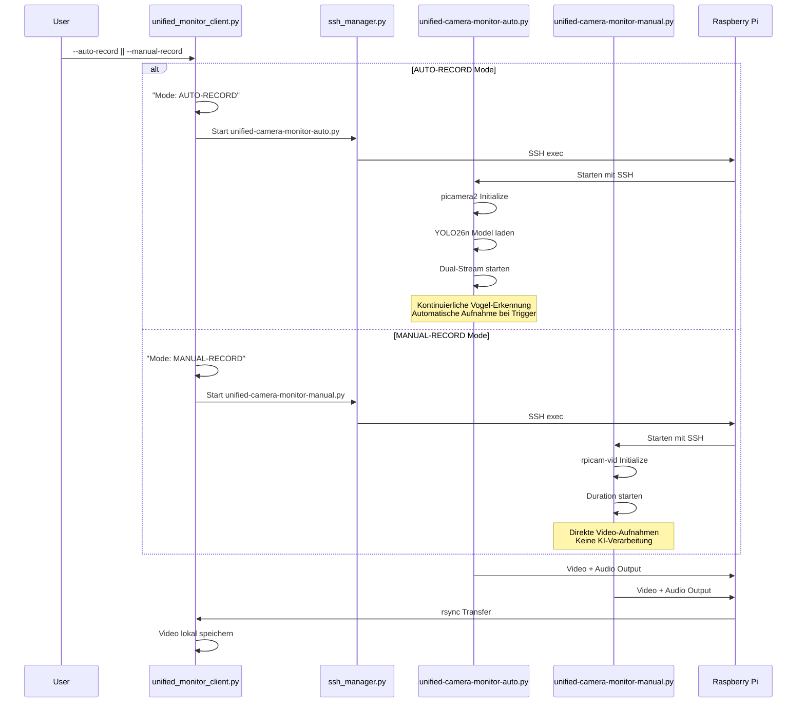
```mermaid
sequenceDiagram
    participant User
    participant Client as unified_monitor_client.py
    participant SSH as ssh_manager.py
    participant Auto as unified-camera-monitor-auto.py
    participant Manual as unified-camera-monitor-manual.py
    participant Pi as Raspberry Pi

    User->>Client: --auto-record || --manual-record

    alt AUTO-RECORD Mode
        Client->>Client: "Mode: AUTO-RECORD"
        Client->>SSH: Start unified-camera-monitor-auto.py
        SSH->>Pi: SSH exec
        Pi->>Auto: Starten mit SSH
        Auto->>Auto: picamera2 Initialize
        Auto->>Auto: YOLO26n Model laden
        Auto->>Auto: Dual-Stream starten
        Note over Auto: Kontinuierliche Vogel-Erkennung<br/>Automatische Aufnahme bei Trigger
    else MANUAL-RECORD Mode
        Client->>Client: "Mode: MANUAL-RECORD"
        Client->>SSH: Start unified-camera-monitor-manual.py
        SSH->>Pi: SSH exec
        Pi->>Manual: Starten mit SSH
        Manual->>Manual: rpicam-vid Initialize
        Manual->>Manual: Duration starten
        Note over Manual: Direkte Video-Aufnahmen<br/>Keine KI-Verarbeitung
    end
    
    Auto->>Pi: Video + Audio Output
    Manual->>Pi: Video + Audio Output
    Pi->>Client: rsync Transfer
    Client->>Client: Video lokal speichern
```

## 🔍 AUTO-RECORD Backend (picamera2 + YOLO26n)

### Ablauf

1. **Initialisierung** (1-2 Sekunden)
   - picamera2 mit Dual-Stream-Konfiguration
   - YOLO26n Modell laden (~150MB)
   - Preview-Stream für Erkennung (640x480)
   - Recording-Stream für Aufnahme (1920x1080-4K)

2. **Kontinuierliche Überwachung**
   - Preview-Frames alle 200ms prüfen
   - YOLO26n Vogel-Erkennung
   - Temporale Filter für stabile Erkennungen
   - Log-Output mit Confidence-Scores

3. **Trigger & Recording**
   - Vogel erkannt (Confidence > Threshold)
   - ffmpeg startet Recording
   - Dauer: `--trigger-duration` (Default: 10s)
   - Audio synchronisiert via ffmpeg `-fflags +genpts`

4. **Output**
   ```
   /home/roimme/recordings/
   ├── 2025-03-08/
   │   ├── auto_recording_14-35-22.mp4
   │   ├── auto_recording_14-45-18.mp4
   │   └── auto_recording_15-02-45.mp4
   ```

### Voraussetzungen

- **picamera2**: Muss auf Pi installiert sein
- **YOLO26n Modell**: Wird automatisch heruntergeladen (~400MB)
- **ffmpeg**: Für Audio/Video Merge
- **Python 3.11+**: Mit NumPy, OpenCV

### Parameter

```bash
python3 unified-camera-monitor-auto.py \
  --threshold 0.5          # Erkennungs-Konfidenz (0.0-1.0)
  --cooldown 2.0           # Sekunden bis nächste Erkennung
  --trigger-duration 10    # Aufnahme-Länge pro Vogel
  --log-file /tmp/auto.log # Log-Ausgabe
```

## 📹 MANUAL-RECORD Backend (rpicam-vid)

### Ablauf

1. **Initialisierung** (<1 Sekunde)
   - rpicam-vid mit Encoding-Parametern
   - H264 Codec (Hardware-Optimiert)
   - Kamera-Rotation: 180° (Standard für Vogelhaus)
   - USB-Audio Input konfigurieren

2. **Recording-Prozess**
   - Direkte Video-Aufnahme für `--duration` Sekunden
   - Gleichzeitig Audio via arecord
   - ffmpeg synchronisiert beide Streams

3. **Output**
   ```
   /home/roimme/recordings/
   ├── 2025-03-08/
   │   ├── manual_recording_16-00-30.mp4 (mit Audio)
   │   └── manual_recording_16-05-45.mp4 (mit Audio)
   ```

### Parameter

```bash
python3 unified-camera-monitor-manual.py \
  --duration 30            # Aufnahme-Dauer (Sekunden)
  --fps 30                 # Frames per second
  --resolution 1920x1080   # Video-Auflösung
  --bitrate 10M            # Encoding-Bitrate
  --rotation 180           # Kamera-Rotation
```

## 🏠 System-Architektur komplett

### Hardware Setup

```
Raspberry Pi 5
├── Kamera (IMX708)
│   └── picamera2 Library
├── USB-Mikrofon
│   ├── Audio Capture (arecord)
│   └── ffmpeg Audio Input
├── rsync für Transfer
└── SSH Server (für Client-Verbindung)

Local PC
├── unified_monitor_client.py
├── SSH Client (mit Paramiko)
├── rsync (Download Videos)
└── Log-Tailing & Monitoring
```

### Dateifluss

```
Recording Process:
┌─────────────┐
│ Kamera IMX708
└──────┬──────┘
       │
    ┌──┴──┐
    │     │
    v     v
[Video]  [Audio]
    │     │
    └──┬──┘
       │
    ffmpeg
  (merge streams)
       │
       v
    MP4 output
       │
    ├── Local /tmp/ (temporary)
    └── ~/recordings/ (permanent)
       │
    rsync
       │
       v
Local PC: ~/downloads/vogel-kamera/
```

## 📊 Systemvergleich

| Aspekt | AUTO-RECORD | MANUAL-RECORD |
|--------|-------------|---------------|
| **Backend** | picamera2 | rpicam-vid |
| **KI-Erkennung** | ✅ YOLO26n | ❌ Keine |
| **CPU-Last** | 50-70% | 200% (H264) |
| **RAM Usage** | ~200MB | ~150MB |
| **Speicher/Min** | ~50MB (30fps) | ~40MB (30fps) |
| **Zeitstempel-Präzision** | Ereignis-basiert | Exakte Dauer |
| **Use-Case** | 24/7 Monitoring | Geplante Sessions |
| **Startup-Zeit** | 1-2s (YOLO laden) | <0.5s |
| **Audio-Sync** | ffmpeg genpts | ffmpeg genpts |

## 🔐 SSH-Kommunikation

---

### 2️⃣ Preview Stream & KI-Analyse

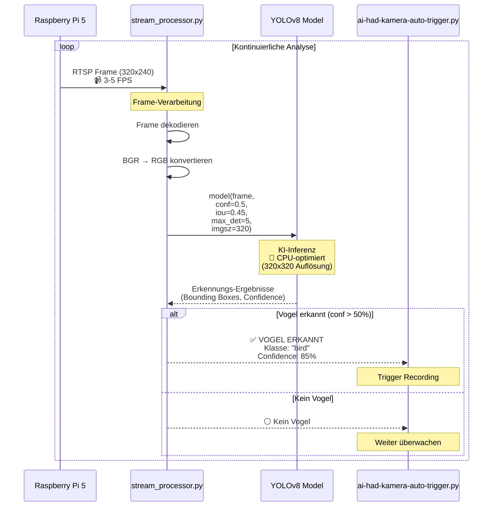
```mermaid
sequenceDiagram
    participant RaspPi as Raspberry Pi 5
    participant Stream as stream_processor.py
    participant YOLO as YOLOv8 Model
    participant Controller as ai-had-kamera-auto-trigger.py

    loop Kontinuierliche Analyse
        RaspPi->>Stream: RTSP Frame (320x240)<br/>📹 3-5 FPS
        
        Note over Stream: Frame-Verarbeitung
        Stream->>Stream: Frame dekodieren
        Stream->>Stream: BGR → RGB konvertieren
        
        Stream->>YOLO: model(frame,<br/>  conf=0.5,<br/>  iou=0.45,<br/>  max_det=5,<br/>  imgsz=320)
        
        Note over YOLO: KI-Inferenz<br/>🧠 CPU-optimiert<br/>(320x320 Auflösung)
        
        YOLO-->>Stream: Erkennungs-Ergebnisse<br/>(Bounding Boxes, Confidence)
        
        alt Vogel erkannt (conf > 50%)
            Stream-->>Controller: ✅ VOGEL ERKANNT<br/>Klasse: "bird"<br/>Confidence: 85%
            Note over Controller: Trigger Recording
        else Kein Vogel
            Stream-->>Controller: ⚪ Kein Vogel
            Note over Controller: Weiter überwachen
        end
    end
```

---

### 3️⃣ Aufnahme-Trigger (3 Modi)

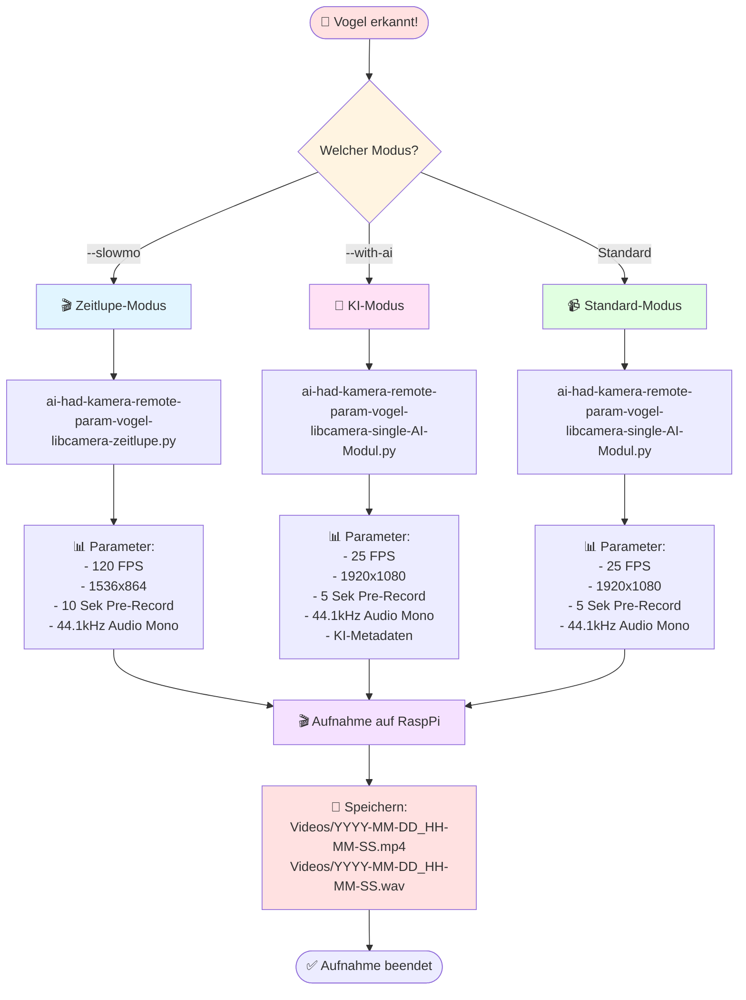
```mermaid
flowchart TD
    Start(["🎯 Vogel erkannt!"])
    
    Start --> Check{"Welcher Modus?"}
    
    Check -->|--slowmo| Slowmo["🎬 Zeitlupe-Modus"]
    Check -->|--with-ai| AI["🤖 KI-Modus"]
    Check -->|Standard| Standard["📹 Standard-Modus"]
    
    Slowmo --> SlowmoScript["ai-had-kamera-remote-param-vogel-<br/>libcamera-zeitlupe.py"]
    AI --> AIScript["ai-had-kamera-remote-param-vogel-<br/>libcamera-single-AI-Modul.py"]
    Standard --> StandardScript["ai-had-kamera-remote-param-vogel-<br/>libcamera-single-AI-Modul.py"]
    
    SlowmoScript --> SlowmoParams["📊 Parameter:<br/>- 120 FPS<br/>- 1536x864<br/>- 10 Sek Pre-Record<br/>- 44.1kHz Audio Mono"]
    AIScript --> AIParams["📊 Parameter:<br/>- 25 FPS<br/>- 1920x1080<br/>- 5 Sek Pre-Record<br/>- 44.1kHz Audio Mono<br/>- KI-Metadaten"]
    StandardScript --> StandardParams["📊 Parameter:<br/>- 25 FPS<br/>- 1920x1080<br/>- 5 Sek Pre-Record<br/>- 44.1kHz Audio Mono"]
    
    SlowmoParams --> Record["🎬 Aufnahme auf RaspPi"]
    AIParams --> Record
    StandardParams --> Record
    
    Record --> Save["💾 Speichern:<br/>Videos/YYYY-MM-DD_HH-MM-SS.mp4<br/>Videos/YYYY-MM-DD_HH-MM-SS.wav"]
    
    Save --> End(["✅ Aufnahme beendet"])

    style Start fill:#ffe1e1
    style Check fill:#fff4e1
    style Slowmo fill:#e1f5ff
    style AI fill:#ffe1f5
    style Standard fill:#e1ffe1
    style Record fill:#f5e1ff
    style Save fill:#ffe1e1
```

---

### 4️⃣ SSH-Kommunikation im Detail

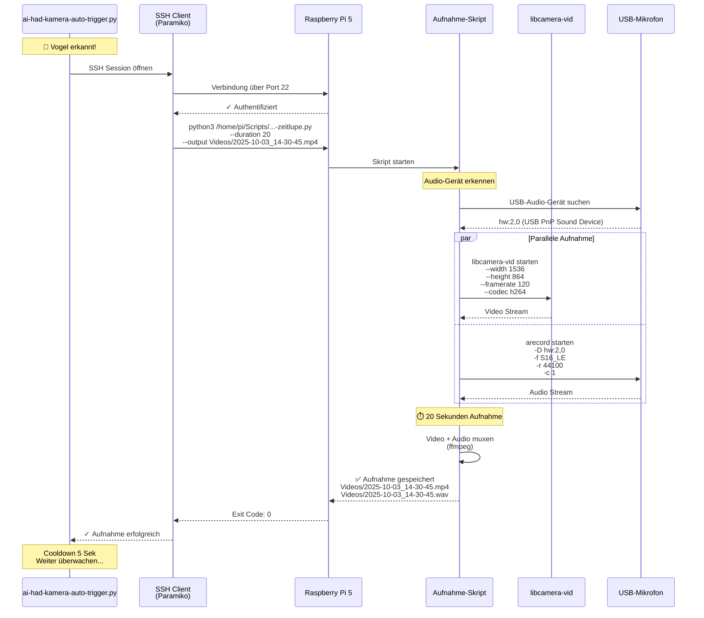
```mermaid
sequenceDiagram
    participant Controller as ai-had-kamera-auto-trigger.py
    participant SSH as SSH Client<br/>(Paramiko)
    participant RaspPi as Raspberry Pi 5
    participant Script as Aufnahme-Skript
    participant Camera as libcamera-vid
    participant Mic as USB-Mikrofon

    Note over Controller: 🎯 Vogel erkannt!
    
    Controller->>SSH: SSH Session öffnen
    SSH->>RaspPi: Verbindung über Port 22
    RaspPi-->>SSH: ✓ Authentifiziert
    
    SSH->>RaspPi: python3 /home/pi/Scripts/...-zeitlupe.py<br/>--duration 20<br/>--output Videos/2025-10-03_14-30-45.mp4
    
    RaspPi->>Script: Skript starten
    
    Note over Script: Audio-Gerät erkennen
    Script->>Mic: USB-Audio-Gerät suchen
    Mic-->>Script: hw:2,0 (USB PnP Sound Device)
    
    par Parallele Aufnahme
        Script->>Camera: libcamera-vid starten<br/>--width 1536<br/>--height 864<br/>--framerate 120<br/>--codec h264
        Camera-->>Script: Video Stream
        
        and
        
        Script->>Mic: arecord starten<br/>-D hw:2,0<br/>-f S16_LE<br/>-r 44100<br/>-c 1
        Mic-->>Script: Audio Stream
    end
    
    Note over Script: ⏱️ 20 Sekunden Aufnahme
    
    Script->>Script: Video + Audio muxen<br/>(ffmpeg)
    
    Script-->>RaspPi: ✅ Aufnahme gespeichert<br/>Videos/2025-10-03_14-30-45.mp4<br/>Videos/2025-10-03_14-30-45.wav
    
    RaspPi-->>SSH: Exit Code: 0
    SSH-->>Controller: ✓ Aufnahme erfolgreich
    
    Note over Controller: Cooldown 5 Sek<br/>Weiter überwachen...
```

---

## ⚙️ CPU-Optimierung Details

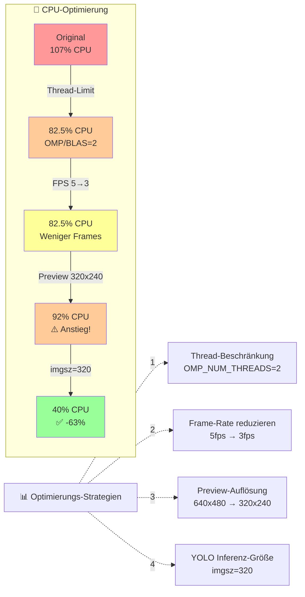
```mermaid
graph LR
    subgraph Optimization["🎯 CPU-Optimierung"]
        A["Original<br/>107% CPU"] -->|"Thread-Limit"| B["82.5% CPU<br/>OMP/BLAS=2"]
        B -->|"FPS 5→3"| C["82.5% CPU<br/>Weniger Frames"]
        C -->|"Preview 320x240"| D["92% CPU<br/>⚠️ Anstieg!"]
        D -->|"imgsz=320"| E["40% CPU<br/>✅ -63%"]
    end
    
    style A fill:#ff9999
    style B fill:#ffcc99
    style C fill:#ffff99
    style D fill:#ffcc99
    style E fill:#99ff99

    Note1["📊 Optimierungs-Strategien"]
    Note1 -.->|1| F["Thread-Beschränkung<br/>OMP_NUM_THREADS=2"]
    Note1 -.->|2| G["Frame-Rate reduzieren<br/>5fps → 3fps"]
    Note1 -.->|3| H["Preview-Auflösung<br/>640x480 → 320x240"]
    Note1 -.->|4| I["YOLO Inferenz-Größe<br/>imgsz=320"]
```

**Erklärung:**
1. **Thread-Limit**: Begrenzt parallele CPU-Threads für NumPy/OpenBLAS
2. **FPS-Reduktion**: Weniger Frames pro Sekunde → weniger Analysen
3. **Preview-Auflösung**: Kleinere Stream-Auflösung (nicht die Aufnahme!)
4. **YOLO imgsz=320**: 🎯 **Durchbruch!** YOLO rechnet intern mit 320x320 statt Vollbild

---

## 🔌 Datenflüsse

### Video-Pipeline

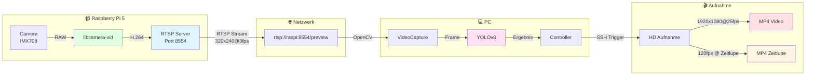
```mermaid
flowchart LR
    subgraph RaspPi["📹 Raspberry Pi 5"]
        A1["Camera<br/>IMX708"] -->|RAW| A2["libcamera-vid"]
        A2 -->|H.264| A3["RTSP Server<br/>Port 8554"]
    end
    
    subgraph Network["🌐 Netzwerk"]
        A3 -->|"RTSP Stream<br/>320x240@3fps"| B1["rtsp://raspi:8554/preview"]
    end
    
    subgraph PC["💻 PC"]
        B1 -->|OpenCV| B2["VideoCapture"]
        B2 -->|Frame| B3["YOLOv8"]
        B3 -->|Ergebnis| B4["Controller"]
    end
    
    B4 -->|"SSH Trigger"| C1["HD Aufnahme"]
    
    subgraph Recording["🎬 Aufnahme"]
        C1 -->|"1920x1080@25fps"| C2["MP4 Video"]
        C1 -->|"120fps @ Zeitlupe"| C3["MP4 Zeitlupe"]
    end

    style A2 fill:#e1ffe1
    style A3 fill:#e1f5ff
    style B3 fill:#ffe1f5
    style C2 fill:#ffe1e1
    style C3 fill:#fff4e1
```

### Audio-Pipeline

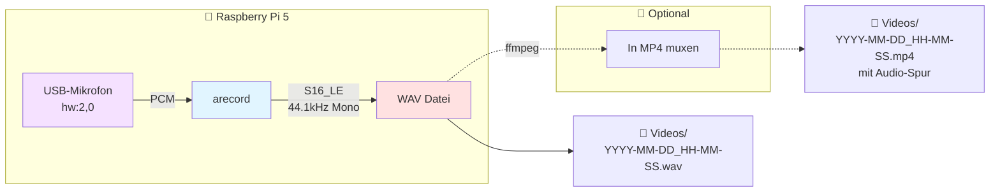
```mermaid
flowchart LR
    subgraph RaspPi["🎤 Raspberry Pi 5"]
        A1["USB-Mikrofon<br/>hw:2,0"] -->|PCM| A2["arecord"]
        A2 -->|"S16_LE<br/>44.1kHz Mono"| A3["WAV Datei"]
    end
    
    subgraph Optional["🔧 Optional"]
        A3 -.->|ffmpeg| B1["In MP4 muxen"]
    end
    
    A3 --> C1["💾 Videos/<br/>YYYY-MM-DD_HH-MM-SS.wav"]
    B1 -.-> C2["💾 Videos/<br/>YYYY-MM-DD_HH-MM-SS.mp4<br/>mit Audio-Spur"]

    style A1 fill:#f5e1ff
    style A2 fill:#e1f5ff
    style A3 fill:#ffe1e1
```

### Audio-Pipeline

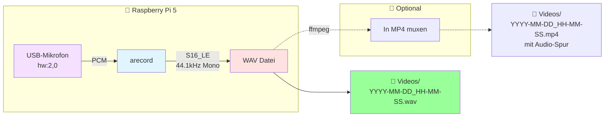
```mermaid
flowchart LR
    subgraph RaspPi["🎤 Raspberry Pi 5"]
        A1[USB-Mikrofon<br/>hw:2,0] -->|PCM| A2[arecord]
        A2 -->|S16_LE<br/>44.1kHz Mono| A3[WAV Datei]
    end
    
    subgraph Optional["🔧 Optional"]
        A3 -.->|ffmpeg| B1[In MP4 muxen]
    end
    
    A3 --> C1[💾 Videos/<br/>YYYY-MM-DD_HH-MM-SS.wav]
    B1 -.-> C2[💾 Videos/<br/>YYYY-MM-DD_HH-MM-SS.mp4<br/>mit Audio-Spur]

    style A1 fill:#f5e1ff
    style A2 fill:#e1f5ff
    style A3 fill:#ffe1e1
    style C1 fill:#99ff99
```

---

## 🎛️ Konfigurations-Hierarchie

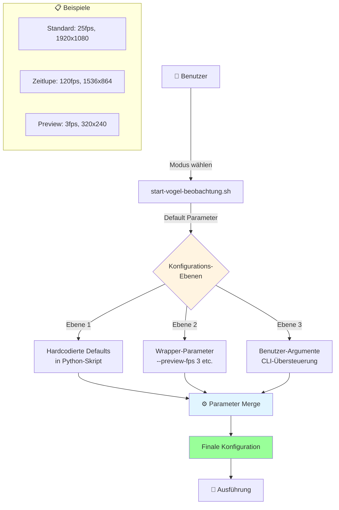
```mermaid
flowchart TD
    User["👤 Benutzer"]
    
    User -->|"Modus wählen"| Wrapper["start-vogel-beobachtung.sh"]
    
    Wrapper -->|"Default Parameter"| Config{"Konfigurations-<br/>Ebenen"}
    
    Config -->|"Ebene 1"| HardCoded["Hardcodierte Defaults<br/>in Python-Skript"]
    Config -->|"Ebene 2"| WrapperParams["Wrapper-Parameter<br/>--preview-fps 3 etc."]
    Config -->|"Ebene 3"| UserArgs["Benutzer-Argumente<br/>CLI-Übersteuerung"]
    
    HardCoded --> Merge["⚙️ Parameter Merge"]
    WrapperParams --> Merge
    UserArgs --> Merge
    
    Merge --> Final["Finale Konfiguration"]
    
    Final --> Execute["🚀 Ausführung"]
    
    subgraph Examples["📋 Beispiele"]
        E1["Standard: 25fps, 1920x1080"]
        E2["Zeitlupe: 120fps, 1536x864"]
        E3["Preview: 3fps, 320x240"]
    end

    style Config fill:#fff4e1
    style Merge fill:#e1f5ff
    style Final fill:#99ff99
```

**Priorität:** Benutzer-Argumente > Wrapper-Parameter > Defaults

---

## 🧩 Modul-Abhängigkeiten

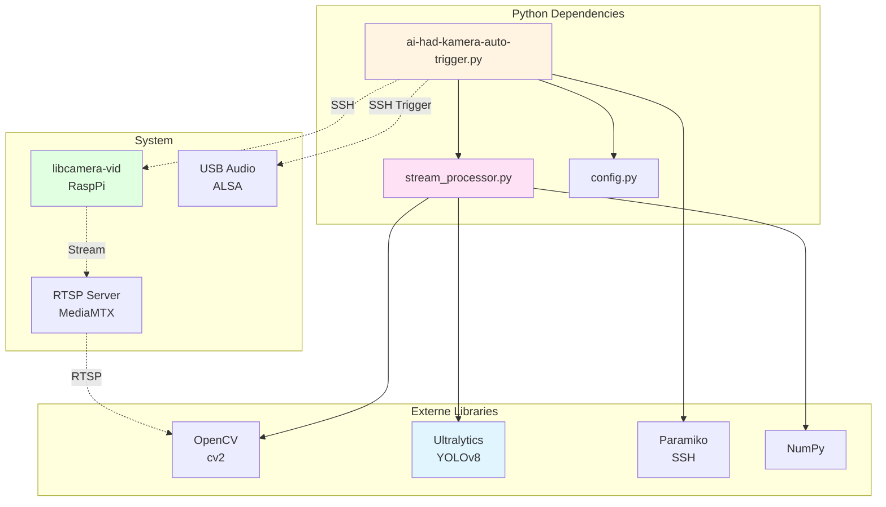
```mermaid
graph TD
    subgraph PyDeps["Python Dependencies"]
        A["ai-had-kamera-auto-trigger.py"]
        B["stream_processor.py"]
        C["config.py"]
    end
    
    subgraph ExtLibs["Externe Libraries"]
        D["OpenCV<br/>cv2"]
        E["Ultralytics<br/>YOLOv8"]
        F["Paramiko<br/>SSH"]
        G["NumPy"]
    end
    
    subgraph Sys["System"]
        H["libcamera-vid<br/>RaspPi"]
        I["RTSP Server<br/>MediaMTX"]
        J["USB Audio<br/>ALSA"]
    end
    
    A --> B
    A --> C
    A --> F
    
    B --> D
    B --> E
    B --> G
    
    A -.SSH.-> H
    H -.Stream.-> I
    I -.RTSP.-> D
    
    A -.->|"SSH Trigger"| J

    style A fill:#fff4e1
    style B fill:#ffe1f5
    style E fill:#e1f5ff
    style H fill:#e1ffe1
```

---

## 📈 Performance-Metriken

### CPU-Auslastung nach Optimierung


```mermaid
gantt
    title CPU-Auslastung während Auto-Trigger Betrieb
    dateFormat X
    axisFormat %s

    section Baseline
    Python-Prozess (107%) :crit, 0, 107
    
    section Nach Optimierung
    Python-Prozess (40%) :active, 0, 40
    System-Overhead (10%) : 0, 10
    Reserve (50%) : 0, 50
```

### Frame-Processing-Zeiten

| Komponente | Zeit | Anteil |
|------------|------|--------|
| Frame-Empfang (RTSP) | ~10ms | 10% |
| Frame-Dekodierung | ~5ms | 5% |
| YOLOv8 Inferenz (imgsz=320) | ~80ms | 80% |
| Ergebnis-Verarbeitung | ~5ms | 5% |
| **Gesamt** | **~100ms** | **100%** |

**→ Theoretische Max-FPS:** 10 FPS  
**→ Praktische FPS:** 3 FPS (CPU-schonend)

---

## 🔒 Sicherheit & SSH

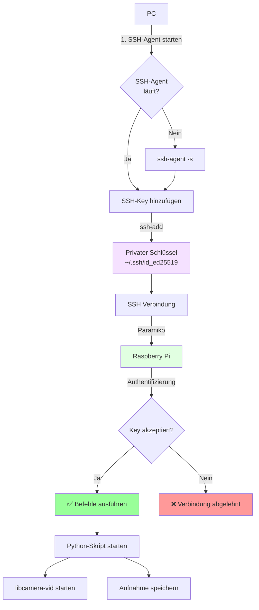
```mermaid
flowchart TD
    A[PC] -->|1. SSH-Agent starten| B{SSH-Agent<br/>läuft?}
    
    B -->|Nein| C[ssh-agent -s]
    B -->|Ja| D[SSH-Key hinzufügen]
    
    C --> D
    D -->|ssh-add| E[Privater Schlüssel<br/>~/.ssh/id_ed25519]
    
    E --> F[SSH Verbindung]
    
    F -->|Paramiko| G[Raspberry Pi]
    
    G -->|Authentifizierung| H{Key akzeptiert?}
    
    H -->|Ja| I[✅ Befehle ausführen]
    H -->|Nein| J[❌ Verbindung abgelehnt]
    
    I --> K[Python-Skript starten]
    K --> L[libcamera-vid starten]
    K --> M[Aufnahme speichern]

    style E fill:#f5e1ff
    style G fill:#e1ffe1
    style I fill:#99ff99
    style J fill:#ff9999
```

**Sicherheitsfeatures:**
- 🔑 SSH-Key Authentifizierung (keine Passwörter!)
- 🔐 SSH-Agent für Key-Management
- 🚫 Nur autorisierte Public Keys auf RaspPi
- 📝 Alle SSH-Befehle geloggt

---

## 🎯 Erkennungs-Workflow

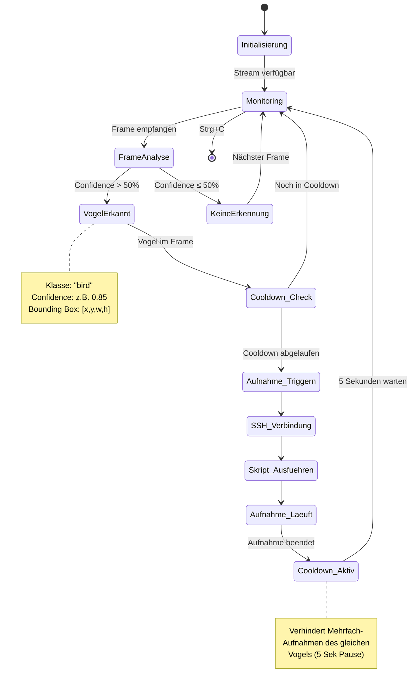
```mermaid
stateDiagram-v2
    [*] --> Initialisierung
    
    Initialisierung --> Monitoring: Stream verfügbar
    
    Monitoring --> FrameAnalyse: Frame empfangen
    
    FrameAnalyse --> VogelErkannt: Confidence > 50%
    FrameAnalyse --> KeineErkennung: Confidence ≤ 50%
    
    KeineErkennung --> Monitoring: Nächster Frame
    
    VogelErkannt --> Cooldown_Check: Vogel im Frame
    
    Cooldown_Check --> Aufnahme_Triggern: Cooldown abgelaufen
    Cooldown_Check --> Monitoring: Noch in Cooldown
    
    Aufnahme_Triggern --> SSH_Verbindung
    SSH_Verbindung --> Skript_Ausfuehren
    Skript_Ausfuehren --> Aufnahme_Laeuft
    
    Aufnahme_Laeuft --> Cooldown_Aktiv: Aufnahme beendet
    
    Cooldown_Aktiv --> Monitoring: 5 Sekunden warten
    
    Monitoring --> [*]: Strg+C
    
    note right of VogelErkannt
        Klasse: "bird"
        Confidence: z.B. 0.85
        Bounding Box: [x,y,w,h]
    end note
    
    note right of Cooldown_Aktiv
        Verhindert Mehrfach-
        Aufnahmen des gleichen
        Vogels (5 Sek Pause)
    end note
```

---

## 📁 Datei-Struktur

```
vogel-kamera-linux/
├── kamera-auto-trigger/
│   ├── scripts/
│   │   ├── ai-had-kamera-auto-trigger.py  🧠 Haupt-Controller
│   │   ├── stream_processor.py            🤖 YOLOv8 KI-Modul
│   │   └── config.py                      ⚙️ Konfiguration
│   ├── start-vogel-beobachtung.sh         🚀 Wrapper-Script
│   ├── run-auto-trigger.sh                🔧 venv Aktivierung
│   ├── README.md                          📖 Dokumentation
│   └── ARCHITEKTUR.md                     🏗️ Diese Datei
│
├── python-skripte/
│   ├── ai-had-kamera-remote-param-vogel-libcamera-single-AI-Modul.py
│   │                                      📹 Standard/KI Aufnahme
│   └── ai-had-kamera-remote-param-vogel-libcamera-zeitlupe.py
│                                          🎬 Zeitlupen-Aufnahme
│
├── git-automation/
│   ├── git_automation.py                  🔄 Git Automatisierung
│   └── GIT_AUTOMATION_README.md
│
└── Videos/                                💾 Aufnahme-Verzeichnis
    ├── 2025-10-03_14-30-45.mp4
    ├── 2025-10-03_14-30-45.wav
    └── ...
```

---

## 🚀 Startup-Sequenz im Detail

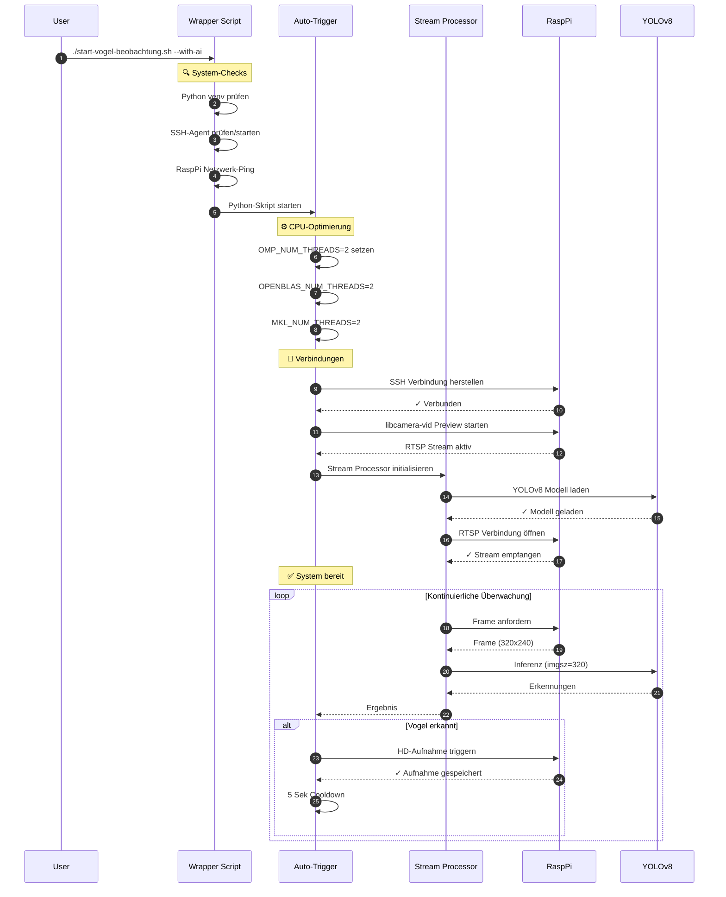
```mermaid
sequenceDiagram
    autonumber
    
    participant User
    participant Wrapper as Wrapper Script
    participant AutoTrigger as Auto-Trigger
    participant StreamProc as Stream Processor
    participant RaspPi
    participant YOLO as YOLOv8
    
    User->>Wrapper: ./start-vogel-beobachtung.sh --with-ai
    
    Note over Wrapper: 🔍 System-Checks
    Wrapper->>Wrapper: Python venv prüfen
    Wrapper->>Wrapper: SSH-Agent prüfen/starten
    Wrapper->>Wrapper: RaspPi Netzwerk-Ping
    
    Wrapper->>AutoTrigger: Python-Skript starten
    
    Note over AutoTrigger: ⚙️ CPU-Optimierung
    AutoTrigger->>AutoTrigger: OMP_NUM_THREADS=2 setzen
    AutoTrigger->>AutoTrigger: OPENBLAS_NUM_THREADS=2
    AutoTrigger->>AutoTrigger: MKL_NUM_THREADS=2
    
    Note over AutoTrigger: 🔌 Verbindungen
    AutoTrigger->>RaspPi: SSH Verbindung herstellen
    RaspPi-->>AutoTrigger: ✓ Verbunden
    
    AutoTrigger->>RaspPi: libcamera-vid Preview starten
    RaspPi-->>AutoTrigger: RTSP Stream aktiv
    
    AutoTrigger->>StreamProc: Stream Processor initialisieren
    
    StreamProc->>YOLO: YOLOv8 Modell laden
    YOLO-->>StreamProc: ✓ Modell geladen
    
    StreamProc->>RaspPi: RTSP Verbindung öffnen
    RaspPi-->>StreamProc: ✓ Stream empfangen
    
    Note over AutoTrigger: ✅ System bereit
    
    loop Kontinuierliche Überwachung
        StreamProc->>RaspPi: Frame anfordern
        RaspPi-->>StreamProc: Frame (320x240)
        StreamProc->>YOLO: Inferenz (imgsz=320)
        YOLO-->>StreamProc: Erkennungen
        StreamProc-->>AutoTrigger: Ergebnis
        
        alt Vogel erkannt
            AutoTrigger->>RaspPi: HD-Aufnahme triggern
            RaspPi-->>AutoTrigger: ✓ Aufnahme gespeichert
            AutoTrigger->>AutoTrigger: 5 Sek Cooldown
        end
    end
```

---

## 🔧 Fehlerbehandlung

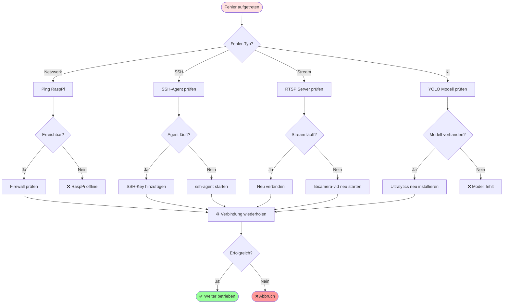
```mermaid
flowchart TD
    Start(["Fehler aufgetreten"])
    
    Start --> Type{"Fehler-Typ?"}
    
    Type -->|Netzwerk| N1["Ping RaspPi"]
    Type -->|SSH| S1["SSH-Agent prüfen"]
    Type -->|Stream| St1["RTSP Server prüfen"]
    Type -->|KI| K1["YOLO Modell prüfen"]
    
    N1 --> N2{"Erreichbar?"}
    N2 -->|Ja| N3["Firewall prüfen"]
    N2 -->|Nein| N4["❌ RaspPi offline"]
    
    S1 --> S2{"Agent läuft?"}
    S2 -->|Ja| S3["SSH-Key hinzufügen"]
    S2 -->|Nein| S4["ssh-agent starten"]
    
    St1 --> St2{"Stream läuft?"}
    St2 -->|Ja| St3["Neu verbinden"]
    St2 -->|Nein| St4["libcamera-vid neu starten"]
    
    K1 --> K2{"Modell vorhanden?"}
    K2 -->|Ja| K3["Ultralytics neu installieren"]
    K2 -->|Nein| K4["❌ Modell fehlt"]
    
    N3 --> Retry["♻️ Verbindung wiederholen"]
    S3 --> Retry
    S4 --> Retry
    St3 --> Retry
    St4 --> Retry
    K3 --> Retry
    
    Retry --> Success{Erfolgreich?}
    Success -->|Ja| End([✅ Weiter betrieben])
    Success -->|Nein| Error([❌ Abbruch])
    
    style Start fill:#ffe1e1
    style Error fill:#ff9999
    style End fill:#99ff99
```

**Automatische Recovery:**
- **Netzwerk-Timeout**: Auto-Reconnect nach 5 Sekunden
- **Stream-Unterbrechung**: Automatischer Stream-Neustart
- **SSH-Fehler**: SSH-Agent Neuinitialisierung
- **Frame-Drop**: Frame überspringen, weiter überwachen

---

## 📊 Monitoring & Logging

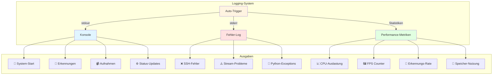
```mermaid
graph TB
    subgraph LogSys["Logging-System"]
        A["Auto-Trigger"] -->|stdout| B["Konsole"]
        A -->|stderr| C["Fehler-Log"]
        A -->|Statistiken| D["Performance-Metriken"]
    end
    
    subgraph Outputs["Ausgaben"]
        B --> B1["🚀 System-Start"]
        B --> B2["🎯 Erkennungen"]
        B --> B3["📹 Aufnahmen"]
        B --> B4["⚙️ Status-Updates"]
        
        C --> C1["❌ SSH-Fehler"]
        C --> C2["⚠️ Stream-Probleme"]
        C --> C3["🐛 Python-Exceptions"]
        
        D --> D1["📈 CPU-Auslastung"]
        D --> D2["🖼️ FPS Counter"]
        D --> D3["🎯 Erkennungs-Rate"]
        D --> D4["💾 Speicher-Nutzung"]
    end

    style A fill:#fff4e1
    style B fill:#e1f5ff
    style C fill:#ffe1e1
    style D fill:#e1ffe1
```

**Log-Beispiele:**

```
🚀 Vogel-Beobachtung mit KI gestartet
━━━━━━━━━━━━━━━━━━━━━━━━━━━━━━━━━━━━━━━
Aufnahme-Modus: 🤖 Mit KI + Audio (yolov8n.pt)
Preview: 320x240 @ 3 FPS
Recording: 1920x1080 @ 25 FPS + 44.1kHz Mono
CPU-Optimierung: OMP_NUM_THREADS=2
━━━━━━━━━━━━━━━━━━━━━━━━━━━━━━━━━━━━━━━

✓ SSH Verbindung hergestellt
✓ RTSP Stream aktiv: rtsp://raspi:8554/preview
✓ YOLOv8 Modell geladen

[14:30:45] 🎯 VOGEL ERKANNT! Confidence: 85%
[14:30:45] 📹 Aufnahme gestartet: Videos/2025-10-03_14-30-45.mp4
[14:31:05] ✅ Aufnahme beendet (20 Sekunden)
[14:31:05] ⏸️ Cooldown: 5 Sekunden

Performance: CPU 40% | FPS 3.2 | RAM 180MB
```

---

## 🎓 Zusammenfassung

### Haupt-Komponenten

| Komponente | Funktion | Technologie |
|------------|----------|-------------|
| **Preview Stream** | Niedrig-auflösende Echtzeit-Überwachung | RTSP, libcamera-vid |
| **KI-Modul** | Vogel-Erkennung in Echtzeit | YOLOv8, OpenCV |
| **Controller** | Orchestrierung & Trigger-Logik | Python, Paramiko |
| **Recording** | HD-Aufnahme mit Audio | libcamera-vid, arecord |
| **SSH-Layer** | Sichere Remote-Kommunikation | SSH, SSH-Agent |

### Datenfluss-Zusammenfassung

1. **RaspPi** sendet Preview-Stream (320x240, 3fps) via RTSP
2. **PC** analysiert Stream mit YOLOv8 (imgsz=320 für CPU-Effizienz)
3. Bei Vogel-Erkennung: **SSH-Trigger** an RaspPi
4. **RaspPi** startet HD-Aufnahme (1920x1080, 25fps oder 120fps)
5. **Audio** wird parallel aufgenommen (44.1kHz Mono)
6. **Speicherung** erfolgt lokal auf RaspPi als MP4 + WAV

### Performance-Optimierungen

```
🔧 Thread-Limiting → 🔧 FPS-Reduktion → 🔧 Auflösung → 🎯 YOLO imgsz=320
   (OMP=2)              (3 FPS)          (320x240)       (DURCHBRUCH!)
   
   107% → 82% → 82% → 40% CPU ✅
```

### Modi-Übersicht

| Modus | FPS | Auflösung | Audio | Verwendung |
|-------|-----|-----------|-------|------------|
| **Standard** | 25 | 1920x1080 | ✅ 44.1kHz | Normale Aufnahmen |
| **Mit KI** | 25 | 1920x1080 | ✅ 44.1kHz | Mit KI-Metadaten |
| **Zeitlupe** | 120 | 1536x864 | ✅ 44.1kHz | Slow-Motion |

---

## 🔗 Referenzen

- [YOLOv8 Dokumentation](https://docs.ultralytics.com/)
- [libcamera Dokumentation](https://libcamera.org/)
- [OpenCV Dokumentation](https://docs.opencv.org/)
- [Paramiko SSH Library](https://www.paramiko.org/)
- [Raspberry Pi Camera Dokumentation](https://www.raspberrypi.com/documentation/computers/camera_software.html)

---

**Version:** 1.2.0  
**Letzte Aktualisierung:** 3. Oktober 2025  
**Status:** ✅ Produktiv im Einsatz
