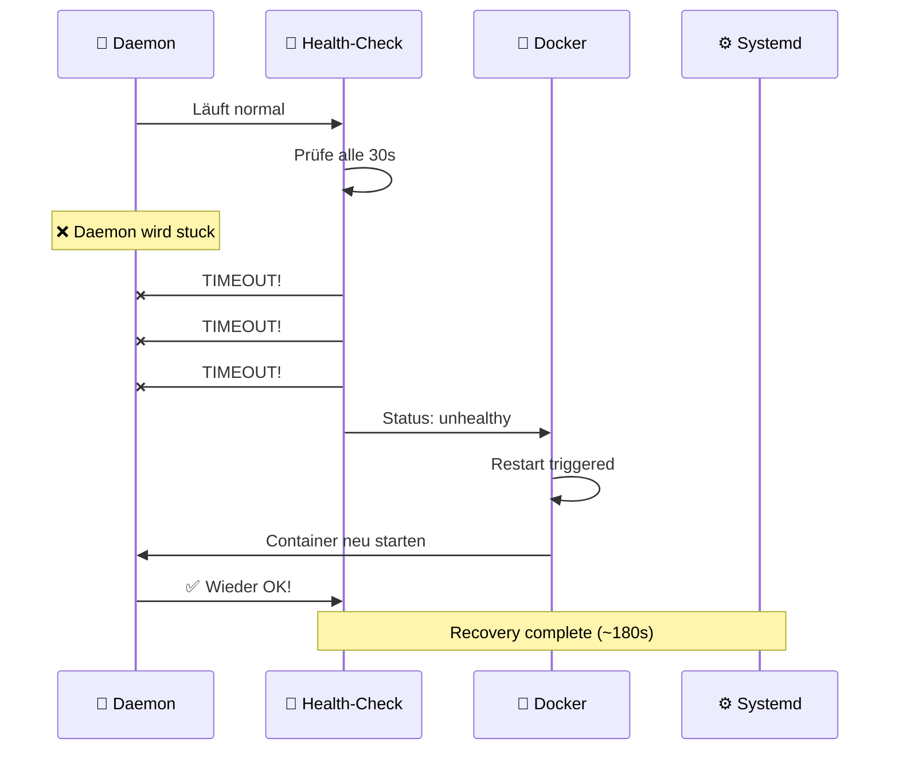

# 🏥 Health-Check System – Quick Reference

## 🚀 TL;DR – Das System in 30 Sekunden



---

## 📊 Die 3 Schichten

### Layer 1: 🐳 Docker (schnell)
- **Trigger:** Health-Check alle 30s
- **Test:** HTTP GET `/api/status` + JSON valid
- **Aktion:** Container Restart
- **Limit:** Max 5 Versuche
- **Pause:** 30s zwischen Versuchen
- **Recovery:** ~90-180 Sekunden

### Layer 2: ⚙️ Systemd (Fallback)
- **Trigger:** Docker compose stuck/crashed
- **Aktion:** Service Restart
- **Limit:** 5 Starts pro 5 Minuten
- **Pause:** 30s zwischen Versuchen
- **Recovery:** ~30-60 Sekunden

### Layer 3: 📊 Optional Health-Monitor
- **Trigger:** Alle 60 Sekunden
- **Test:** Docker Health Status
- **Aktion:** Logging + optionale Webhooks
- **Nutzen:** Zusätzliche Transparenz

---

## 🔧 Kommandos zum Debuggen

### Status überprüfen
```bash
# 1. Docker Health Status
docker inspect pi-daemon --format='{{.State.Health.Status}}'
# Output: healthy | unhealthy | starting

# 2. Systemd Service Status
systemctl status pi-daemon

# 3. Letzte Health-Checks
docker inspect pi-daemon --format='{{json .State.Health.Log}}' | jq

# 4. Container Logs
docker logs pi-daemon | tail -20
```

### Logs live ansehen
```bash
# Docker Logs (live)
docker logs -f --timestamps pi-daemon

# Systemd Logs (live)
journalctl -u pi-daemon -f

# Health-Monitor Logs (falls aktiv)
tail -f /var/log/pi-daemon-health.log
```

### Service neu starten
```bash
# Option 1: Docker nur neu starten
docker restart pi-daemon

# Option 2: Systemd Service neu starten
sudo systemctl restart pi-daemon

# Option 3: Reset StartLimitBurst + Start
sudo systemctl reset-failed pi-daemon
sudo systemctl start pi-daemon
```

### Health-Check manuell testen
```bash
docker exec pi-daemon python3 -c "
import urllib.request, ssl, sys
try:
    ctx = ssl.create_default_context()
    ctx.check_hostname = False
    ctx.verify_mode = ssl.CERT_NONE
    urllib.request.urlopen('https://localhost:8443/api/status', context=ctx, timeout=4)
    print('✅ Health-Check OK')
    sys.exit(0)
except Exception as e:
    print(f'❌ Health-Check FEHLER: {e}')
    sys.exit(1)
"
```

---

## ⚡ Häufige Probleme & Lösungen

### Problem: Container startet immer neu
**Symptome:** `docker logs` zeigt Fehler, Service ist in Restart-Schleife

**Diagnose:**
```bash
# Check StartLimitBurst
systemctl status pi-daemon
# Suche: "StartLimitBurst was hit" oder "inactive (dead)"

# Check Docker Logs
docker logs pi-daemon | grep -i error
```

**Lösung:**
```bash
# StartLimitBurst zurücksetzen
sudo systemctl reset-failed pi-daemon

# Logs prüfen vor Restart
journalctl -u pi-daemon -n 100 | less

# Image/Config neu laden
docker pull pi-daemon:latest
docker-compose up --force-recreate

# Service neustarten
sudo systemctl start pi-daemon
```

---

### Problem: WebUI antwortet nicht, aber Daemon läuft
**Symptome:** `docker ps` zeigt Container als "Up", aber HTTP 8443 antwortet nicht

**Diagnose:**
```bash
# Health-Status?
docker inspect pi-daemon --format='{{.State.Health.Status}}'
# Falls: unhealthy → Docker Restart läuft

# Port offen?
netstat -tlnp | grep 8443

# Container aktiv?
docker ps | grep pi-daemon

# Last Health-Check
docker logs pi-daemon | grep -i "health" | tail -5
```

**Lösung:**
```bash
# Docker Restart forcieren
docker restart pi-daemon

# Oder Systemd
sudo systemctl restart pi-daemon

# Dann warten, bis Status wieder healthy ist
watch 'docker inspect pi-daemon --format="{{.State.Health.Status}}"'
# Drücke Ctrl+C wenn "healthy" erscheint
```

---

### Problem: Health-Check schlägt immer fehl
**Symptome:** Docker zeigt Status "unhealthy", aber WebUI lädt

**Diagnose:**
```bash
# API direkt testen
curl -k https://localhost:8443/api/status -v

# Flask-Port offen?
netstat -tlnp | grep 8443

# Container Netzwerk OK?
docker exec pi-daemon curl http://localhost:8443/
```

**Lösungen:**
```bash
# 1. Certificate Fehler? (SSL context issue)
docker logs pi-daemon | grep -i ssl

# 2. API überantwortet? Timeout erhöhen in docker-compose.yml
# healthcheck:
#   test: timeout 10 python3 ...
#   timeout: 10s

# 3. Container SIGKILL beenden + neu starten
docker kill pi-daemon
docker-compose up -d
```

---

## 📈 Monitoring Dashboard (Optional)

### Mit systemd-journalctl + tail:
```bash
# Multi-window monitoring
tmux new-session -d -s "pi-daemon-monitor"
tmux send-keys -t pi-daemon-monitor "watch 'docker inspect pi-daemon --format=\"{{.State.Health.Status}}\" && echo && systemctl status pi-daemon | head -5'" Enter
tmux send-keys -t pi-daemon-monitor -X new-window
tmux send-keys -t pi-daemon-monitor "journalctl -u pi-daemon -f" Enter
```

### Mit Prometheus + Grafana:
```yaml
# prometheus.yml
global:
  scrape_interval: 30s

scrape_configs:
  - job_name: 'pi-daemon'
    static_configs:
      - targets: ['localhost:8443']
    metrics_path: '/api/status'
```

---

## 📋 Konfiguration schnell ändern

### Health-Check Interval (schneller reagieren)
**Datei:** `/opt/pi-daemon/docker-compose.yml`
```yaml
healthcheck:
  interval: 15s      # schneller (statt 30s)
  timeout: 5s
  retries: 2         # weniger Versuche (statt 3)
  start_period: 20s
```
Dann: `docker-compose up -d`

### Systemd Limits erhöhen (längeres Fenster)
**Datei:** `/etc/systemd/system/pi-daemon.service`
```ini
StartLimitInterval=600    # 10 Min (statt 5)
StartLimitBurst=10        # 10 Starts (statt 5)
```
Dann: `sudo systemctl daemon-reload && sudo systemctl restart pi-daemon`

---

## 🎯 Wann ist das System "gesund"?

```mermaid
checklist
  ✓ docker ps zeigt pi-daemon als "Up"
  ✓ docker inspect health status = "healthy"
  ✓ curl https://localhost:8443/api/status antwortet
  ✓ systemctl status pi-daemon = "active (running)"
  ✓ WebUI Dashboard lädt + aktualisiert sich
  ✓ Videos werden noch immer aufgenommen
```

---

## 📞 Support-Checkliste

Falls Probleme auftreten:

```bash
# 1. Status sammeln
mkdir -p /tmp/pi-daemon-debug
docker logs pi-daemon > /tmp/pi-daemon-debug/docker-logs.txt
journalctl -u pi-daemon -n 200 > /tmp/pi-daemon-debug/systemd-logs.txt
docker inspect pi-daemon > /tmp/pi-daemon-debug/docker-inspect.json
systemctl status pi-daemon > /tmp/pi-daemon-debug/systemctl-status.txt

# 2. Komprimieren
tar -czf pi-daemon-debug-$(date +%Y%m%d-%H%M%S).tar.gz /tmp/pi-daemon-debug/

# 3. Zur Analyse bereitstellen
echo "Debug-Archive erstellt: $(ls -lh pi-daemon-debug-*.tar.gz)"
```

---

## 🔗 Weitere Ressourcen

- 📊 **Detaillierte Mermaid-Diagramme:** [HEALTHCHECK-MERMAID.md](HEALTHCHECK-MERMAID.md)
- 📖 **Vollständige Dokumentation:** [HEALTHCHECK-OPTIMIZATION.md](HEALTHCHECK-OPTIMIZATION.md)
- ⚙️ **Systemd Service Docs:** `man systemd.service`
- 🐳 **Docker Health-Check:** `docker help healthcheck`

---

**Kurz zusammengefasst:** System ist selbstheilend, braucht meist keine manuelle Intervention! ✨
