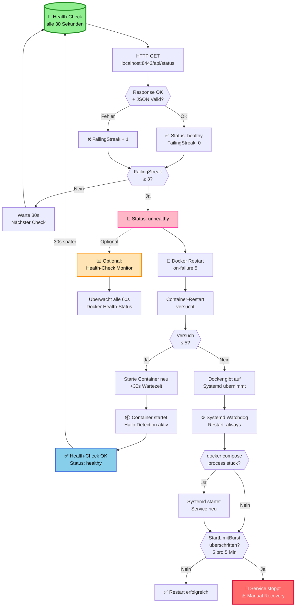
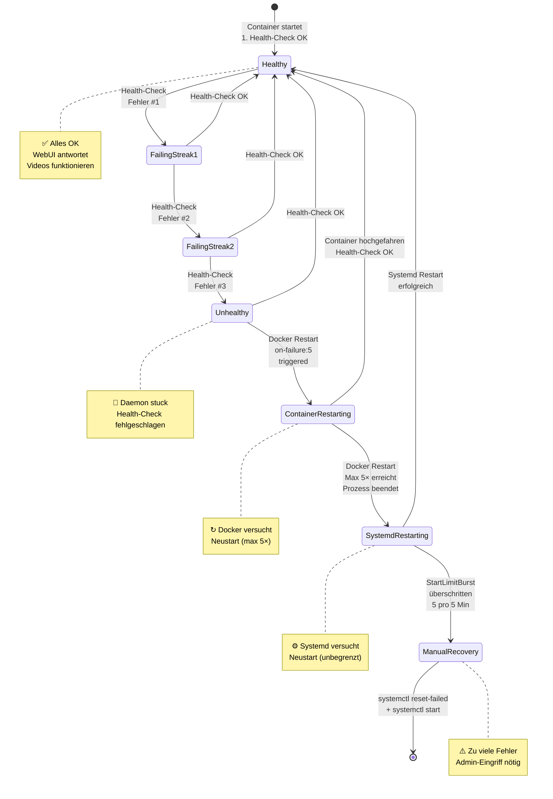
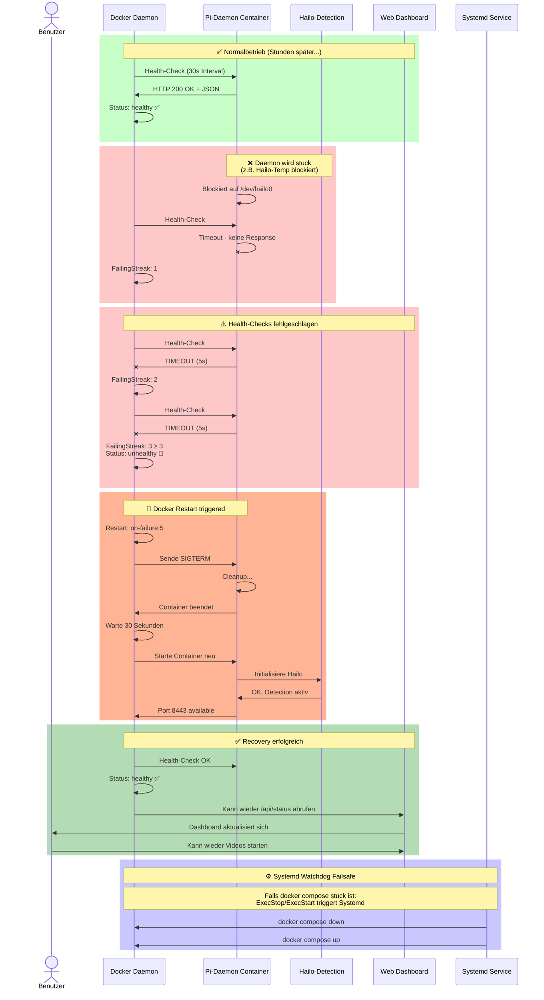
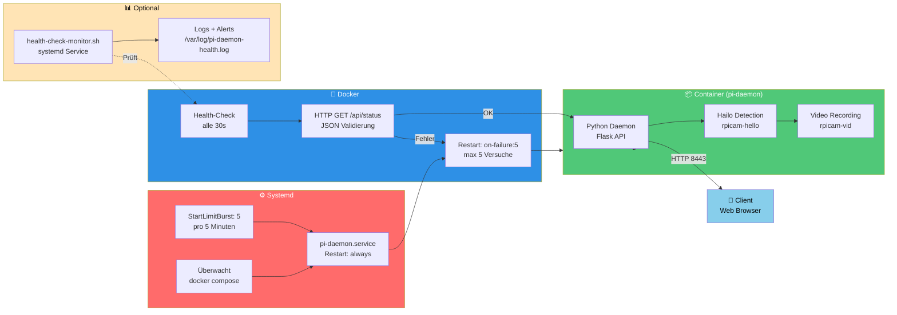
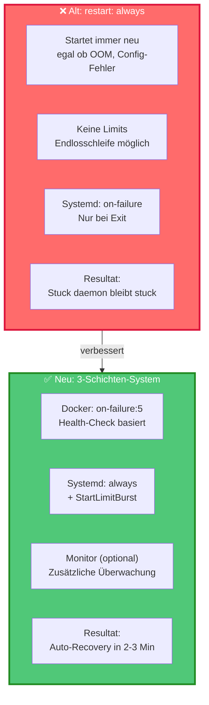
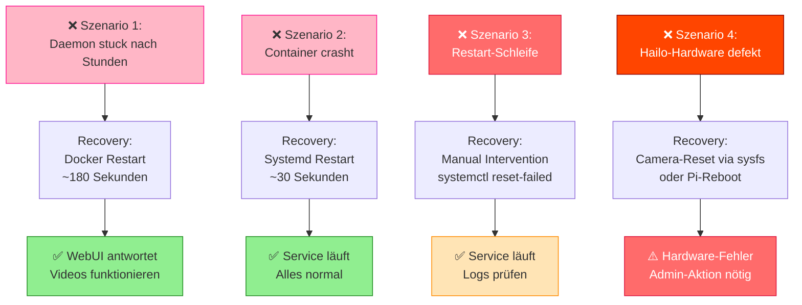

# 🏥 Health-Check System – Mermaid Diagramme

## 1️⃣ Restart-System Flowchart



---

## 2️⃣ Zustandsübergänge (State Machine)



---

## 3️⃣ Zeitliche Abfolge (Sequence Diagram)



---

## 4️⃣ Stuck-Scenario Zeitplan

```mermaid
gantt
    title Health-Check Restart Timeline (Stuck Daemon Szenario)
    dateFormat HH:mm:ss
    
    section Normal
    Normalbetrieb           :crit, normal1, 00:00:00, 02:00:00
    
    section Fehler
    Daemon stuck            :crit, stuck1, 02:00:00, 03:00:00
    Health-Check #1 FAIL    :active, hc1, 02:00:00, 02:00:05
    Health-Check #2 FAIL    :active, hc2, 02:00:30, 02:00:35
    Health-Check #3 FAIL    :active, hc3, 02:01:00, 02:01:05
    Status unhealthy        :crit, unhealthy, 02:01:05, 02:02:00
    
    section Docker Restart
    Docker Restart Trigger  :restart1, 02:02:00, 02:02:30
    Warte 30s               :crit, wait1, 02:02:30, 02:03:00
    Container Neustart      :restart1, 02:03:00, 02:03:30
    Container-Startup       :active, startup, 02:03:30, 02:03:45
    Health-Check OK         :ok, hc_ok, 02:03:45, 02:03:50
    
    section Recovery
    Status healthy          :ok, healthy, 02:03:50, 04:00:00
    WebUI antwortet        :ok, webui, 02:03:50, 04:00:00
    
    section Timeline
    🔴 T+0s: Stuck        :milestone, m1, 02:00:00, 0m
    ⚠️ T+90s: Unhealthy    :milestone, m2, 02:01:30, 0m
    🔄 T+120s: Restart     :milestone, m3, 02:02:00, 0m
    ✅ T+180s: Recovered   :milestone, m4, 02:03:00, 0m
```

---

## 5️⃣ Komponenten-Architektur



---

## 6️⃣ Restart-Strategien Vergleich



---

## 7️⃣ Fehler-Szenarios und Recovery



---

## 🎯 Zusammenfassung: Was passiert beim Stuck-Daemon?

| Time | Event | Component | Status |
|------|-------|-----------|--------|
| **T+0s** | Daemon blockiert (z.B. Hailo stuck) | Container | 🔴 Stuck |
| **T+30s** | Health-Check #1 FAIL | Docker | ⚠️ FailingStreak: 1 |
| **T+60s** | Health-Check #2 FAIL | Docker | ⚠️ FailingStreak: 2 |
| **T+90s** | Health-Check #3 FAIL → **Unhealthy** | Docker | 🔴 Unhealthy |
| **T+120s** | **Docker Restart** triggered | Docker | ↻ Restarting |
| **T+150s** | Container stellt sich selbst wieder her | Container | 🟡 Startup |
| **T+180s** | **Recovery erfolgreich** ✅ | All | ✅ Healthy |

**Total Recovery Time:** **~3 Minuten** ohne manuelle Intervention!

---

## 📋 Mermaid Diagramme in Markdown

Diese Diagramme funktionieren in:
- ✅ GitHub README / Markdown
- ✅ Obsidian / Notion (mit Mermaid Plugin)
- ✅ GitLab Wiki
- ✅ Confluence (mit Mermaid Plugin)
- ✅ mkdocs-material

Zum Rendering benötigt: `mermaid` syntax highlighting oder ein Markdown-Viewer mit Mermaid-Support.
