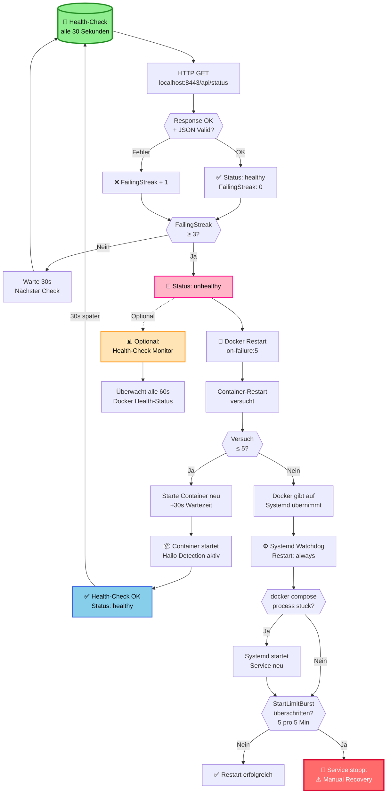
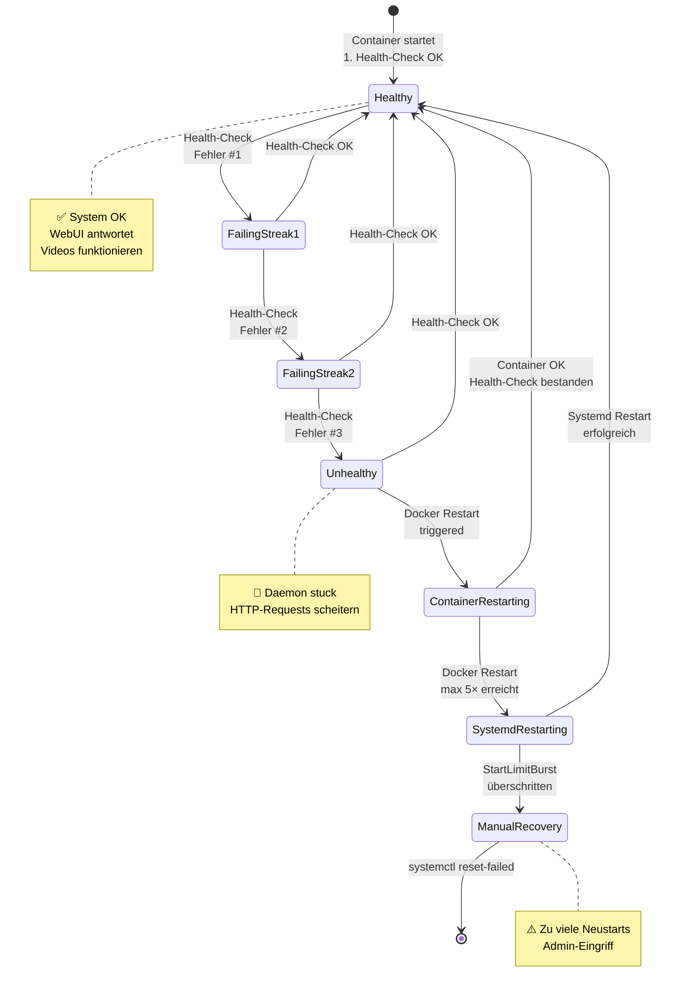
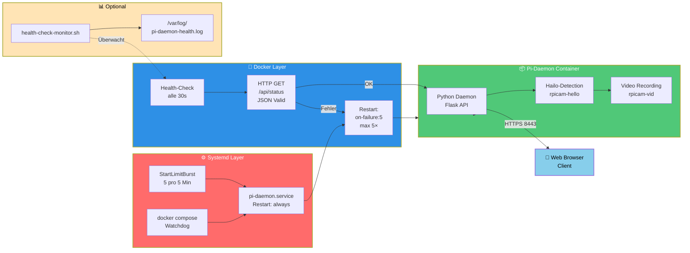
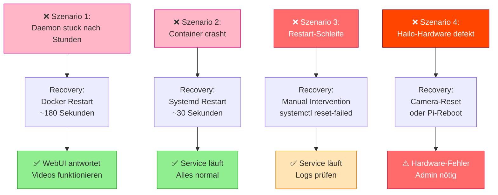
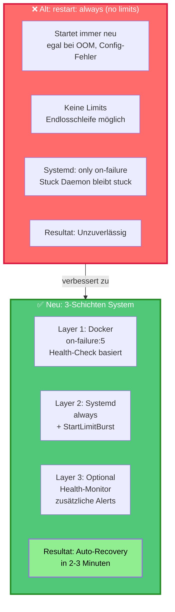

# 🏥 Health-Check Optimierung – Robustheit gegen Stuck Daemon

## Übersicht

Das System wurde optimiert, um **automatisch zu erkennen und zu reagieren** wenn der Pi-Daemon "stuck" wird (blockiert/reagiert nicht auf HTTP-Requests).

### Was wurde verbessert?

| Komponente | Alt | Neu | Nutzen |
|-----------|-----|-----|--------|
| **Docker Restart** | `always` | `on-failure:5` | Verhindert Restart wenn Docker-Fehler (z.B. OOM) vorhanden |
| **Health-Check Test** | HTTP GET auf `/` | HTTP GET auf `/api/status` + JSON-Validierung | Prüft ob API wirklich funktioniert, nicht nur HTTP 200 |
| **Health-Check Interval** | 30s | 30s (unverändert) | – |
| **Health-Check Retries** | 3 Versuche | 3 Versuche | – |
| **Systemd Restart** | `on-failure` | `always` | Startet auch wenn `docker compose` stuck ist |
| **Systemd Start-Limit** | Keine | 5 Starts pro 5 Min | Verhindert Endlosschleife bei fundamentalen Fehlern |
| **Monitoring** | Keine | Health-Check Monitor Script (optional) | Logs + zusätzliche Alerts |

---

## 🔄 Wie funktioniert das Restart-System?

### Quick Mermaid Flowchart:



---

## 🎯 Zustandsübergänge (State Diagram)



---

## ⏱️ Zeitliche Abfolge (bei Stuck-Daemon)

```mermaid
gantt
    title Health-Check Recovery Timeline
    dateFormat HH:mm:ss
    
    section Normal
    Normalbetrieb           :done, normal, 00:00:00, 02:00:00
    
    section Fehler
    Daemon stuck            :crit, stuck, 02:00:00, 03:00:00
    Health-Check #1 FAIL    :active, hc1, 02:00:00, 02:00:05
    Health-Check #2 FAIL    :active, hc2, 02:00:30, 02:00:35
    Health-Check #3 FAIL    :active, hc3, 02:01:00, 02:01:05
    Status unhealthy        :crit, unhealthy, 02:01:05, 02:02:00
    
    section Docker Restart
    Docker Restart Trigger  :restart, restart1, 02:02:00, 02:02:30
    Warte 30s               :crit, wait, 02:02:30, 02:03:00
    Container Restart       :restart, restart2, 02:03:00, 02:03:30
    Container Startup       :active, startup, 02:03:30, 02:03:45
    Health-Check OK         :ok, hc_ok, 02:03:45, 02:03:50
    
    section Recovery
    Status healthy          :ok, healthy, 02:03:50, 04:00:00
    WebUI antwortet         :ok, webui, 02:03:50, 04:00:00
    
    section Milestones
    🔴 Stuck                :crit, milestone, m1, 02:00:00, 1m
    ⚠️ Unhealthy            :crit, milestone, m2, 02:01:05, 1m
    🔄 Restart              :milestone, m3, 02:02:00, 1m
    ✅ Recovered            :ok, milestone, m4, 02:03:50, 1m
```

**Total Recovery: ~180 Sekunden** ohne manuelle Aktion!

---

## 🏗️ Komponenten-Architektur



---

## 🚨 Fehler-Szenaricos



---

## 📊 Restart-Strategien: Alt vs. Neu



---

## 📋 Deployment

Alle Dateien werden von Ansible automatisch installiert:

```bash
# Template → Actual File
docker-compose.yml.j2      → /opt/pi-daemon/docker-compose.yml
pi-daemon.service.j2       → /etc/systemd/system/pi-daemon.service
health-check-monitor.sh.j2 → /usr/local/bin/health-check-monitor.sh (optional)
pi-daemon-healthcheck.service.j2 → /etc/systemd/system/pi-daemon-healthcheck.service (optional)
```

**Nach der Installation:**

```bash
# Systemd neu laden
sudo systemctl daemon-reload

# Services neu starten
sudo systemctl restart pi-daemon

# Optional: Health-Check Monitor starten
sudo systemctl start pi-daemon-healthcheck
sudo systemctl enable pi-daemon-healthcheck
```

---

## 🔍 Monitoring & Debugging

### Status prüfen

```bash
# Docker Health-Status
docker inspect pi-daemon --format='{{json .State.Health}}'

# Systemd Service Status
systemctl status pi-daemon

# Logs anschauen
journalctl -u pi-daemon -f                          # Live
journalctl -u pi-daemon -n 100                      # Letzte 100
tail -f /var/log/pi-daemon-health.log               # Health-Monitor
```

### Health-Check manuell testen

```bash
docker exec pi-daemon python3 -c "
import urllib.request, ssl, sys, json
try:
    ctx = ssl.create_default_context()
    ctx.check_hostname = False
    ctx.verify_mode = ssl.CERT_NONE
    resp = urllib.request.urlopen('https://localhost:8443/api/status', context=ctx, timeout=4)
    data = json.loads(resp.read())
    print('✅ Health-Check OK:', data.get('version'))
except Exception as e:
    print('❌ Health-Check FEHLER:', e)
    sys.exit(1)
"
```

---

## 🎯 Zusammenfassung

| Komponente | Verhalten |
|-----------|-----------|
| **Health-Check** | Alle 30s, HTTP GET auf `/api/status` |
| **Docker Restart** | Nach 3× unhealthy (90s), max 5 Versuche |
| **Systemd Restart** | Immer, wenn Service beendet |
| **Restart-Pause** | 30s zwischen Versuchen |
| **Start-Limit** | Max 5 Starts pro 5 Min |
| **Recovery Time** | **~180 Sekunden** ohne manuelle Intervention |

**System ist jetzt selbstheilend!** ✅
