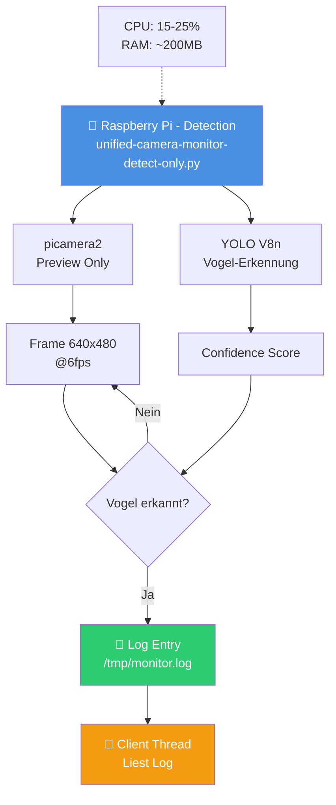
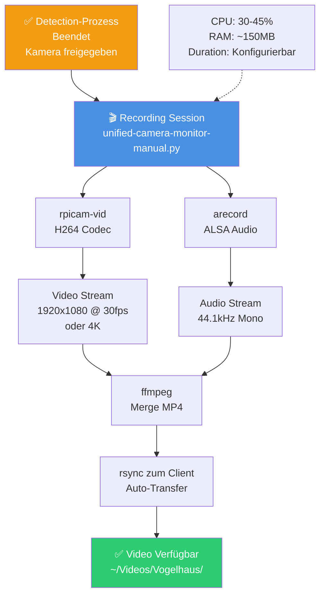
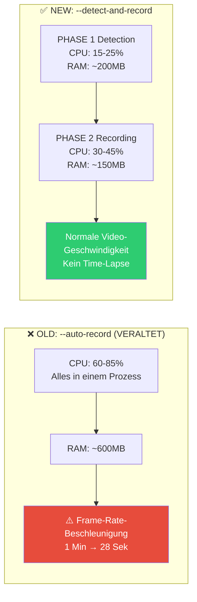
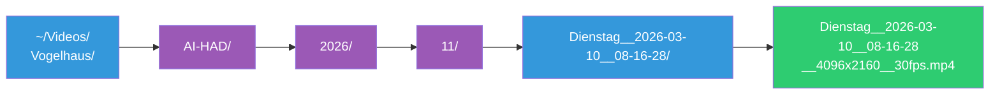

# 🆕 Detect-and-Record Modus (NEU!)

## 🎯 Lösung für das Time-Lapse Problem

Das alte `--auto-record` hatte ein Problem: Videos wurden im Time-Lapse verarbeitet (1 Min → 28 Sek Verarbeitung).

**Ursache**: Detection, Video-Encoding, Audio-Merge, Konvertierung und rsync waren alle in einem Prozess und verursachten CPU-Bottlenecks.

**Lösung**: Zwei-Phasen-Betrieb mit **sauberer Prozess-Trennung**!

---

## 🏗️ Architektur

### ⚡ Quick Reference - Parameter Cheatsheet

```bash
# BASICS: MODE + FLAG + DURATION
python3 unified_monitor_client.py [MODE] --detect-and-record --duration [SEC]

MODE:        normal | slowmo | 4k | ai-had
DETECTION:   --threshold [0.0-1.0]  Default: 0.5
             --cooldown [1-300]      Default: 15
             --trigger [0.3-30.0]    Default: 1.0
RECORDING:   --fps [15/24/30/60/120] Default: 30
             --resolution [480p/720p/1080p/2k/4k]
             --bitrate [kbps]        Default: auto
SPECIAL:     --audio-only            (Nur Audio, kein Video)
             --manual-record         (Skip Detection, nur Recording)
             --auto-record           (⚠️ Legacy, nicht empfohlen)
```

**Schnellstarts:**
```bash
# Klassisch: Standard Bird Detection + 10 Sekunden
python3 unified_monitor_client.py normal --detect-and-record

# Kurz & knackig: Mobile/Test
python3 unified_monitor_client.py normal --detect-and-record --resolution 480p --fps 15 --duration 5

# 4K Cinema: Maximale Qualität
python3 unified_monitor_client.py 4k --detect-and-record --duration 30 --bitrate 8000

# Audio nur: Vogelgesang aufnehmen
python3 unified_monitor_client.py normal --detect-and-record --audio-only --duration 30

# Manuelle Aufnahme: Kein Detection-Overhead
python3 unified_monitor_client.py normal --manual-record --duration 20
```

---

### PHASE 1️⃣ - DETECTION (Fokussiert)



**Was passiert hier:**
- Nur YOLO-Inferenz
- Frame-Capture (640x480 Preview)
- Kein Video-Encoding
- Minimal CPU/RAM

---

### PHASE 2️⃣ - RECORDING (Nach erfolgreichem Trigger)



**Was passiert hier:**
- Hochqualitäts-Video (rpicam-vid)
- Audio-Sync
- Video-Konvertierung
- Automatischer Transfer

---

## 🚀 Verwendung

### Schnellstart (EMPFOHLEN)

```bash
# Einfach: Standard Bird Detection + 10 Sekunden Video
cd ~/vogel-kamera-linux/unified-monitor-client
python3 unified_monitor_client.py normal --detect-and-record

# Video wird hier gespeichert:
# ~/Videos/Vogelhaus/AI-HAD/2026/11/Dienstag__2026-03-10__HH-MM-SS/Dienstag__2026-03-10__HH-MM-SS__1920x1080__30fps.mp4
```

---

### Mit Detection-Parametern

```bash
# Detection für 2 Minuten, dann 20 Sekunden Video aufnehmen
python3 unified_monitor_client.py normal --detect-and-record \
  --threshold 0.4 \           # DETECTION: Erkennungs-Schwelle
  --cooldown 15 \             # DETECTION: Max. eine Erkennung alle 15 Sekunden
  --trigger 1.0 \             # DETECTION: Mindestens 1 Sekunde Vogel erkannt
  --duration 20               # RECORDING: 20 Sekunden nach Trigger aufnehmen
```

---

### Mit Qualitäts-Parametern

```bash
# Standard Detection + qualitativ hochwertig aufnehmen
python3 unified_monitor_client.py normal --detect-and-record \
  --duration 30 \             # RECORDING: 30 Sekunden aufnehmen
  --fps 30 \                  # RECORDING: 30 Frames pro Sekunde
  --resolution 1080p \        # RECORDING: Full HD Auflösung
  --bitrate 5000              # RECORDING: 5000 kbps Bitrate
```

---

### 4K Cinema mit Audio

```bash
# Schneller Vogel-Trigger + 4K Cinema Aufnahme
python3 unified_monitor_client.py 4k --detect-and-record \
  --threshold 0.5 \           # DETECTION: Standard Schwelle
  --duration 30 \             # RECORDING: 30 Sekunden in 4K
  --bitrate 8000              # RECORDING: Hohe Bitrate für 4K
```

**Hinweis**: Der `4k` Mode setzt automatisch Auflösung auf 4096x2160 @ 25fps

---

### Nur Vogelgesang (Audio-only)

```bash
# Vogel erkannt → nur Ton aufnehmen (15 Sekunden)
python3 unified_monitor_client.py normal --detect-and-record \
  --audio-only \              # RECORDING: Nur Audio, kein Video
  --duration 15               # RECORDING: 15 Sekunden Audio
```

---

### Testen mit manueller Aufnahme

```bash
# KEIN Detection = direkt 10 Sekunden Video
python3 unified_monitor_client.py normal --manual-record \
  --duration 10               # RECORDING: 10 Sekunden aufnehmen
```

**Hinweis**: `--manual-record` ignoriert alle DETECTION-Parameter

---

### Expert: Alle Parameter kombiniert

```bash
# Alles konfiguriert - für spezielle Anwendungsfälle
python3 unified_monitor_client.py 4k --detect-and-record \
  --threshold 0.6 \           # DETECTION: Mittlere Strenge
  --cooldown 20 \             # DETECTION: 20 Sekunden Puffer
  --trigger 1.5 \             # DETECTION: 1,5 Sekunden Mindestdauer
  --duration 45 \             # RECORDING: 45 Sekunden
  --fps 25 \                  # RECORDING: 25 fps (optimal für 4K)
  --bitrate 8000 \            # RECORDING: Hohe Qualität
  --resolution 4k             # RECORDING: Force 4K (Mode-Default)
```

---

### Parameter-Kombinationen nach Anforderung

**Energie-effizient:**
```bash
python3 unified_monitor_client.py normal --detect-and-record \
  --duration 5 --resolution 480p --fps 15 --bitrate 1500
```

**Hochqualität:**
```bash
python3 unified_monitor_client.py 4k --detect-and-record \
  --duration 60 --fps 25 --bitrate 8000
```

**Zeitlupe:**
```bash
python3 unified_monitor_client.py slowmo --detect-and-record \
  --duration 10 --fps 120 --bitrate 6000
```

**Audio-fokussiert:**
```bash
python3 unified_monitor_client.py normal --detect-and-record \
  --audio-only --duration 30
```

---

## 📊 Komplette Parameter-Dokumentation

### 🎬 RECORDING-MODES (Erstes Argument)

```bash
python3 unified_monitor_client.py <MODE> --detect-and-record
```

| Mode | Auflösung | FPS | Audio | Bitrate | Zweck |
|------|-----------|-----|-------|---------|-------|
| `normal` | 1920x1080 | 30 | ✅ | auto | Standard-Vogelbeobachtung |
| `slowmo` | 1536x864 | 120 | ❌ | auto | Zeitlupe-Aufnahmen |
| `4k` | 4096x2160 | 25 | ✅ | auto | Cinema 4K Qualität |
| `ai-had` | 1920x1080 | 30 | ✅ | auto | Audio-optimiert |

---

### 🆕 DETECTION-PHASE Parameter (--detect-and-record / --auto-record)

Steuern die Vogel-Erkennung und den Trigger-Mechanismus.

| Parameter | Type | Default | Range | Beschreibung |
|-----------|------|---------|-------|--------------|
| `--threshold` | float | 0.5 | 0.0 - 1.0 | YOLO-Erkennungs-Schwelle: Höher = strenger, nur sichere Erkennungen |
| `--cooldown` | int | 15 | 1 - 300 | Sekunden Wartezeit nach erfolgreichem Trigger (Duplikate vermeiden) |
| `--trigger` | float | 1.0 | 0.3 - 30.0 | Mindest-Dauer in Sekunden wie lange Vogel sichtbar sein muss für Trigger |

**Erklärung:**
- `--threshold 0.5` = Mittlere Erkennungsgenauigkeit (empfohlen)
- `--threshold 0.7` = Streng (weniger Fehlalarme, aber evtl. Vögel übersehen)
- `--threshold 0.3` = Locker (mehr Erkennungen, aber evtl. Fehlalarme)
- `--trigger 0.3` = Schnell trigerbar (Vögel fliegen schnell vorbei)
- `--trigger 1.5` = Puffer (nur längere Vogelbesuche)
- `--cooldown 30` = Lange Pausen (sparen Energie bei vielen Vögeln)
- `--cooldown 10` = Häufige Aufnahmen (mehr Videos, mehr CPU)

**Beispiel für verschiedene Szenarien:**

Schnelle Vogel-Reaktion (z.B. schnell flüchtige Vögel):
```bash
--threshold 0.4 --trigger 0.3 --cooldown 10
```

Sichere Erkennung (z.B. Park mit Possums):
```bash
--threshold 0.7 --trigger 1.5 --cooldown 30
```

---

### 📹 RECORDING-PHASE Parameter (--detect-and-record / --manual-record)

Steuern die Videoqualität und -länge nach erfolgreichem Trigger.

| Parameter | Type | Default | Options | Beschreibung |
|-----------|------|---------|---------|--------------|
| `--duration` | int | 10 | 1 - 600 | Aufnahmedauer in **SEKUNDEN** nach Trigger oder Start (nicht Minuten!) |
| `--fps` | int | 30 | 15, 24, 30, 60, 120 | Framerate - höher = flüssiger aber größere Dateigröße |
| `--resolution` | str | auto | 480p, 720p, 1080p, 2k, 4k | Video-Auflösung (kann Mode überschreiben) |
| `--bitrate` | int | auto | 1000 - 25000 | Video-Bitrate in kbps (auto=optimal für Mode) |
| `--audio-only` | flag | false | - | Nur Audio aufnehmen, kein Video |

**Erklärung:**

`--duration`:
- `--duration 5` = Kurze Aufnahmen (schnelle Verarbeitung, kleine Dateien)
- `--duration 20` = Standard (Balance Qualität/Größe)
- `--duration 60` = Lange Aufnahmen (größere Dateien, beste Qualität)

`--fps`:
- `--fps 15` = Energieeffizient, kleinere Dateien
- `--fps 30` = Standard, gute Balance
- `--fps 60` = Smooth, schnelle Bewegungen schön aufgelöst
- `--fps 120` = Ultra-smooth, nur mit slowmo mode

`--resolution`:
- `--resolution 480p` = Klein & schnell (energieeffizient)
- `--resolution 720p` = Kompromiss (viele Details, noch kompakt)
- `--resolution 1080p` = Full HD (Standard, beste Balance)
- `--resolution 2k` = 2K Ultra (sehr detailliert)
- `--resolution 4k` = Cinema 4K (maximale Qualität, große Dateien)

`--bitrate`:
- `--bitrate 3000` = Niedrig (kleine Dateien, schneller Transfer)
- `--bitrate 5000` = Standard Video
- `--bitrate 8000` = Hochqualität (für 4K/Zeitlupe)
- `--bitrate 15000` = Ultra (maximale Qualität, große Dateien)

`--audio-only`:
- Keine Flags = Video + Audio (Standard)
- `--audio-only` = Nur Ton aufnehmen (z.B. für Vogelgesang)

**Beispiele für verschiedene Use-Cases:**

Energieeffiziente Aufnahme (Raspberry Pi mit begrenztem Speicher):
```bash
python3 unified_monitor_client.py normal --detect-and-record \
  --duration 10 \
  --resolution 720p \
  --fps 15 \
  --bitrate 2500
```

Hochqualitäts-Aufnahme (4K Cinema):
```bash
python3 unified_monitor_client.py 4k --detect-and-record \
  --duration 30 \
  --resolution 4k \
  --fps 25 \
  --bitrate 8000
```

Vogelgesang-Sammlung:
```bash
python3 unified_monitor_client.py normal --detect-and-record \
  --duration 15 \
  --audio-only
```

Zeitlupe (Slow-Motion):
```bash
python3 unified_monitor_client.py slowmo --detect-and-record \
  --duration 10 \
  --fps 120
```

---

### 🎛️ RECORDING-Modi Parameter (Automatisch basierend auf Mode)

Diese Parameter werden automatisch basierend auf dem Mode gesetzt, können aber durch explizite Flags überschrieben werden.

| Mode | default-width | default-height | default-fps | default-bitrate | audio |
|------|---------------|----------------|-------------|-----------------|-------|
| `normal` | 1920 | 1080 | 30 | 5000 | ✅ Ja |
| `slowmo` | 1536 | 864 | 120 | 6000 | ❌ Nein |
| `4k` | 4096 | 2160 | 25 | 8000 | ✅ Ja |
| `ai-had` | 1920 | 1080 | 30 | 5000 | ✅ Ja |

**Hinweis**: Du kannst diese Defaults mit `--resolution`, `--fps`, `--bitrate` überschreiben.

---

### 🚩 SPECIAL FLAGS (nur mit --detect-and-record)

| Flag | Beschreibung |
|------|--------------|
| `--detect-and-record` | Aktiviert neuen Zwei-Phasen-Modus (EMPFOHLEN) |
| `--auto-record` | ⚠️ Veraltet - kombiniert Detection + Recording im gleichen Prozess |
| `--manual-record` | Deaktiviert Detection, startet direkt Aufnahme |
| `--audio-only` | Schaltet Video aus, speichert nur Audio |

---

### 🔧 EXPERT-Parameter für detect-only (Fernsteuerung, intern)

Diese Parameter werden vom Client automatisch an das Remote-Skript weitergeleitet:

| Parameter | Default | Beschreibung |
|-----------|---------|--------------|
| `--audio-threshold` | 0.5 | Audio-Triggerschwelle für AI-HAD Mode |
| `--camera` | 0 | Kamera-Nummer (0=erste, 1=zweite) |
| `--model` | auto | Pfad zu Custom YOLO-Modell |
| `--debug` | false | Debug-Output aktivieren |

**Hinweis**: Diese sind meist nicht notwendig - nutze sie nur wenn du Custom-Modelle oder mehrere Kameras hast.

---

## 📋 Praktische Beispiele

### Beispiel 1: Schnelle Vogel-Reaktion (Mobile / Netzwerk-Limited)

```bash
python3 unified_monitor_client.py normal --detect-and-record \
  --threshold 0.4 \
  --trigger 0.3 \
  --duration 5 \
  --resolution 720p \
  --fps 15 \
  --bitrate 2500
```

**Szenario**: Schnell durchfliegende Vögel, kleine Dateigröße
- Detection: Schneller Trigger (0,3s)
- Recording: Kurze Aufnahme (5s)
- Dateigrößen: ~1-2 MB
- Transfer-Zeit: ~30 Sekunden
- **Gesamtzeit**: ~2-3 Minuten
- **Video-Speicherort**: `~/Videos/Vogelhaus/AI-HAD/2026/11/Dienstag__2026-03-10__HH-MM-SS/Dienstag__2026-03-10__HH-MM-SS__1920x1080__30fps.mp4`

---

### Beispiel 2: 4K Cinema mit Puffer (Hochqualität)

```bash
python3 unified_monitor_client.py 4k --detect-and-record \
  --threshold 0.7 \
  --trigger 1.5 \
  --cooldown 30 \
  --duration 45 \
  --fps 25 \
  --bitrate 8000
```

**Szenario**: Sichere Vogel-Beobachtung in bester Qualität
- Detection: Strikte Erkennung (70%)
- Trigger-Puffer: 1,5 Sekunden (kein Flüchten)
- Recording: Long-Form (45s), 4K Qualität
- Dateigrößen: ~25-30 MB
- Transfer-Zeit: ~60-90 Sekunden
- **Gesamtzeit**: ~3-4 Minuten
- **Video-Speicherort**: `~/Videos/Vogelhaus/AI-HAD/2026/11/Dienstag__2026-03-10__HH-MM-SS/Dienstag__2026-03-10__HH-MM-SS__4096x2160__25fps.mp4`

---

### Beispiel 3: Vogelgesang-Sammlung (Audio-only)

```bash
python3 unified_monitor_client.py normal --detect-and-record \
  --threshold 0.5 \
  --trigger 1.0 \
  --duration 30 \
  --audio-only
```

**Szenario**: Vogelgesang aufnehmen ohne Video
- Detection: Standard (50%)
- Recording: 30 Sekunden Audio
- Dateigröße: ~0.5-1 MB
- Transfer-Zeit: Sofort (~5 Sekunden)
- **Gesamtzeit**: ~1-2 Minuten

---

### Beispiel 4: Energie-Effiziente Überwachung

```bash
python3 unified_monitor_client.py normal --detect-and-record \
  --threshold 0.5 \
  --duration 10 \
  --resolution 480p \
  --fps 15 \
  --bitrate 1500 \
  --cooldown 20
```

**Szenario**: Lange Überwachung, minimale Ressourcen
- Detection: Standard-Einstellungen
- Recording: Minimal-Qualität (480p)
- Dateigrößen: ~0.5-1 MB
- Transfer-Zeit: ~15 Sekunden
- CPU: ~15% (Detection) + 20% (Recording)
- **Gesamtzeit**: ~1-2 Minuten

---

### Beispiel 5: Zeitlupe-Aufnahme (Slow-Motion)

```bash
python3 unified_monitor_client.py slowmo --detect-and-record \
  --threshold 0.4 \
  --duration 10 \
  --fps 120 \
  --bitrate 6000
```

**Szenario**: Flugbewegungen in Zeitlupe
- Detection: Loose (40%)
- Recording: 10 Sekunden @ 120fps
- Ergebnis: ~5 Sekunden Video @ 120fps = sehr detailliert
- Dateigrößen: ~8-10 MB
- Transfer-Zeit: ~45 Sekunden
- **Gesamtzeit**: ~2-3 Minuten

---

### Beispiel 6: Manuelle Aufnahme (ohne Erkennung)

```bash
# Direkt 30 Sekunden aufnehmen, kein Detection-Overhead
python3 unified_monitor_client.py 4k --manual-record \
  --duration 30 \
  --fps 25 \
  --bitrate 8000
```

**Szenario**: Testaufnahme oder bekannter Vogel-Standort
- Processing: Keine Detection (schneller Start)
- Recording: Sofort 4K für 30s
- **Gesamtzeit**: ~3-4 Minuten (nur Recording + Transfer)

---

## � Parameter-Kompatibilität Matrix

Diese Tabelle zeigt, welche Parameter mit welchen Flags kombinierbar sind:

| Parameter | --detect-and-record | --auto-record | --manual-record |
|-----------|:-------------------:|:-------------:|:---------------:|
| `--threshold` | ✅ | ✅ | ❌ |
| `--cooldown` | ✅ | ✅ | ❌ |
| `--trigger` | ✅ | ✅ | ❌ |
| `--audio-threshold` | ✅ | ❌ | ❌ |
| `--duration` | ✅ | ✅ | ✅ |
| `--fps` | ✅ | ✅ | ✅ |
| `--resolution` | ✅ | ✅ | ✅ |
| `--bitrate` | ✅ | ✅ | ✅ |
| `--audio-only` | ✅ | ✅ | ✅ |

**Erklärung:**
- ✅ Parameter funktioniert mit diesem Flag
- ❌ Parameter wird ignoriert oder führt zu Fehler

### SSH auf Raspberry Pi

```bash
ssh -i ~/.ssh/your-ssh-key <your-username>@your-raspberry-pi
```

### Live Log ansehen

```bash
# Terminal 1: Detection Logs
tail -f /tmp/unified-camera-monitor.log

# Suche nach "TRIGGER"
grep "TRIGGER\|Vogel erkannt" /tmp/unified-camera-monitor.log

# Statistiken
grep "Status:\|Frames" /tmp/unified-camera-monitor.log | tail -5
```

### Prozesse prüfen

```bash
# Welche Prozesse laufen?
ps aux | grep unified-camera

# Detection-process?
ps aux | grep detect-only

# Recording-process?
ps aux | grep rpicam

# Audio-process?
ps aux | grep arecord
```

### Problembehebung

```bash
# Alle Camera-Prozesse killen
pkill -9 -f "unified-camera"
pkill -9 -f "rpicam"
pkill -9 -f "arecord"

# Log löschen
rm /tmp/unified-camera-monitor.log

# Neu starten
python3 unified_monitor_client.py normal --detect-and-record
```

---

## 📈 Performance-Vergleich



---

## 💾 Video-Speicherung

Videos werden automatisch nach rsync-Transfer in strukturierter Ablage gespeichert:

```
~/Videos/Vogelhaus/
└── AI-HAD/
    └── YYYY/
        └── KW/
            └── WOCHENTAG__YYYY-MM-DD__HH-MM-SS/
                └── WOCHENTAG__YYYY-MM-DD__HH-MM-SS__WIDTHxHEIGHT__FPS.mp4
```

**Beispiele:**



**Vollständiger Pfad:**
```bash
/home/imme/Videos/Vogelhaus/AI-HAD/2026/11/Dienstag__2026-03-10__08-16-28/Dienstag__2026-03-10__08-16-28__4096x2160__30fps.mp4
```

**Dateiname-Schema:**
```
WOCHENTAG__YYYY-MM-DD__HH-MM-SS__WIDTHxHEIGHT__FPS.mp4
```

**Strukturbeschreibung:**
- `YYYY` = Jahr (2026)
- `KW` = Kalenderwoche (01-53)
- `WOCHENTAG__YYYY-MM-DD__HH-MM-SS` = Deutsch, Z.B. "Dienstag__2026-03-10__08-16-28"
- `WIDTHxHEIGHT` = Auflösung (z.B. 4096x2160 für 4K, 1920x1080 für normal)
- `FPS` = Framerate (z.B. 25, 30, 120)

---

## 🎬 FAQ zu Parametern
|------------|-----------------|----------|----------|
| 480p | 2-3 MB | 10% | Schnelle Tests, Energie-Modus |
| 720p | 4-6 MB | 15% | Gutes Mittelmaß, mobile Überwachung |
| 1080p | 6-12 MB | 25% | Standard, beste Balance |
| 2K | 12-20 MB | 35% | Detailliert, größere Objekte |
| 4K | 25-50 MB | 45% | Maximum Detail, Cinema |

---

### F: Was passiert wenn kein Vogel erkannt wird?

**A**: Nach ~2 Minuten Timeout endet der Detection-Prozess automatisch:
- Detection-Phase endet sauber
- Keine Recording-Phase
- Dein System geht in Idle

Du kannst das Script einfach neu starten.

---

### F: Kann ich die Detection-Phase abbrechen?

**A**: Ja! `Ctrl+C` beendet den ganzen Prozess sauber:
1. SIGTERM wird gesendet (graceful shutdown)
2. Offene Dateien werden geschlossen
3. Remote-Prozesse werden beendet
4. Fallback: SIGKILL nach 5 Sekunden

---

### F: Wie lange dauert eine komplette Aufnahme?

**A**: Abhängig von Parametern, durchschnittlich:

| Szenario | Detection | Recording | Transfer | Gesamt |
|----------|-----------|-----------|----------|--------|
| Schnell (480p, 5s) | 0-2 min | 5s | 15-20s | 1-2 min |
| Standard (1080p, 20s) | 0-2 min | 20s | 45-60s | 2-3 min |
| Hochqualität (4K, 45s) | 0-2 min | 45s | 90-120s | 3-4 min |
| Audio-only (30s) | 0-2 min | 30s | 5-10s | 1-2 min |

**Hinweis**: Detection-Phase ist "0-2 Min" weil sie sofort triggert wenn Vogel erkannt wird.

---

### F: Kann ich mehrfach hintereinander nutzen?

**A**: Ja! Nach jeder Aufnahme kannst du das Script neu starten:
```bash
# Erste Aufnahme
python3 unified_monitor_client.py normal --detect-and-record

# Nach ~3 Minuten (oder ctrl+c):
python3 unified_monitor_client.py normal --detect-and-record
```

---

### F: Welche Combination ist am Energie-effizientesten?

**A**: Diese Parameter sparen CPU & Speicher:

```bash
python3 unified_monitor_client.py normal --detect-and-record \
  --threshold 0.5 \         # Standard Detection
  --cooldown 25 \           # Längere Pausen
  --trigger 1.0 \           # Normale Sensitivität
  --duration 5 \            # Kurze Videos
  --resolution 480p \       # Kleine Auflösung
  --fps 15                  # Niedrige FPS
```

**CPU-Last: 15% Detection + 18% Recording = 33% total**
**Dateigröße: ~2 MB pro Video**

---

### F: Welche Combination ergibt die beste Qualität?

**A**: Maximum Quality Setup:

```bash
python3 unified_monitor_client.py 4k --detect-and-record \
  --threshold 0.7 \         # Nur sichere Erkennungen
  --trigger 1.5 \           # Robustes Trigger
  --duration 45 \           # Lange Videos
  --fps 25 \                # 4K-optimal FPS
  --bitrate 10000           # Ultra-Bitrate
```

**CPU-Last: 20% Detection + 40% Recording = 60% total**
**Dateigröße: ~50-80 MB pro Video**

---

## 🔗 Weitere Ressourcen

- [Raspberry Pi Scripts README](../raspberry-pi-scripts/UNIFIED-MONITOR-README.md)
- [Main Client README](README.md)
- [YOLO Documentation](https://docs.ultralytics.com/)

---

## ✅ Abschluss & Lokale Bereistellung

Nach erfolgreicher Aufnahme wird der **komplette Pfad zur lokalen Datei** ausgegeben:

```bash
===========================================================================
✅ VIDEO ERFOLGREICH BEREITGESTELLT
===========================================================================

📍 Lokaler Pfad:
/home/imme/Videos/Vogelhaus/AI-HAD/2026/11/Dienstag__2026-03-10__09-11-04/Dienstag__2026-03-10__09-11-04__1920x1080__30fps.mp4

📊 Datei-Details:
   - Größe: ~10-15 MB (je nach Duration/Bitrate)
   - Format: MP4 (H.264 Video + AAC Audio)
   - Auflösung: 1920x1080 (normal mode)
   - FPS: 30
   - Audio: ✅ Ja (mono, 44.1kHz)

🎬 Bereit zum Abspielen mit:
   - VLC Media Player
   - ffplay (ffmpeg)
   - Beliebiger Standard-Player
```

**Direkter Zugriff:**
```bash
# Video mit ffmpeg überprüfen
ffprobe /home/imme/Videos/Vogelhaus/AI-HAD/2026/11/Dienstag__2026-03-10__09-11-04/Dienstag__2026-03-10__09-11-04__1920x1080__30fps.mp4

# Mit VLC abspielen
vlc /home/imme/Videos/Vogelhaus/AI-HAD/2026/11/Dienstag__2026-03-10__09-11-04/Dienstag__2026-03-10__09-11-04__1920x1080__30fps.mp4
```

---

**Version**: v2.2.0 (NEW Detect-and-Record Mode)
**Letztes Update**: 2025-03-10
**Status**: ✅ Production Ready
